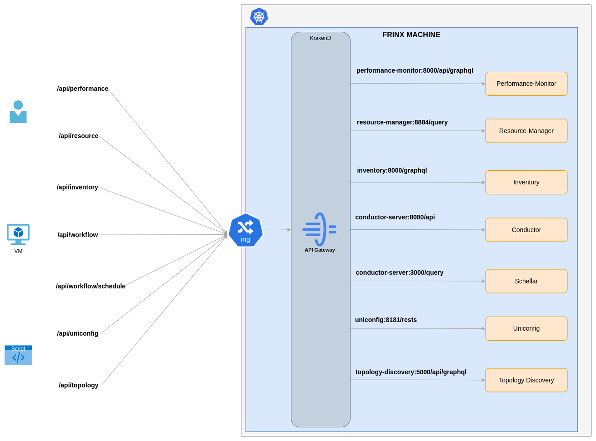
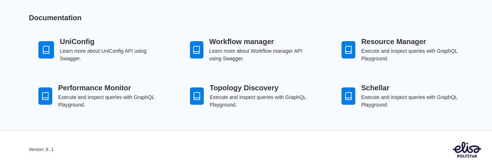

# API Gateway

Communication with FRINX Machine is facilitated through both a user-friendly UI and a robust REST API. 
All our services offer REST and GraphQL APIs, allowing seamless interaction for both users and automated systems.

Our architecture employs an API Gateway to consolidate all endpoints into a single, accessible location. Each service is assigned a unique path, simplifying access. 
To connect with a specific service, you only need to know the FM KrakenD/OAuth2-Proxy ingress host and the designated path for your desired service. 
This streamlined approach ensures efficient and straightforward communication with FRINX Machine.

## Api Gateway diagram

## Api Docs

API documentation is accesibla via Frinx Machine installation

