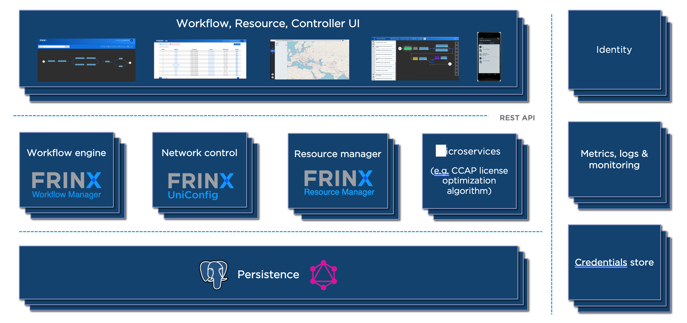

# FRINX Machine introduction

FRINX Machine is a dockerized deployment of multiple elements. The FRINX
Machine enables large-scale automation of network devices, services and
retrieval of operational state data from a network. User-specific
workflows are designed through the use of OpenConfig NETCONF & YANG
models, vendor native models, and the CLI. The FRINX Machine uses
dockerized containers that are designed and tested to work together to
create a user-specific solution.

!!!
FRINX-machine can be installed in Kubernetes using the [Helm chart](https://artifacthub.io/packages/helm/frinx-helm-charts/frinx-machine)
!!!

## FRINX Machine core components

### FRINX UniConfig

-   Connects to the devices in the network
-   Retrieves and stores configuration from devices
-   Pushes configuration data to devices
-   Builds diffs between actual and intended config to execute atomic
    configuration changes
-   Retrieves operational data from devices
-   Manages transactions across one or multiple devices
-   Translates between CLI, vendor native, and industry-standard data
    models (i.e. OpenConfig)
-   Reads and stores vendor native data models from mounted network
    devices (i.e YANG models)
-   Ensures high availability, reducing network outages and downtime
-   Executes commands on multiple devices simultaneously

### Netflix Conductor (workflow engine) - the core of the Workflow manager

-   Atomic tasks are chained together into more complex workflows
-   Defines, executes and monitors workflows (via REST or UI)

We chose Netflix’s conductor workflow engine since it has been proven to
be a highly scalable open-source technology that integrates very well with
FRINX UniConfig. Further information about Conductor can be found at:

-   **Sources:** https://github.com/Netflix/conductor
-   **FRINXio sources:** https://github.com/FRINXio/conductor-community
-   **Docs:** https://conductor-oss.github.io/conductor/index.html

### Postgres database - the core of Device inventory

-   Stores inventory data

### Monitoring software: loki + grafana + influxdb + telegraf - core of Monitoring

-   Stores workflow execution and metadata
-   Stores UniConfig logs
-   Stores docker container logs

### UniConfig UI (user interface) aka Frinx frontend

-   This is the primary user interface for the FRINX Machine
-   Allows users to create, edit or run workflows and monitor any open
    tasks
-   Allows users to mount devices and view their status. The UI allows
    users to execute UniConfig operations such as read, edit, and
    commit. Configurations can be pushed to or synced from the network
-   Device inventory, workflow execution, and resource manager are
    all accessible through the UI

## High-Level Architecture

The following diagram outlines the main functional components in the FRINX
Machine solution:

## Defining a workflow

The workflows are defined using a JSON-based domain-specific language
(DSL) by wiring a set of tasks together. The tasks are either control
tasks (fork, conditional, etc.) or application tasks (i.e. encoding a
file) that are executed on a remote device.

The FRINX Machine distribution comes pre-loaded with several
standardized workflows

A detailed description of how to run workflows and tasks, along with
examples can be found in the official [Netflix Conductor
documentation](https://conductor-oss.github.io/conductor/documentation/configuration/workflowdef/index.html)

## Operating FRINX Machine

To find out more about how to run the pre-packaged workflows, continue to [!ref icon="briefcase" text="Use cases"](../use-cases/index.md)
