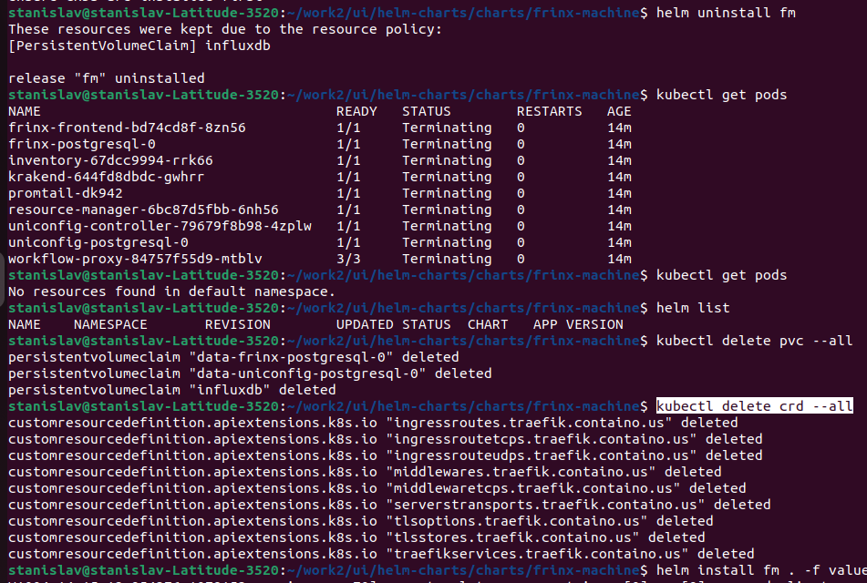
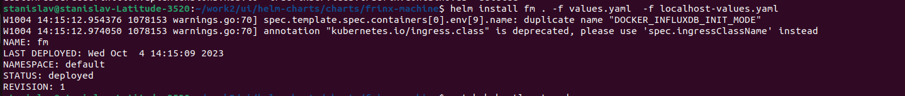
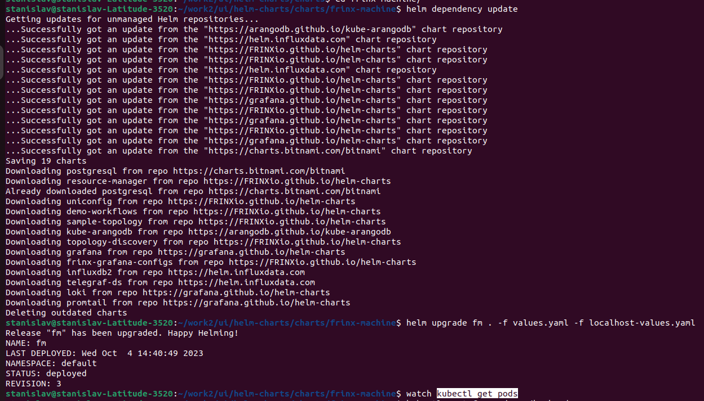
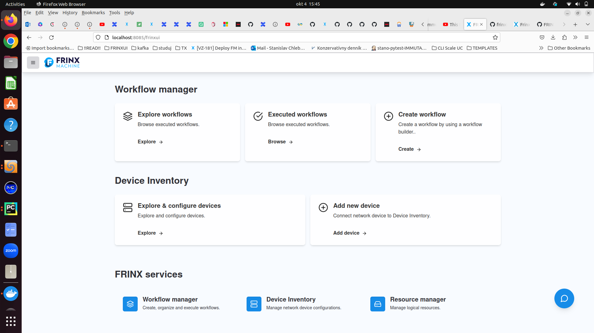

# Frinx Machine on local machine

## Prerequisites

Installed
- docker, docker desktop
- helm
- git

Docker Desktop
- Settings / Kubernetes  
[x] Enable Kubernetes  
Start a Kubernetes single-node cluster when starting Docker Desktop.

Repository
- git clone git@github.com:FRINXio/helm-charts.git

Credentials for dockerhub
- ask Simon for regcred.yaml
- `kubectl apply -f regcred.yaml`

## Reset kubernetes
Docker Desktop
- Settings / Kubernetes  
  press button **Reset Kubernetes cluster**  
  All stacks and Kubernetes resources will be deleted.

## Teardown gracefully
REPO is where helm-charts repo resides...
```commandline
cd <REPO>
cd helm-charts/charts/frinx-machine
helm uninstall fm
kubectl get pods
helm list
kubectl delete pvc --all
kubectl delete crd --all
```



## Deployment
REPO is where helm-charts repo resides...

### Prepare localhost-values.yaml
```commandline
cd <REPO>
cd helm-charts/charts/frinx-machine
touch localhost-values.yaml
vim localhost-values.yaml
```
The content of localhost-values.yaml
```commandline
inventory:
  env:
    TOPOLOGY_ENABLED: true

topology-discovery:
  enabled: true
  env:
    IMPORT_ARANGO_DEMO_DATA: true
    IMPORT_DEVICE_INVENTORY_DATA: true

frinx-arango-config:
  enabled: true
  arangodb_config:
    enabled: true

demo-workflows:
  enabled: true

sample-topology:
  enabled: true


```
### Deploy fm
```commandline
cd <REPO>
cd helm-charts/charts/frinx-machine
helm install fm . -f values.yaml  -f localhost-values.yaml
watch kubectl get pods
watch kubectl get svc
```


### Change hardcoded IP
```commandline
cd <REPO>
cd helm-charts
cd charts/frinx-frontend
vim values.yaml
```
like this
```commandline
diff --git a/charts/frinx-frontend/values.yaml b/charts/frinx-frontend/values.yaml
index c3a7ff6..431f653 100644
--- a/charts/frinx-frontend/values.yaml
+++ b/charts/frinx-frontend/values.yaml
@@ -86,7 +86,7 @@ env:
   UNICONFIG_API_DOCS_URL: "/api/workflow/docs-uniconfig"
   INVENTORY_ENABLED: true
   INVENTORY_API_URL: "/api/inventory"
-  INVENTORY_WS_URL: "ws://10.19.0.5:8001/api/inventory"
+  INVENTORY_WS_URL: "ws://localhost:8001/api/inventory"
   RESOURCE_MANAGER_ENABLED: true
   RESOURCE_MANAGER_API_URL: "/api/resource"
   UNISTORE_API_URL: "/api/unistore"
```
### Reflect change in deployed cluster
```commandline
cd <REPO>
cd helm-charts/charts/frinx-machine
# at first we need to update frinx-machine/charts:
helm dependency update
# then we can upgrade fm cluster:
helm upgrade fm . -f values.yaml -f localhost-values.yaml
# you should see one front end pod terminating and the new one starting:
kubectl get pods
```

### Forward port to access web page
```commandline
$ kubectl port-forward svc/krakend 8085:8080
Forwarding from 127.0.0.1:8085 -> 8080
Forwarding from [::1]:8085 -> 8080
```
### Forward port to access inventory webservice
```commandline
$ kubectl port-forward svc/krakend 8001:8001
Forwarding from 127.0.0.1:8001 -> 8001
Forwarding from [::1]:8001 -> 8001
```
### Frinx Machine frontend
In browser type `http://localhost:8085/frinxui`

