## Demo “L3VPN”

<!-- Before running L3VPN, run **Allocate_Root_Pool / 1** workflow and check if lab-vmx1 (device) is already installed.

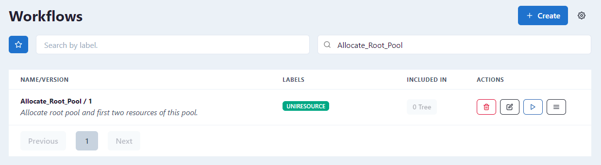
-->

- On the FRINX Dashboard, open menu in the top-left corner and select on **L3VPN Automation**.
- Select **Services**.
- Select **+ Add service**.
- Fill in the information as shown below. Select the chain icon to automatically generate the **VPN ID**.

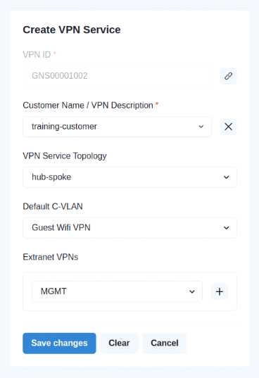

- Select **Save changes**.
- You are redirected to the previous page.

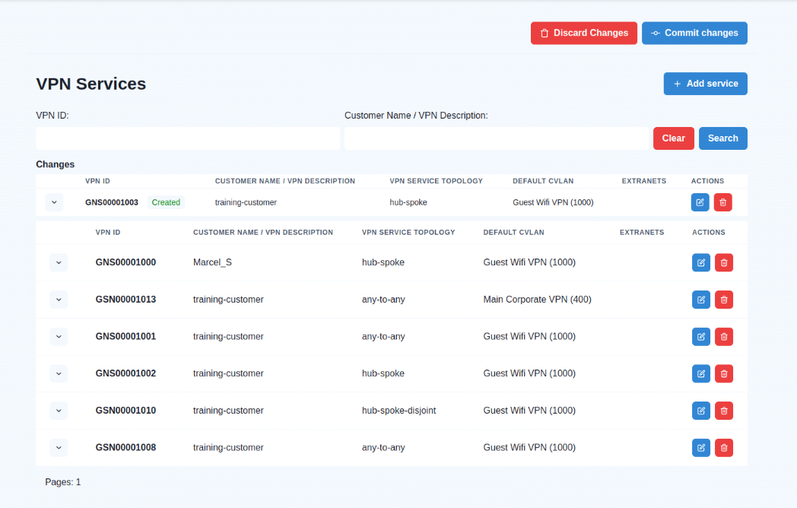

- Select **Commit changes**.
- Select **Commit changes** again.
- After committing, you can see all executed tasks and sub-workflows. Select **Go to detail** to review individual processes.

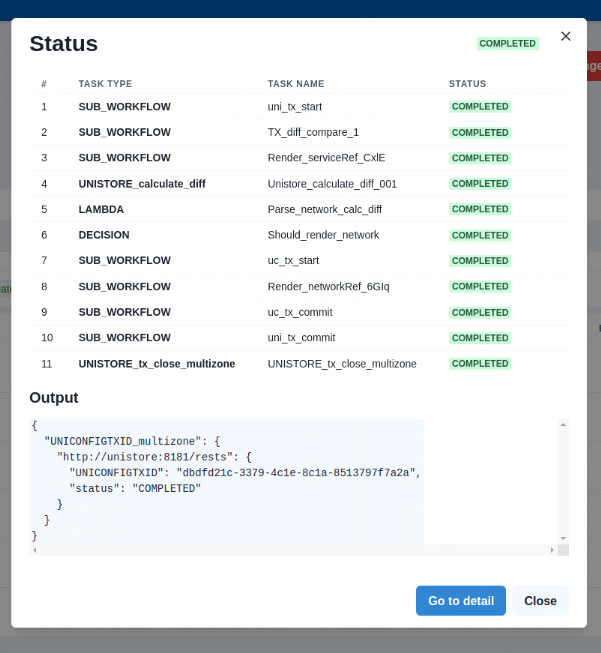

### Step 1.

- Navigate back to the **L3VPN Automation** page.
- Select **Sites**.
- Locate the **test_site_3b9UQL4i** entry.

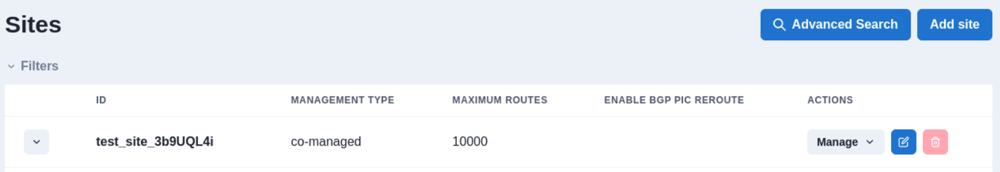

- For **test_site_3b9UQL4i**, select **Manage** and **Site network access**.

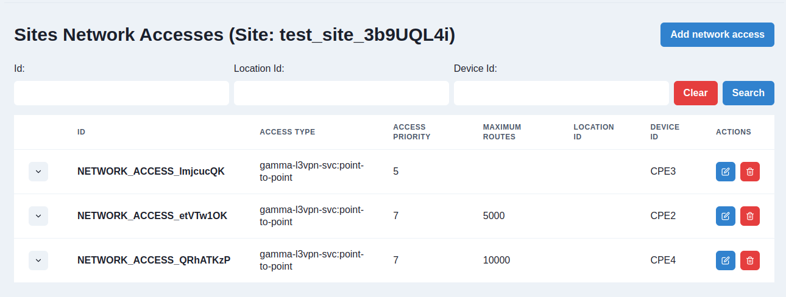

- Select **Add network access**.

### Step 2.

Enter the following settings:

**General and Service**

**VPN Attachment:** GNS00001002

**BTM Circuit Reference:** CES00000000-05

**Devices:** Select one of the CPE devices.

**SVC Input Bandwith (Mbsp):** 1000

**SVC Output Bandwith (Mbps):** 1000

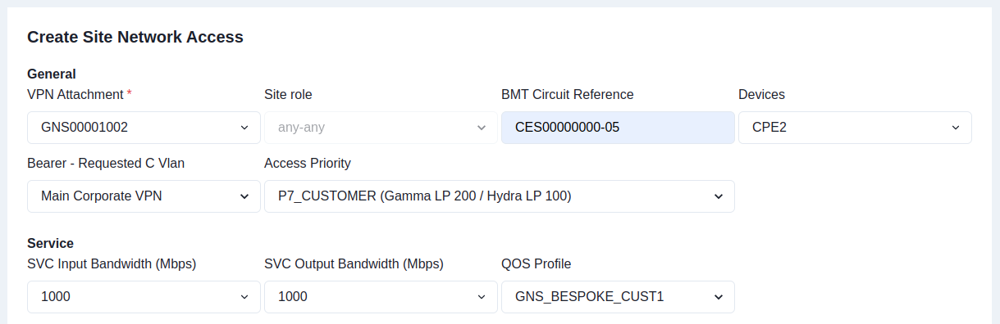

**Routing Protocol:**

- Select **+ Create Static Protocol**.

**Static Routing LAN:** 10.0.0.0/8

**Static Routing Next Hop:** 10.0.0.1

**Static Routing Lan Tag:** 999

**Bgp Profiles:** 300ms

**Maximum Routes:** 2000

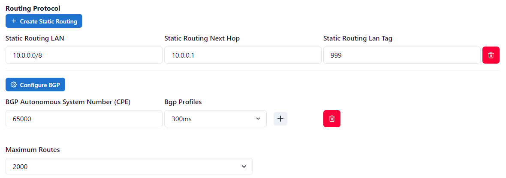

**IP Connection**

To automatically generate a provider and customer address, select the chain icon:

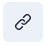

**BFD Profile:** 500ms

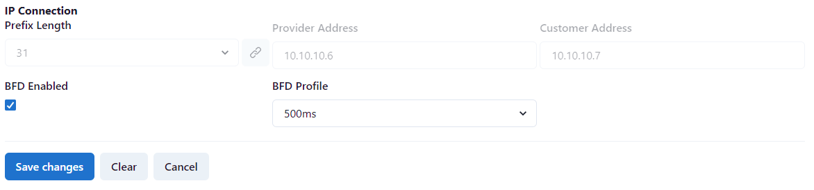

Select **Save Changes**.

### Step 3.

Select **Commit Changes**.

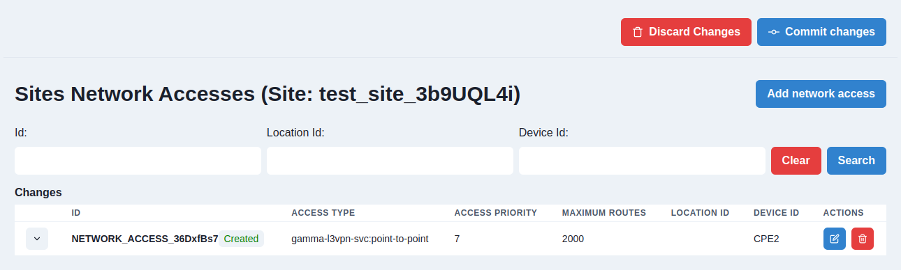

Wait until all tasks are completed.

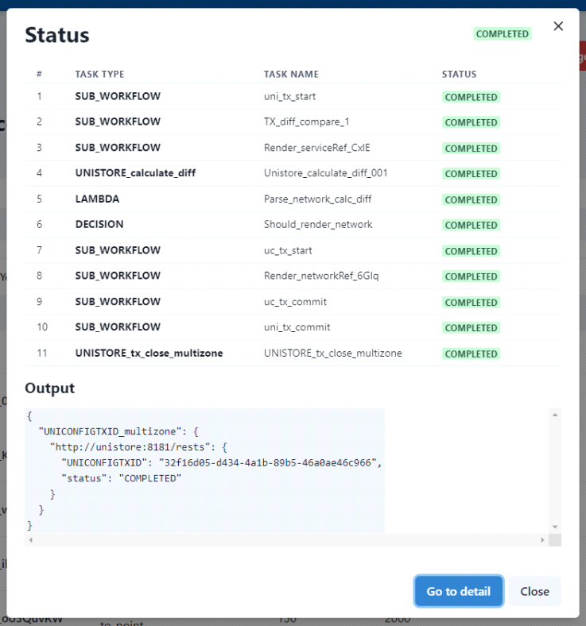
