# FRINX Machine Demo Manual

After logging into FRINX Machine, you can see the **FRINX Machine dashboard**:

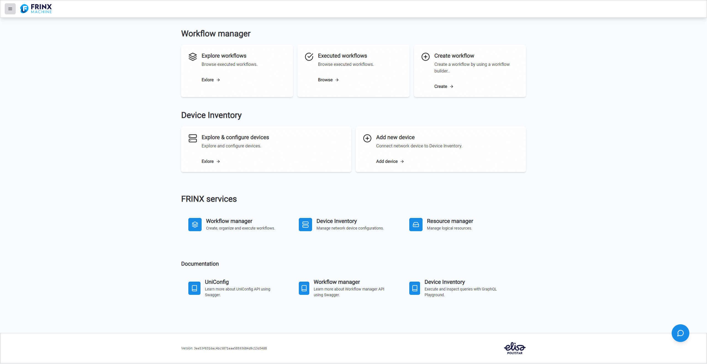

## Demo Config Manager UI

Using the Demo Config Manager:

1) On the FRINX Machine main page, select **Explore & configure devices**.
2) Make sure that the device you want to configure is installed. If not, select
   **Install** first.
3) For this demo, we use the **IOS01** device. Locate the device in the list and
   select the corresponding gear icon on the right. (If you see a message saying
   **Transaction expired**, select **Refresh**).


4) For the **Loopback0** interface, change the status from **enabled** status to
   **false**.
5) To save your changes, select **Save**.
6) To review your changes, select **Calculate diff**.
7) To view the set of commands used for the change, select **Dry run**.
8) To apply changes to the device, select **Commit to network**. You can also
   see the changes in the Operational data store.


To revert changes made to the device configuration:

9) Select **Transactions**.
10) Select the **Revert** icon for your transaction.
11) Select **Revert changes**.

## Demo workflow UI basics

The Workflow Builder is a graphical interface for Workflow Manager. It is used
to create, modify and manage workflows.

Workflows are groups of tasks and/or sub-workflows that can be used to install
or delete devices, create loopback interfaces on devices, send messages and much
more. You can create your own workflows or edit existing ones by adding or
removing tasks or sub-workflows.

Every task and sub-workflow placed in a workflow has a unique reference alias.
No two workflows can share a name and version.

<!--
### Creating a new workflow

Now we will take a look at how to create a new workflow. The new workflow will be created from template workflow called **http_example_01 / 1** which can be found under explore workflows. If you dont wish to create workflow you can just execute this workflow in explore workflows.

1) The easiest way to create a new workflow is to click on **Create** button in the main page of FRINX Machine.


2) In the **Name** type the name of your workflow (please keep in mind that name of the workflow cannot be later changed). **Description** stands for additional info of the workflow - you can leave it blank. Once the workflow is created **Label** can help you find your workflow in **Explore workflows** faster but you can leave it blank as well. After inserting all data click on **Save changes**.


After saving changes you will be redirected to canvas. Here we will add tasks and subworkflow in our workflow.


3) Click + on the **http** and **labmda** under **System tasks** and **Post_to_Slack** under **Workflows**. All tasks and subworkflows are added on same place in the canvas so you need to move them to actually see them. For connecting all parts of the workflow hower over OUT/IN where + sign will appear. Connect all parts in this way: START - http - lamda - Post_to_Slack - END. As you can see each task and workflow has its own set of characters after its name - these are reference aliases and work as unique identifier.


Above every task/workflow you can see 2 squares:

**Update:**


**Remove/Expand:**


4) **http - adjustment**. This task provides multiple methods for working with data from web pages. Click on update above http task. On the right side you can see General Settings and Input Parameters. Leave **General Setting** the way they are and click on **Input Parameters**. Insert:
```https://jsonplaceholder.typicode.com/todos/${workflow.input.selector}```
in the **URI** and leave other columns unchanged. This set of data will get data from JSON database based on selectors input. Now click on **Save Changes** under **Headers**.


5) **lambda - adjustment**. Click on **Input parameters** and in the **Lambda value** insert:
```${NAME_OF_HTTP_TASK.output.body}```
In our example the name is **http_1cc1**. In the **Script expression** copy-paste: `return JSON.parse($.lambdaValue)`. Lambda takes data from previous http task and returns parsed data (message text) from JSON. Click on **Save Changes**.


6) **Post_to_Slack - adjustment**. Click on **Input parameters** and in the **slack_webhook_id** insert T03UXD8N58B/B03VCP8U99P/jermqzN9AkhNgXYIZkP0qLI0. In the **message_text** insert:
```${NAME_OF_LAMBDA_TASK.output.result.title}```
**Post_to_Slack** is a workflow that can be used standalone or as a part of other workflows. This workflow works as as sender of messages to specific destination in Slack. Click on **Save Changes**.

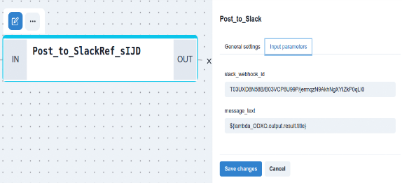

> **Info**: If you don´t see selector column just click on **Close** under the selector column, click on **Definitions** on the top left, insert the name of your workflow in the **Search by keyword**. and press run workflow under **Actions**.

7) Now the workflow is ready to be executed. Insert a number between 1 - 200  in the **selector** and press **Execute**. Click on **Continue to detail**.


8) Now you can see that workflow was executed and every task was completed successfully.

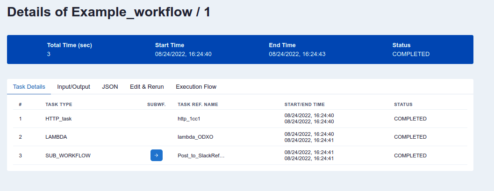

The output (demo Latin JSON) of the workflow in the Slack:


You can visit Slack directly via https://join.slack.com/t/frinx-community/shared_invite/zt-1esnmbq4l-ui9xLCS4zKGHUXZxz~PdrQ to see your own message. We recommend to use the browser version.
-->

## Create a new custom workflow

Now we can create a new workflow from scratch:

1) Select **Create** on the main page of FRINX Machine.


2) Enter details for the new workflow. Under **Name**, enter a name for your
   workflow (note that this name cannot be changed later). The **Description**
   is for additional information about the workflow and can be left empty.
   **Label** can help you to find your workflow later under **Explore
   workflows**, but can also be left empty. Select **Save changes** when ready.


3) Under **System tasks**, click the **+** sign for the **lambda**, **decision**
and **terminate** tasks. Under **Workflows**, click the **+** sign for
**Device_identification**. Tasks and sub-workflows are added on top of each
other on the canvas and can be dragged around. To connect all parts of the
workflow, hover over **IN** and **OUT** where the **+** sign appears. Connect
the parts as follows: **START** - **lambda** - **decision** - **(other)** to
**Device_identification** and **default** to **terminate**. Each task and
workflow has a reference alias after its name, which works as unique a
identifier.

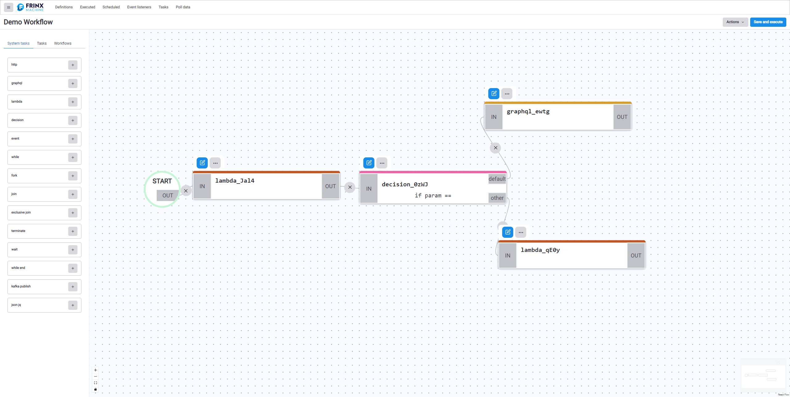

Above every task or workflow there are two icons:

**Update:**


**Remove/Expand:**


4) **lambda** task: This task makes a decision about which status to choose
   based on the embedded port. In this example, we only consider ports
   10000–10004 while others are ignored. The lambda task lets you enter a small
   code (lambda function without name) into the workflow builder.

    In this case, if the specified port is both greater than or equal to 10000
    and less than 10005, the chosen status is *keep working*. Otherwise, the
    status is *end*. This status is the output of the lambda and the input for
    the next task or sub-workflow.

    > Sub-workflows are similar to classic workflows, but inside of another
    > workflow. The workflow that we are creating can also be used as a building
    > block for another workflow, becoming a sub-workflow itself. In this
    > manner, we can layer and reuse previously created workflows.

    In the **Input parameters** tab and the **Lambda value** field, enter the
    following: `${workflow.input.port}`. This indicates that the task should use
    the value entered in the **port** field in the input of this workflow. (We
    will cover this later, in section 7.)

    In the **Script expression** field, enter the following function described
    above:
```
if ($.lambdaValue >= 10000 && $.lambdaValue < 10005) { 
  return {value: 'other'}
} else { 
  return {value: false}
}
```


5) **decision** task: This task makes a different kind of decision from the
   lambda task discussed above. It operates like a switch on a track, sending
   the train one way or another. The data needed to make a decision is supplied
   by the lambda task.

    In the **Input parameters** tab, delete the default parameter **foo**. For the
  **param** parameter, enter `${lambda_IkSu.output.result.value}`. (Note that
  *IkSu* is an automatically generated reference alias that you must edit to
  match the one generated for you.) What `${lambda_IkSu.output.result.value}`
  means is to take the value from *lambda_xyzq* which is in the output, find the
  result in the output and the value in it.

    If the input value for **decision** is **other**, it directs the flow
    towards **device_identification**. If the input value is **false**, it
    directs the flow towards **terminate**. This corresponds to the way we
    connected the cells in the Workflow Builder.


6) **terminated** task:

    In the **Input parameters** tab, enter `COMPLETED` (or `FAILED`, at your
    discretion) in the **Termination status** field. You can enter whatever
    message you want in the **Expected workflow output** field (for example,
    `Device not supported`.)

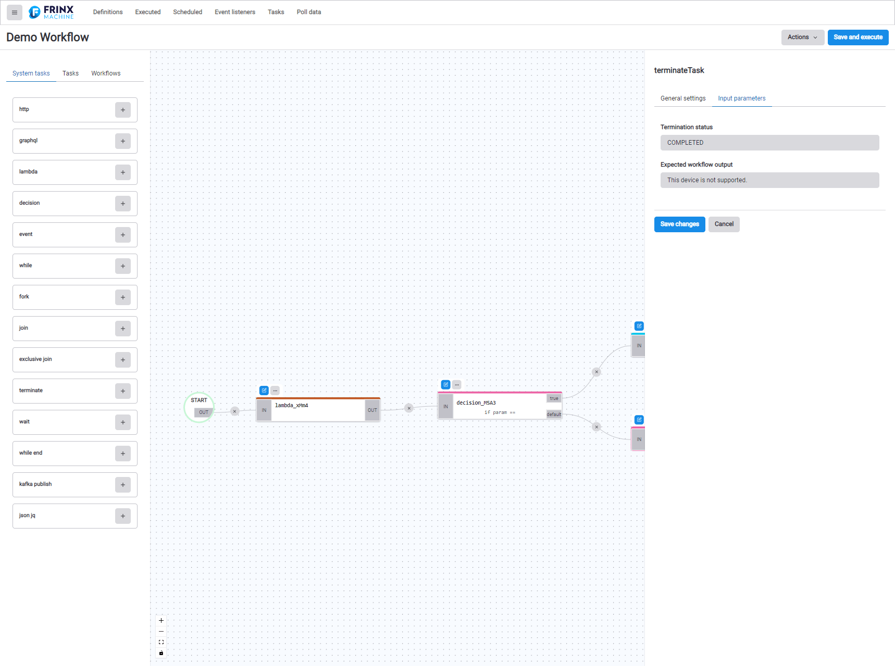

7) **Device_identification** task:

    In the **Input parameters** tab under **management_ip**, enter
    `sample-topology`. This is the name of the topology in this installation,
    whereas in production you would use a real name. For **port**, enter
    `${workflow.input.port}`. If you enter a port number manually, the workflow
    will not ask for one when started (the same goes for **management_ip** and
    other fields). However, we want the user to be able to select a port they,
    as we did with the **lambda** task in section 4.

    **username** and **password**: For this demo, we assume that the following
    login credentials are used on all devices:
    - username: `frinx` 
    - password: `frinx`

    As above, if we enter the username and password directly, the workflow will
    not ask for credentials at startup.

    When working with devices using different login credentials, it is useful to
    to change or enter credentials at startup. This can be done in the same way
    as with the **port** parameter:

    - username: `${workflow.input.username}`
    - password: `${workflow.input.password}`

    As mentioned above, in this demo workflow we will assume that login
    credentials are identical everywhere.

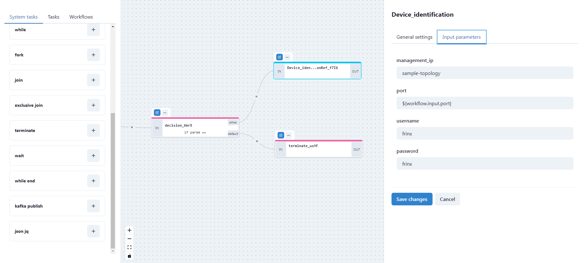

8) Now we can add more tasks. In the left column under **System tasks**, we can add another **lambda**. In the **Workflows** section, you can find **Read_journal_cli_device**. Let us place them next to each other after **Device_identification** and concatenate them:


9) Second **lambda**: Enter `${Device_identificationRef_f7I6.output}` as the lambda value, meaning "take the output from the previous **Device_identification** task and use that".

    Enter the following into the body:
```
if ($.lambdaValue.sw == 'saos') { 
  var data = $.lambdaValue.sw.toUpperCase()+$.lambdaValue.sw_version+'_1'
  return data
} else { 
  return { value: false }
}
```

A translation of what is happening here: "If the identified device is of the
type *saos*, extract the name from the output message of the previous task,
change the letters to uppercase, extract the version from the output message of
the previous task, glue them together and add `_1` (since that is how devices
are named in this demo topology).


10) **Read_journal_cli_device**: In the **Input parameters** tab under
    **device_id**, enter `${lambda_ZW66.output.result}`.


11) The output from **Read_journal_cli_device** is concatenated with **END**, as
    is the output from **terminated**. Thus we have closed our custom workflow.


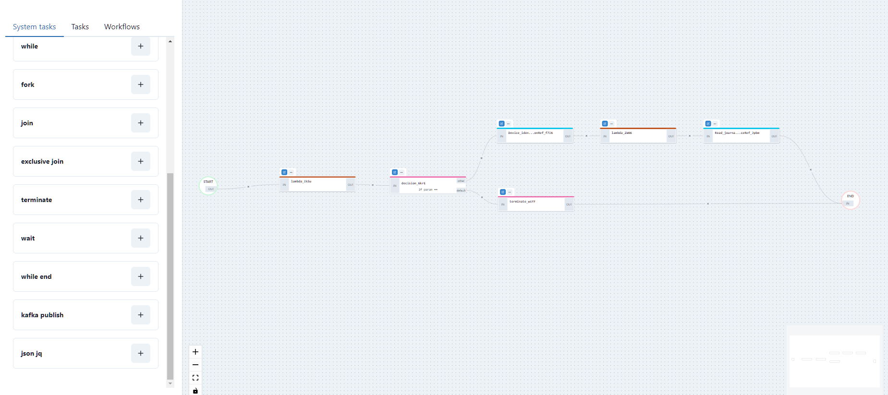

12) Save and run your workflow.

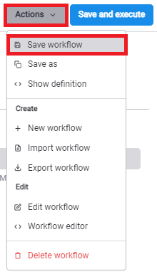


Next steps:

Find your new workflow and run it with multiple different inputs such as
`10 000`, `10 002`, `10 012`, etc.

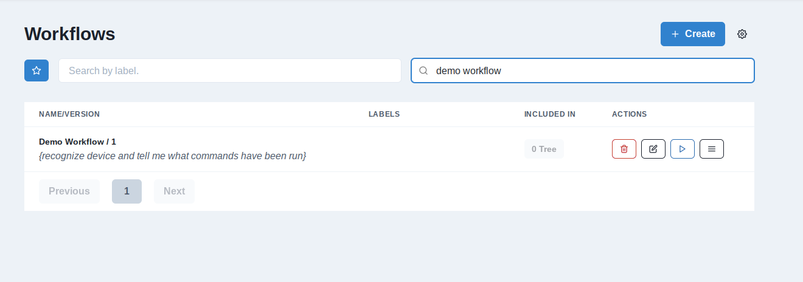

For different ports, you can see different devices with other run commands in
memory.

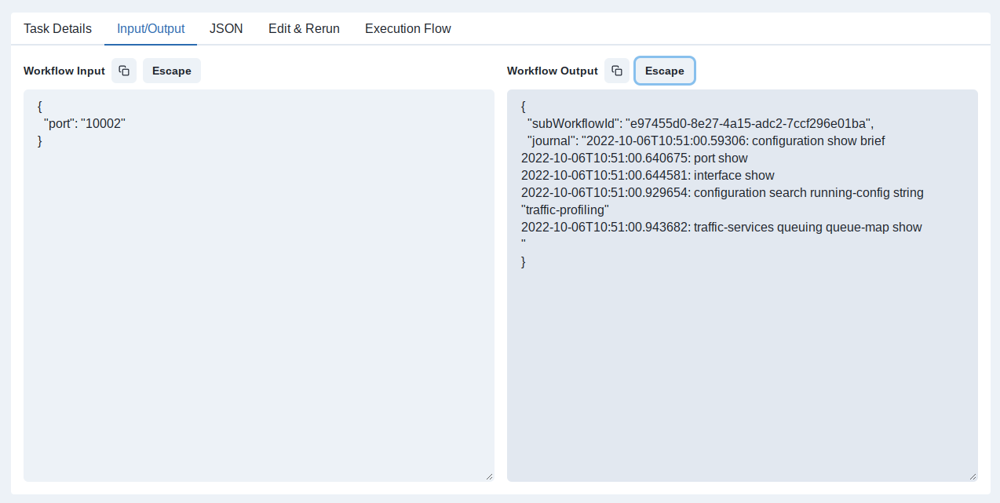


## Demo: Build a workflow that sends a message to Slack

Now let’s look at building a workflow. Our example workflow will make an HTTP
request, parse the desired part of the HTTP response, and post the result in a
Slack workspace.

1) Select **Create workflow§** on the main page of FRINX Machine.

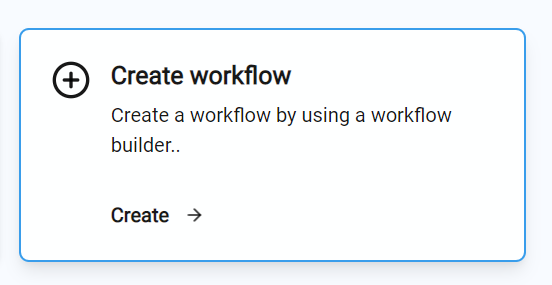

2) Under **Name**, type the name of your workflow (keep in mind that the name
must be unique and cannot be changed later). **Description** stands for
additional info of the workflow and can be left blank. Once the workflow is
created, you can specify a **Label** to help organize workflows under **Explore
workflows** (this can be left blank as well). After all the data is entered,
select **Save changes**.


**Restartable** – When checked, if the workflow fails the FRINX UI will
include an option to restart the workflow with the same inputs, without
restarting it all over and without creating a new workflow ID. For our case, you
can leave it checked.

After saving your changes, you are redirected to the canvas. Here we will add
tasks and sub-workflows to our workflow.

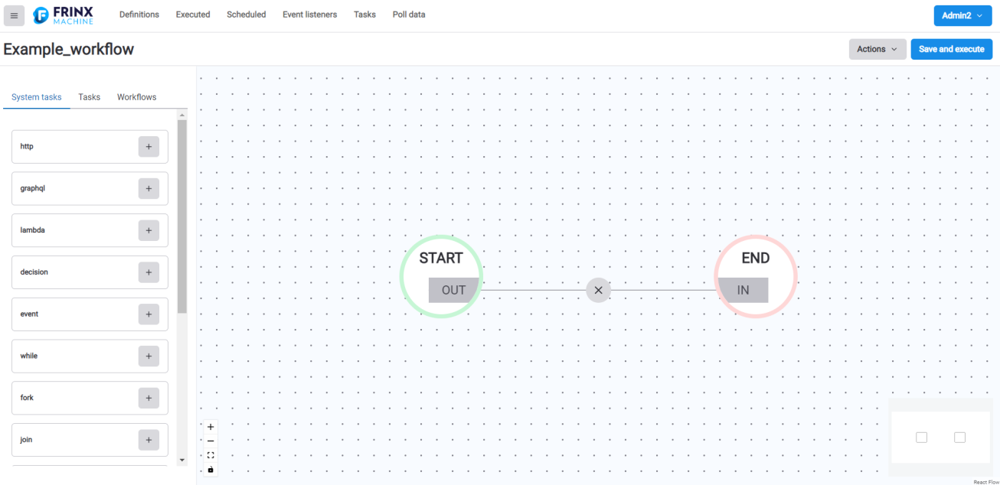

3) Click **+** on **http** and **lambda** under **System tasks** and
**Post_to_Slack** under **Workflows**. All tasks and subworkflows are added in
the same place on the canvas, so you need to move some to see others. To connect
all parts of the workflow, hover over OUT/IN where the + sign will appear.
Connect all parts as follows: **START - http - lamda - Post_to_Slack - END**. As
you can see, each task and workflow has its own set of characters after its
name. These are reference aliases that work as unique identifiers.


Above every task or workflow, there are two squares:

**Edit:**


**Remove/Expand:**


4) **http - edit**. This task provides multiple methods for working with data
from webpages. In this case, we will make an HTTP GET request to fetch data
which we will then parse. Click on **edit** above the HTTP task. On the right
side, you can see the **General settings** and **Input parameters** tabs. Select
**Input Parameters** and under **URI**, enter
`https://jsonplaceholder.typicode.com/todos/${workflow.input.selector}` and
leave the other columns unchanged. This set of data will receive data from the
JSON database based on selector input. Select **Save Changes**.

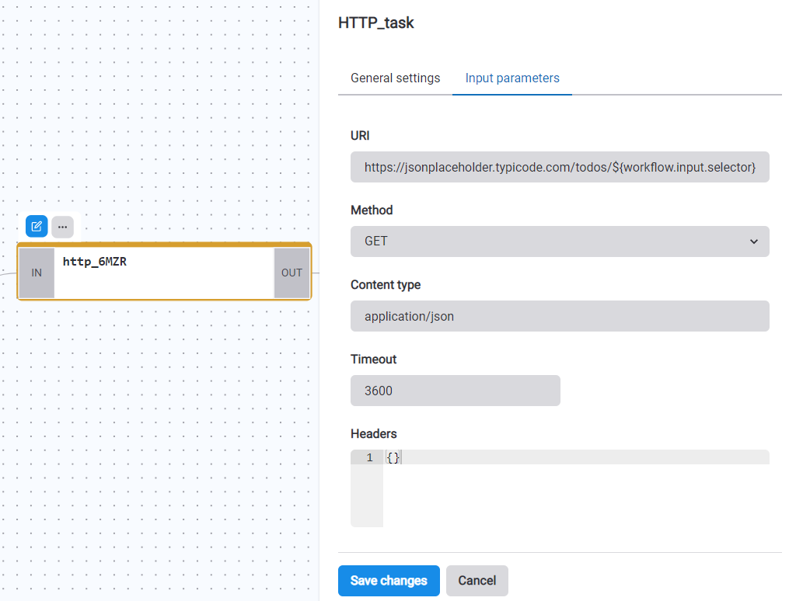

5) **lambda - edit**. Lambda takes data from the http task above and returns
parsed data (message text) from JSON. Select **Input parameters** and under
**Lambda value**, insert the following: `${http_<unique_id>.output.body}`. In
our example, the name is `http_6MZR`. Under **Script expression**, enter the
following: `return JSON.parse($.lambdaValue)`. Select **Save changes**.

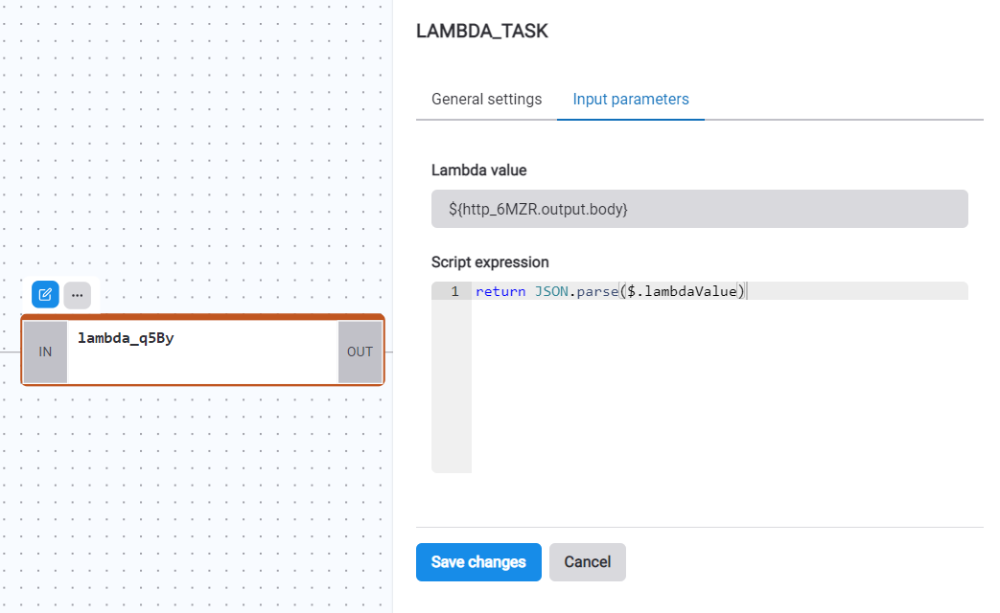

6) **Post_to_Slack - edit**. Post_to_Slack is a workflow that can be used
standalone or as a part of other workflows. This workflow sends messages to
specific destination in Slack. Select **Input parameters** and under
**slack_webhook_id**, enter the following:
`T02BFFVUQ/B04MQ2PRWQ1/xw9pWOAm0e4OMPfPxmrI1Jbp`. Under **message_text**, enter
the following: ${lambda_<unique_id>.output.result.title}. Select 
**Save Changes**.

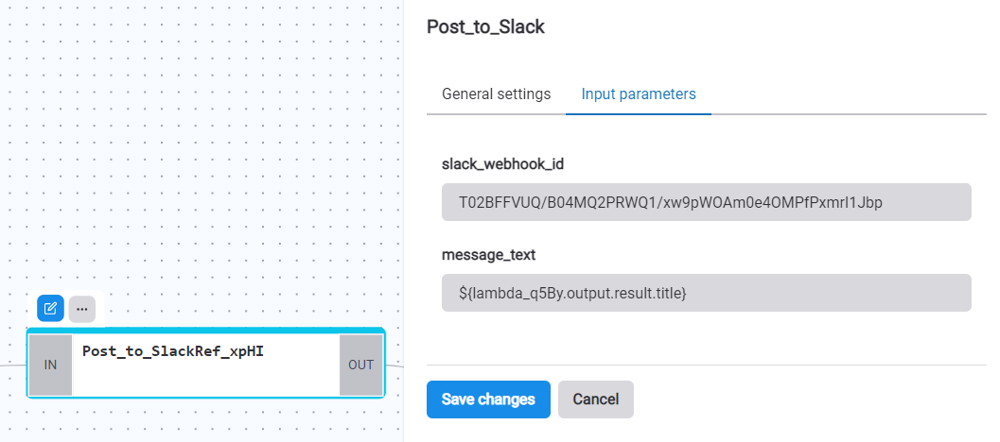

7) In the upper-right corner of the Workflow Builder, Select
**Save and execute**. The workflow is now ready to be executed. Under
**selector**, insert a number between 1 and 200. Select **Execute**.


8) Select **Executed workflow in detail**. Here you can see that the workflow
was executed and that every task was completed successfully.

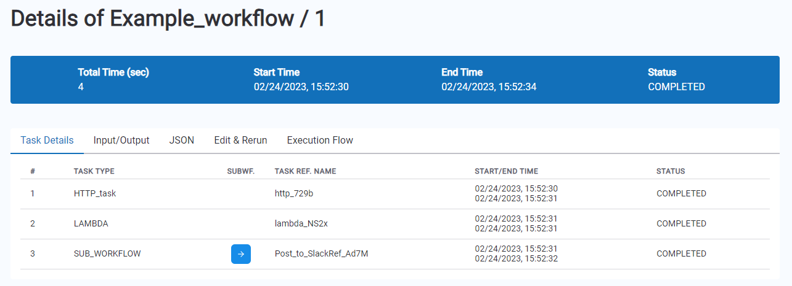

The output (demo Latin JSON) of the workflow in Slack:


You can join the Slack channel where the message about this workflow is sent to
verify that it was sent successfully:
https://join.slack.com/share/enQtNDg2ODM4MDgyMjY3My0zYjdhOTNjMTkxYTk3OTRhMGY3MjQ5YWNmYTJlNGRiNTkwZTNmNGVjMGQ2MGY3ODkwMzY2MmY0ODIwN2ZkMjJj
(Note that entry to this channel may be limited to @elisapolystar.com
accounts only.)

## Demo: Create a loopback address on devices stored in the inventory

This workflow creates a loopback interface on all devices installed in the
inventory or, alternatively, on all devices filtered by labels. Labels are
markers that serve as a differentiator.

1) Check if all devices are installed. You can install them manually or by
   executing the **Install_all_from_inventory / 1** workflow.


2) On the main page, select **Explore workflows**. In the **Search by keyword**
   column, enter `loopback`. The **Create_loopback_all_in_uniconfig / 1**
   workflow appears in the list. Under **Actions**, select the corresponding
   **Run** button for the workflow.

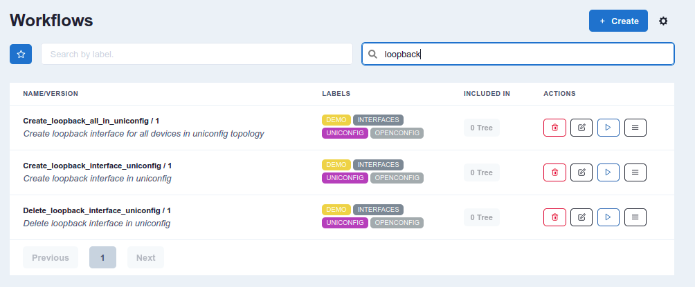

3) Under **loopback_id**, enter `77` and select **Execute**. Click on the link
   that appears.


4) All tasks were executed correctly and are completed.


On the results page, you will see five individual tasks:

### INVENTORY_get_all_devices_as_dynamic_fork_tasks
This workflow displays a list of all devices in the inventory or devices
filtered by label. It parses the output in the correct format for the dynamic
fork, which creates a number of tasks depending on the number of devices in the
inventory. 

### SUB_WORKFLOW
This is the dynamic fork sub-workflow. In this case, it creates
**UNICONFIG_write_structured_device_data** for every individual device in the
inventory. You can then get detailed information on progress and succession for
every device.

### UNICONFIG_calculate_diff
This remote procedure call creates a difference between the actual UniConfig
topology devices and the intended UniConfig topology nodes. 

### UNICONFIG_dryrun_commit
This remote procedure call resolves the difference between actual and intended
device configurations. After all changes are applied, the cli-dryrun journal is
read and a remote procedure call output is created and returned. 

### UNICONFIG_commit
This is the final task that actually commits the intended configuration to the devices.

## Demo: L3VPN

<!-- Before running L3VPN, run **Allocate_Root_Pool / 1** workflow and check if lab-vmx1 (device) is already installed.


-->

On the FRINX Dashboard, open the menu in the top-left corner and select
**L3VPN Automation**.

Select **Services**.

Select **+ Add service**. Fill in the information as shown below. Select the
chain icon to automatically generate the **VPN ID**.


Select **Save changes**. You are redirected to the previous page.

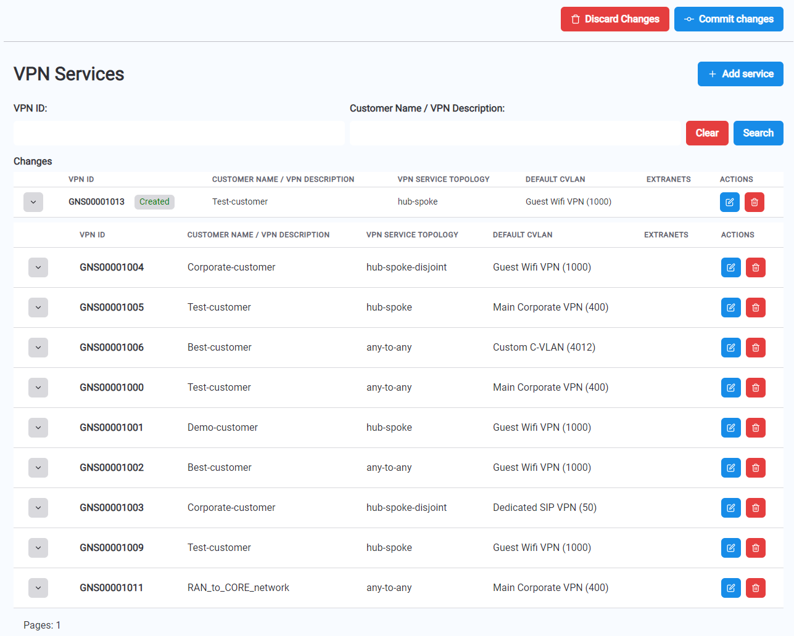

Select **Commit changes**. Select **Commit changes** again.

After committing, you can see all executed tasks and sub-workflows. Select
**Go to detail** to review individual processes.


### Step 1.

Navigate back to the **L3VPN Automation** page.

Select **Sites**. Locate the `test_site_3b9UQL4i` entry.


For `test_site_3b9UQL4i`, select **Manage** and **Site network access**.


Select **Add network access**.

### Step 2.

Enter the following settings:

**General** and **Service**:
- **VPN Attachment:** GNS00001005
- **BTM Circuit Reference:** CES00000000-05
- **Devices:** Select one of the CPE devices.
- **SVC Input Bandwith (Mbsp):** 1000
- **SVC Output Bandwith (Mbps):** 1000


**Routing Protocol:**
- Select **+ Create Static Protocol** and **Configure BGP**.
- **Static Routing LAN:** 10.0.0.0/8
- **Static Routing Next Hop:** 10.0.0.1
- **Static Routing Lan Tag:** 999
- **Bgp Profiles:** 300ms
- **Maximum Routes:** 2000

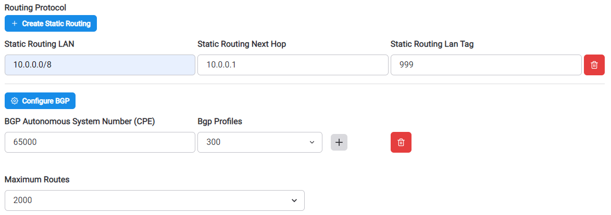

**IP Connection**

To automatically generate a provider and customer address, select the chain
icon:


**BFD Profile:** 500ms


Select **Save Changes**.

### Step 3.

Select **Commit Changes**.

Wait until all tasks are completed.

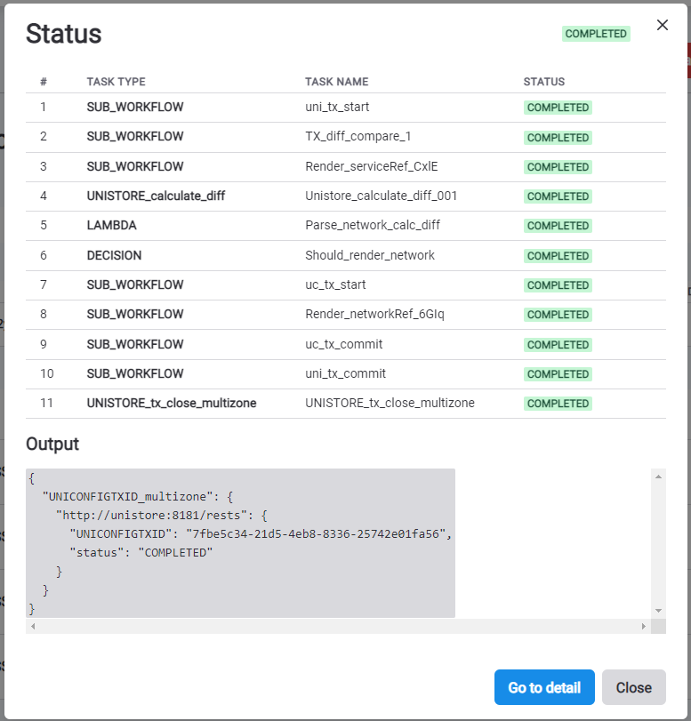
