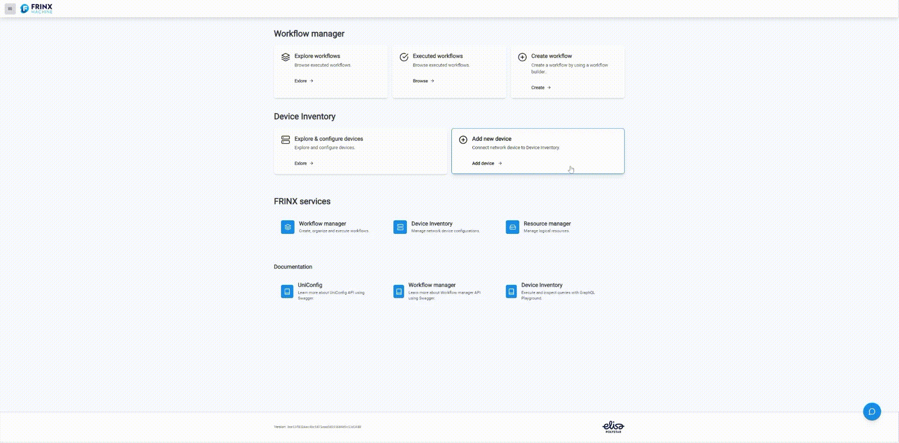
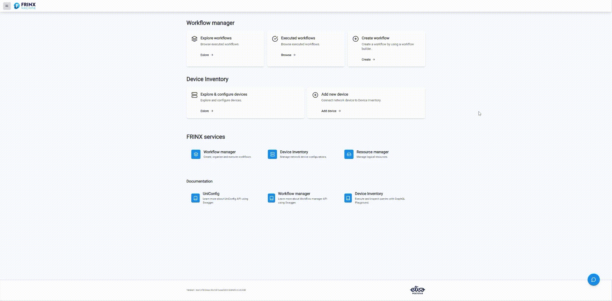

# Add a device to inventory and install it

## Adding device to inventory

At the FRINX Machine **Dashboard** under **Device Inventory** section click on **Add new device** panel. The page with the form titled **Add device** opens.



## JSON examples

New devices added to Device inventory are defined by JSON code snippets. (These snippets are part of UniConfig RPC connection-manager:install-node.) They are similar to [Blueprints](/frinx-workflow-manager/blueprints). This snippet is going to be filled into **Mount parameters** field.

Another way is to add a new device from blueprint: toggle the **Use blueprint?** switch in the form and
choose the blueprint that you want to use from **Select blueprint** drop-down list.

Note: following snippets refer to devices present in sample-topology demo

### Cisco classic IOS (cli)

```json
{
    "cli": {
        "cli-topology:host": "sample-topology",
        "cli-topology:port": "10009",
        "cli-topology:transport-type": "ssh",
        "cli-topology:device-type": "ios",
        "cli-topology:device-version": "15.4",
        "cli-topology:password": "cisco",
        "cli-topology:username": "cisco",
        "cli-topology:journal-size": 500,
        "cli-topology:dry-run-journal-size": 180,
        "cli-topology:parsing-engine": "tree-parser"
    }
}
```

### Cisco IOS XR (netconf)

```json
{
    "netconf":{
        "netconf-node-topology:host":"sample-topology",
        "netconf-node-topology:port":17000,
        "netconf-node-topology:tcp-only":false,
        "netconf-node-topology:username":"cisco",
        "netconf-node-topology:password":"cisco",
        "netconf-node-topology:session-timers": {
            "netconf-node-topology:keepalive-delay":5
        },
        "netconf-node-topology:other-parameters": {
            "netconf-node-topology:dry-run-journal-size":180
        },
        "uniconfig-config:uniconfig-native-enabled":true,
        "uniconfig-config:blacklist":{
            "uniconfig-config:path":[
                "openconfig-interfaces:interfaces",
                "ietf-interfaces:interfaces",
                "openconfig-vlan:vlans",
                "openconfig-routing-policy:routing-policy",
                "openconfig-lldp:lldp",
                "Cisco-IOS-XR-l2vpn-cfg:l2vpn",
                "Cisco-IOS-XR-group-cfg:groups",
                "openconfig-acl:acl",
                "openconfig-network-instance:network-instances"
            ]
        }
    }
}
```

### Huawei (cli)

```json
{
    "cli":{
        "cli-topology:host":"sample-topology",
        "cli-topology:port":"10008",
        "cli-topology:password":"huawei",
        "cli-topology:username":"huawei",
        "cli-topology:device-type":"vrp",
        "cli-topology:journal-size":500,
        "cli-topology:device-version":"*",
        "cli-topology:parsing-engine":"tree-parser",
        "cli-topology:transport-type":"ssh",
        "cli-topology:dry-run-journal-size":180
    }
}
```

### CALIX (netconf)
Note: this device is not present in sample-topology

```json
{
    "netconf":{
        "netconf-node-topology:host":"sample-topology",
        "netconf-node-topology:port":17001,
        "uniconfig-config:blacklist":{
            "uniconfig-config:path":[],
            "uniconfig-config:extension":[]
        },
        "netconf-node-topology:password":"PASSWORD",
        "netconf-node-topology:tcp-only":false,
        "netconf-node-topology:username":"USERNAME",
        "netconf-node-topology:session-timers":{
            "netconf-node-topology:keepalive-delay":0
        },
        "uniconfig-config:uniconfig-native-enabled":true,
        "uniconfig-config:install-uniconfig-node-enabled":true
    }
}
```

### Nokia (netconf)
Note: this device is not present in sample-topology

```json
{
    "netconf":{
        "netconf-node-topology:host":"sample-topology",
        "netconf-node-topology:port":17001,
        "netconf-node-topology:session-timers": {
            "netconf-node-topology:keepalive-delay":10
        },
        "netconf-node-topology:tcp-only":false,
        "netconf-node-topology:username":"USERNAME",
        "netconf-node-topology:password":"PASSWORD",
        "uniconfig-config:uniconfig-native-enabled":true,
        "uniconfig-config:install-uniconfig-node-enabled":true,
        "uniconfig-config:blacklist":{
            "uniconfig-config:path":[]
        },
        "netconf-node-topology:yang-module-capabilities":{
            "capability":[]
        }
    }
}
```

### SAOS 6 (cli)

```json
{
	"cli": {
		"cli-topology:host": "sample-topology",
		"cli-topology:port": "10001",
		"cli-topology:password": "frinx",
		"cli-topology:username": "frinx",
		"cli-topology:device-type": "saos",
		"cli-topology:journal-size": 500,
		"cli-topology:device-version": "6",
		"cli-topology:parsing-engine": "one-line-parser",
		"cli-topology:transport-type": "ssh",
		"cli-topology:dry-run-journal-size": 180
	}
}
```

### SAOS 8 (cli)

```json
{
	"cli": {
		"cli-topology:host": "sample-topology",
		"cli-topology:port": "10002",
		"cli-topology:password": "frinx",
		"cli-topology:username": "frinx",
		"cli-topology:device-type": "saos",
		"cli-topology:journal-size": 500,
		"cli-topology:device-version": "8",
		"cli-topology:parsing-engine": "one-line-parser",
		"cli-topology:transport-type": "ssh",
		"cli-topology:dry-run-journal-size": 180
	}
}
```


## Install the new device from Inventory

After the device is added we can install it to UniConfig.
At the FRINX Machine **Dashboard** under **Device Inventory** section click on **Explore & configure devices** panel. The page titled **Devices** opens - it lists all devices from Device inventory.

Click blue **Install** button located on the row next to a device which you want to install - after successful installation button will change to green button with the text **Installed**.  



If you follow instruction properly, your devices are now listed in Device inventory and installed, ready to be operated through Frinx Machine.
