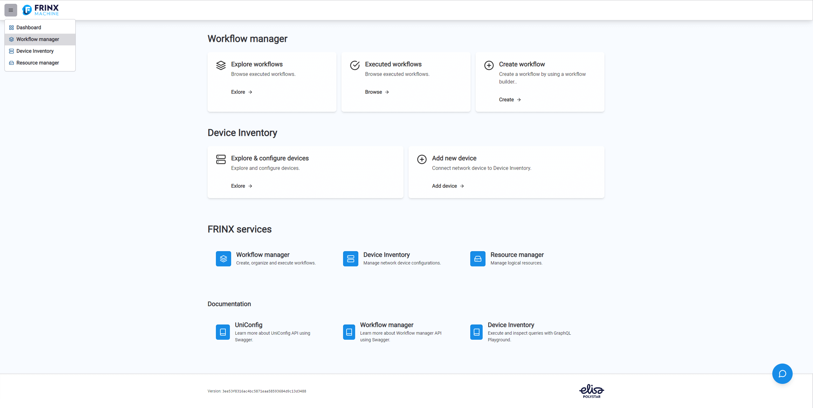
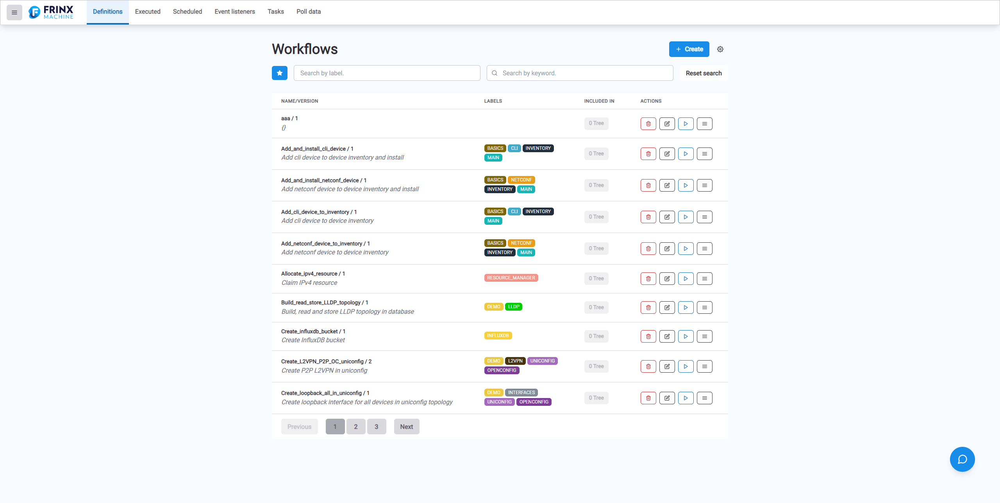
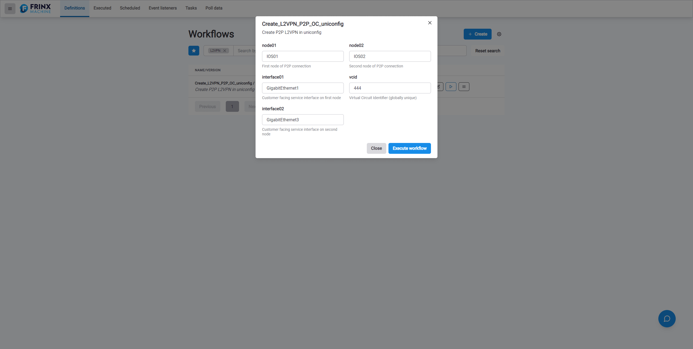
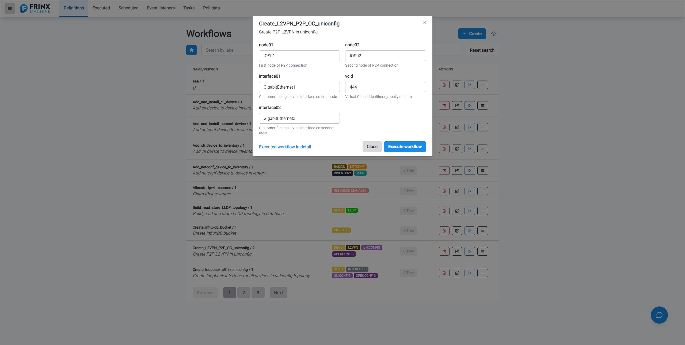
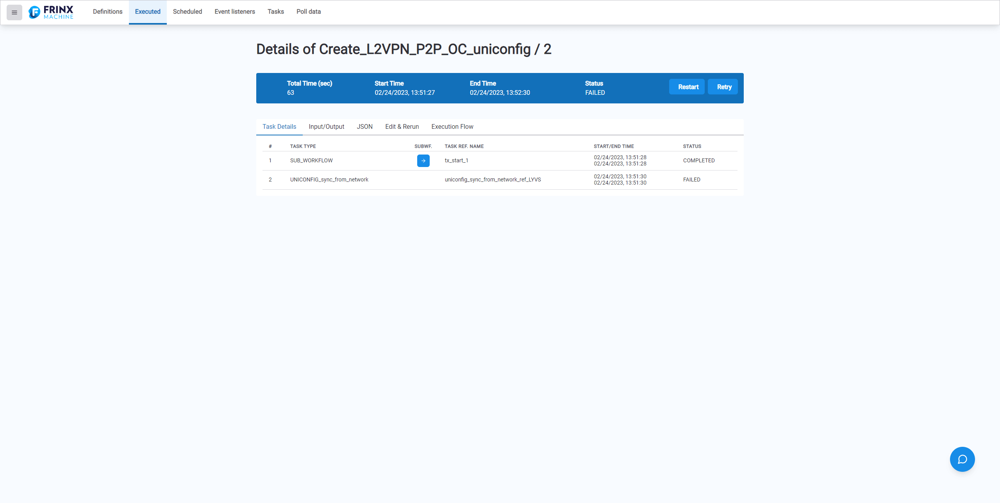
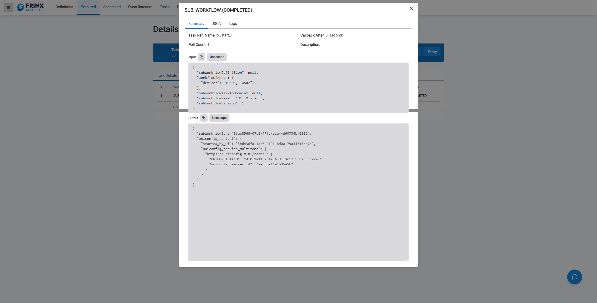

# Creating a Layer 2 VPN Point-to-Point Connection

This section details how to find and execute a prebuilt workflow that
creates a Layer 2 VPN Point-to-Point connection within Workflow Manager.

## Navigating through Workflow Manager

From the FRINX Machine **Dashboard** you can either
under section **Workflow Manager** click panel **Explore workflows**
or select the menu tab in
the upper left-hand corner and click the menu item **Workflow manager**.

On the page **Workflow definitions** fill in search box **Search workflow by name** the name of workflow: **Create_L2VPN_P2P_OC_uniconfig** and click **Search** button or scroll
down to find it in the list of prebuilt worflows.





Once you have located the workflow press the **Play** button located to the
right of the workflow, this will open the form with the title **Create_L2VPN_P2P_OC_uniconfig** - the workflow
configuration window.

## Configuring the Workflow

The configuring form for workflow **Create_L2VPN_P2P_OC_uniconfig** contains inputs pre-filled with following data:

```
node01: IOS01
node02: IOS02
interface01: GigabitEthernet1
interface02: GigabitEthernet3
vcid: 444
zone: http://{uniconfig_host}/rests
```



Once you have completed, press the **Execute workflow** button, to the left of the **Execute workflow** button will appear the link **Executed workflow in detail**. Click on this
link **Executed workflow in detail** to see the details of the executed workflow.



### Output of the Executed Workflow

You can see the detail of executed workflow after clicking link **Executed workflow in detail** immediatelly after executing of workflow.
If you do not use this opportunity you can navigate to **Executed workflows** page and to find executed workflow in the list of executed workflows.
(From the FRINX Machine **Dashboard** under section **Workflow Manager** click panel **Executed workflows**)

Select the workflow **Create_L2VPN_P2P_OC_uniconfig** to see the
output from all of the tasks completed within this workflow.



This following sections are available within the output window or on the page with details for executed workflow:

`Task Details`: This tab gives a detailed list of the individual tasks (ordered list of tasks - **task type**)
executed within the conductor, a log of each tasks **start time** and **end time**,
and a **status** of 'Completed' or 'Failed'. If task is a workflow (that is the parent workflow is calling another workflow)
we refer to is as **subworkflow** and there is an icon which navigate us to display a detailed list of the individual tasks from which consist the subworkflow. 

`Input/Output`: This tab contains **Workflow Input** which can be e.g. inputs for some API call and **Workflow Output** which can be e.g. result from
some API call.

`JSON`: This tab gives a detailed output in JSON format of all
executed tasks from which consist the workflow. Click the **Unescape** button
to make the output more user-friendly to read.

`Edit & Rerun`: This tab allows you to change the inputs of the previously executed workflow and execute the new instance by clicking of **Rerun** button.

`Execution Flow`: A structured map from the conductor lays out the
path of tasks executed from start to finish, any forks in the path are
also shown here.

`Task Details`: As we already explained this tab lists tasks from which the workflow consists - 
if you click on any of the tasks you will receive a pop-up window that
contains these tabs:

1. `Summary`: Provide a summary for executed task e.g. **Task Ref. Name**, **Description**, **Input**, **Output**...
2. `JSON`: JSON output of the completed task with that goes into greater detail. 
    about the task execution. Click the **Unescape** button to make the output more user-friendly to read.
3. `Logs`: Log status.

Pop-up window can be exited via clicking close-task-details icon.

### Sub-Workflows

Within the original Details of **Create_L2VPN_P2P_OC_uniconfig**
window you will see a sub-workflow.



This sub-workflow is an embedded task that makes a separate API call to
Slack to notify a pre-defined user group that the workflow has been
executed and whether it has succeeded or failed.
