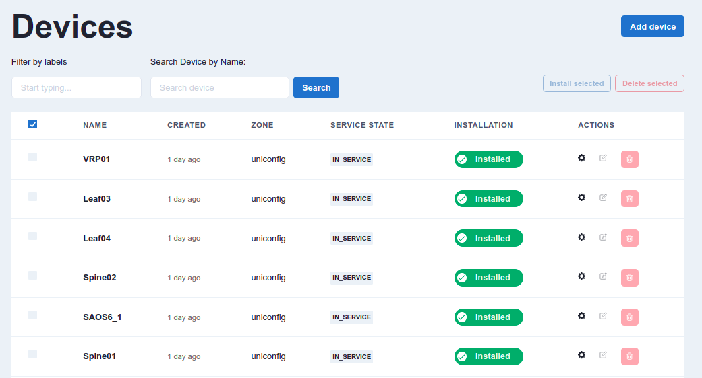

## Demo: Creating a loopback address on devices stored in the inventory

This workflow creates a loopback interface on all devices installed in the inventory or on all devices filtered by labels. Labels are markers that serve as a differentiator.

1) Check if all devices are installed. You can install them manually or by executing the **Install_all_from_inventory / 1** workflow.

2) On the main page, select **Explore workflows**. In the **Search by keyword** column, enter *loopback*. The **Create_loopback_all_in_uniconfig / 1** workflow will appear in the list. Under **Actions**, select the corresponding **Run** button for the workflow.

4) Under **loopback_id**, insert *77* and select **Execute**. Click on the link that appears.

5) All tasks were executed correctly and are completed.

On the results page, you will see five individual tasks:

### INVENTORY_get_all_devices_as_dynamic_fork_tasks
This workflow displays a list of all devices in the inventory or devices filtered by label. It parses the output in the correct format for the dynamic fork, which creates a number of tasks depending on the number of devices in the inventory. 

### SUB_WORKFLOW
This is the dynamic fork sub-workflow. In this case, it creates **UNICONFIG_write_structured_device_data** for every individual device in the inventory. You can then get detailed information on the progress and succession of every device.

### UNICONFIG_calculate_diff
This remote procedure call creates a difference between the actual UniConfig topology devices and the intended UniConfig topology nodes. 

### UNICONFIG_dryrun_commit
This remote procedure call resolves the difference between actual and intended device configurations. After all changes are applied, the cli-dryrun journal is read and a remote procedure call output is created and returned. 

### UNICONFIG_commit
This is the final task that actually commits the intended configuration to the devices.
