## Demo workflow UI basics

Workflow Builder is a graphical interface for Workflow Manager and is used to create, modify and manage workflows.

Workflows are groups of tasks and/or sub-workflows that can be used, for example, to install or delete devices, create loopback interfaces on devices, send messages and much more. You can create your own workflows or edit existing ones by adding or removing tasks or sub-workflows.

Every task and sub-workflow placed in a workflow has a unique reference alias, and no two workflows can share a name and version.

<!--
### Creating a new workflow

Now we will take a look at how to create a new workflow. The new workflow will be created from template workflow called **http_example_01 / 1** which can be found under explore workflows. If you dont wish to create workflow you can just execute this workflow in explore workflows.

1) The easiest way to create a new workflow is to click on **Create** button in the main page of FRINX Machine.


2) In the **Name** type the name of your workflow (please keep in mind that name of the workflow cannot be later changed). **Description** stands for additional info of the workflow - you can leave it blank. Once the workflow is created **Label** can help you find your workflow in **Explore workflows** faster but you can leave it blank as well. After inserting all data click on **Save changes**.

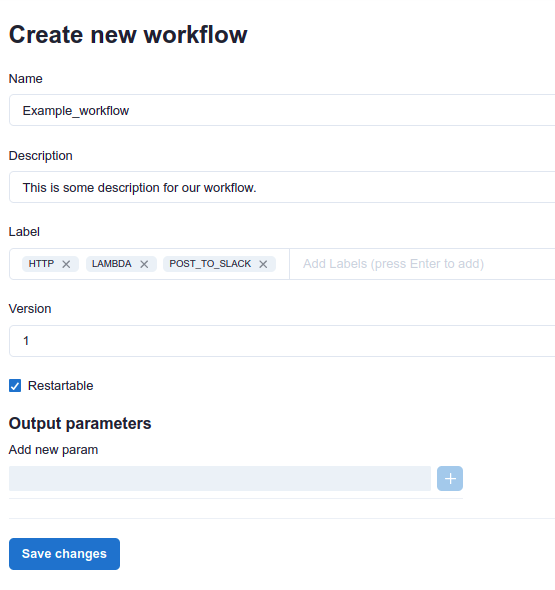

After saving changes you will be redirected to canvas. Here we will add tasks and subworkflow in our workflow.

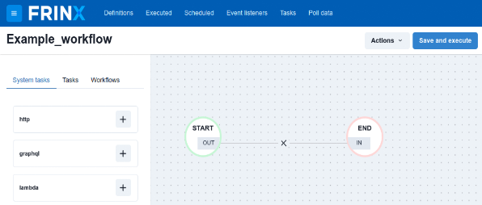

3) Click + on the **http** and **labmda** under **System tasks** and **Post_to_Slack** under **Workflows**. All tasks and subworkflows are added on same place in the canvas so you need to move them to actually see them. For connecting all parts of the workflow hower over OUT/IN where + sign will appear. Connect all parts in this way: START - http - lamda - Post_to_Slack - END. As you can see each task and workflow has its own set of characters after its name - these are reference aliases and work as unique identifier.

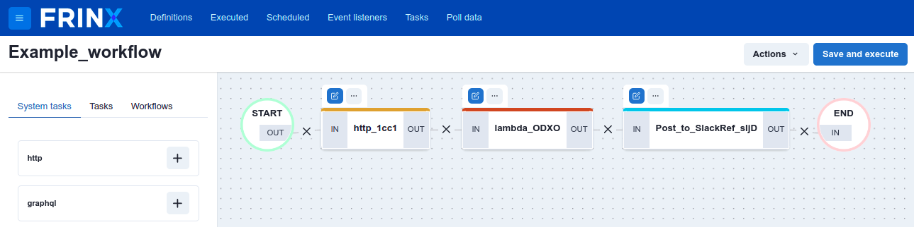

Above every task/workflow you can see 2 squares:

**Update:**


**Remove/Expand:**


4) **http - adjustment**. This task provides multiple methods for working with data from web pages. Click on update above http task. On the right side you can see General Settings and Input Parameters. Leave **General Setting** the way they are and click on **Input Parameters**. Insert:
```https://jsonplaceholder.typicode.com/todos/${workflow.input.selector}```
in the **URI** and leave other columns unchanged. This set of data will get data from JSON database based on selectors input. Now click on **Save Changes** under **Headers**.

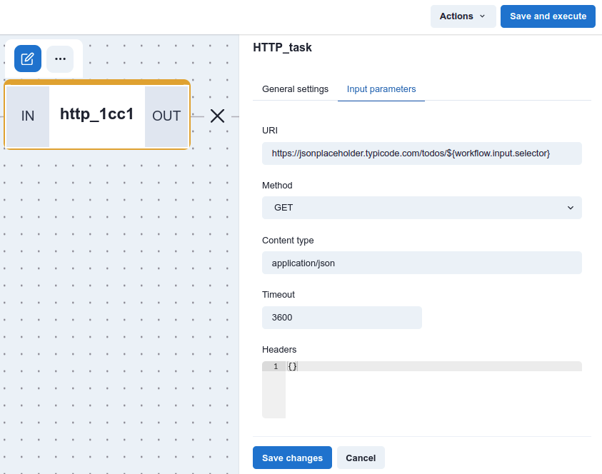

5) **lambda - adjustment**. Click on **Input parameters** and in the **Lambda value** insert:
```${NAME_OF_HTTP_TASK.output.body}```
In our example the name is **http_1cc1**. In the **Script expression** copy-paste: `return JSON.parse($.lambdaValue)`. Lambda takes data from previous http task and returns parsed data (message text) from JSON. Click on **Save Changes**.


6) **Post_to_Slack - adjustment**. Click on **Input parameters** and in the **slack_webhook_id** insert T03UXD8N58B/B03VCP8U99P/jermqzN9AkhNgXYIZkP0qLI0. In the **message_text** insert:
```${NAME_OF_LAMBDA_TASK.output.result.title}```
**Post_to_Slack** is a workflow that can be used standalone or as a part of other workflows. This workflow works as as sender of messages to specific destination in Slack. Click on **Save Changes**.

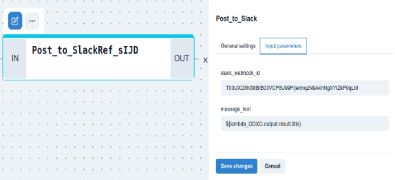

> **Info**: If you don´t see selector column just click on **Close** under the selector column, click on **Definitions** on the top left, insert the name of your workflow in the **Search by keyword**. and press run workflow under **Actions**.

7) Now the workflow is ready to be executed. Insert a number between 1 - 200  in the **selector** and press **Execute**. Click on **Continue to detail**.

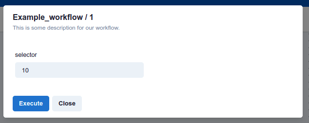

8) Now you can see that workflow was executed and every task was completed successfully.


The output (demo Latin JSON) of the workflow in the Slack:

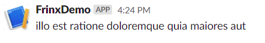

You can visit Slack directly via https://join.slack.com/t/frinx-community/shared_invite/zt-1esnmbq4l-ui9xLCS4zKGHUXZxz~PdrQ to see your own message. We recommend to use the browser version.
-->

## How to create a new custom workflow

Now we can create a new workflow from scratch:

1) Select **Create** on the main page of FRINX Machine.


2) Enter details for the new workflow. Under **Name**, enter a name for your workflow (note that this name cannot be changed later). The **Description** is for additional information about the workflow and can be left empty. **Label** can help you to find your workflow later under **Explore workflows**, but can also be left empty. Select **Save changes** when ready.

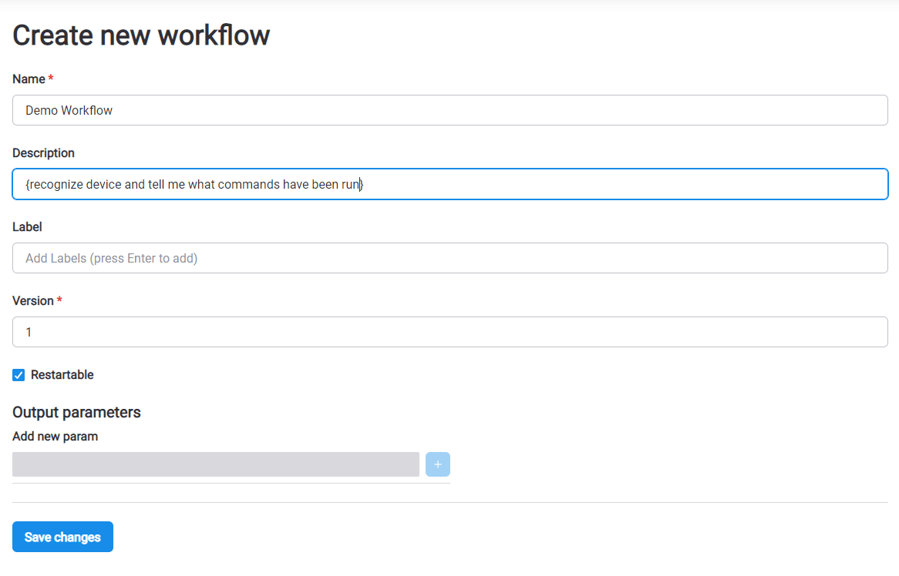

3) Under **System tasks**, click the **+** sign for the **lambda**, **decision** and **terminate** tasks. Under **Workflows**, click the **+** sign for **Device_identification**. Tasks and sub-workflows are added on top of each other on the canvas and can be dragged around. To connect all parts of the workflow, hover over **IN** and **OUT** where the **+** sign appears.
Connect the parts as follows: **START** - **lambda** - **decision** - **(other)** to **Device_identification** and **default** to **terminate**. Each task and workflow has a reference alias after its name, which works as unique a identifier.

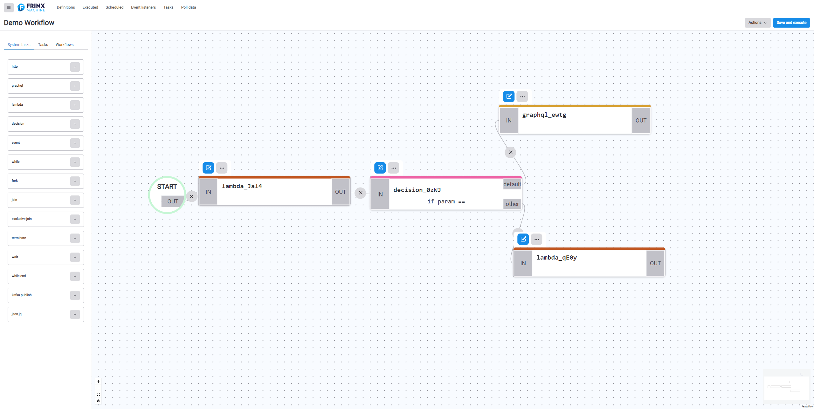

Above every task or workflow there are two icons:

**Update:**


**Remove/Expand:**


4) **lambda** task: Makes a decision on which status to choose based on the embedded port. In this example we will only consider ports 10000–10004, and others are ignored. The lambda task lets you enter a small code (lambda - function without name) into the workflow builder.

In this case, if the specified port is both greater than or equal to 10000 and less than 10005, the status chosen is *keep working*. Otherwise, the status is *end*. This status is the output of the lambda and the input for the next task or sub-workflow.

> Sub-workflows are similar to classic workflows, but inside of another workflow. The workflow that we are creating can also be used as a building block for another workflow, becoming a sub-workflow itself. In this manner, we can layer and reuse previously created workflows.

In the **Input parameters** tab and the **Lambda value** field, enter: `${workflow.input.port}`. This indicates that the task should work with what was entered in the **port** field in the input of this workflow. (We will cover this later, in section 7.)

In the **Script expression** field, enter a small function which we described above.
```
if ($.lambdaValue >= 10000 && $.lambdaValue < 10005) { 
  return {value: 'other'}
} else { 
  return {value: false}
}
```


5) **decision** task: Makes a different kind of decision from the lambda task discussed above. This task works like a switch on a track, sending the train one way or another. The data needed to make a decision is supplied by the lambda task.

In the **Input parameters** tab, delete the default parameter **foo**. For the **param** parameter, enter `${lambda_IkSu.output.result.value}`. (Note that *IkSu* is an automatically generated reference alias that you must edit to match the one generated for you.) What `${lambda_IkSu.output.result.value}` means is to take the value from *lambda_xyzq* which is in the output, find the result in the output and the value in it.

If the input value for **decision** is **other**, it directs the flow towards **device_identification**. If the input value is false, it directs the flow towards **terminate**. This corresponds to the way we connected the cells in the workflow builder.


6) **terminated** task:

In the **Input parameters** tab, enter *COMPLETED* (or *FAILED*, at your discretion) in the **Termination status** field. You can enter whatever message you want in the **Expected workflow output** field (for example, *Device not supported.*)

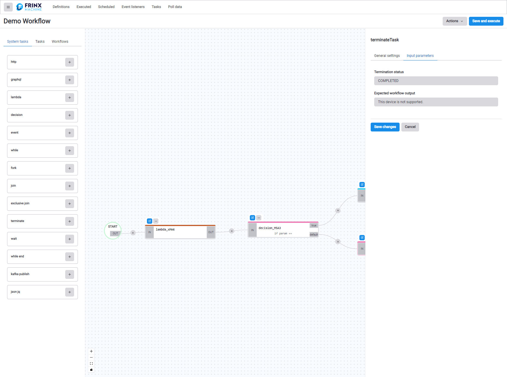

7) **Device_identification** task:

In the **Input parameters** tab under **management_ip**, enter *sample-topology*. This is the name of the topology in this installation, whereas in production you would use a real name. For **port**, enter `${workflow.input.port}`. If you enter a port number manually, the workflow will not ask for one when started (the same goes for **management_ip** and other fields). However, we want the user to be able to select a port they are interested in, as we did with the **lambda** task in section 4.

**username** and **password**: For this demo, we assume that the following login credentials are used on all devices: `username: frinx` and `password: frinx`

As above, if we enter the username and password directly, the workflow will not ask for credentials at startup.

When working with devices using different login credentials, you need to be able to change or enter them at startup. This can be achieved in the same way as with the **port** parameter:

username: `${workflow.input.username}`

password: `${workflow.input.password}`

Like we mentioned above, in this demo workflow we will assume that login credentials are the same everywhere.

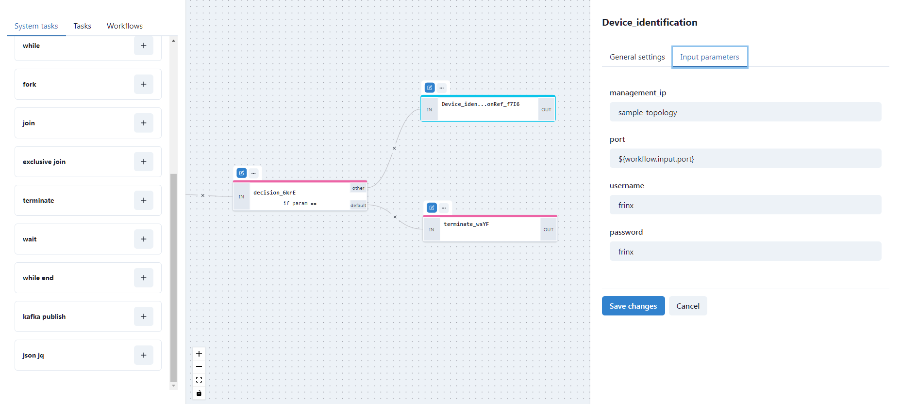

8) Now we can add more tasks. In the left column under **System tasks**, we can add another **lambda**. In the **Workflows** section, you can find **Read_journal_cli_device**. Let us place them next to each other after **Device_identification** and concatenate them:


9) Second **lambda**: Enter `${Device_identificationRef_f7I6.output}` as the lambda value, meaning "take the output from the previous **Device_identification** task and use that".

Enter the following into the body:
```
if ($.lambdaValue.sw == 'saos') { 
  var data = $.lambdaValue.sw.toUpperCase()+$.lambdaValue.sw_version+'_1'
  return data
} else { 
  return { value: false }
}
```

A translation of what is happening here: "If the identified device is of the type *saos*, then extract the name from the output message of the previous task, change the letters to uppercase, extract the version from the output message of the previous task, glue them together and add `_1` (because that is how devices are named in this demo topology".


10) **Read_journal_cli_device**: In the **Input parameters** tab under **device_id**, enter `${lambda_ZW66.output.result}`.

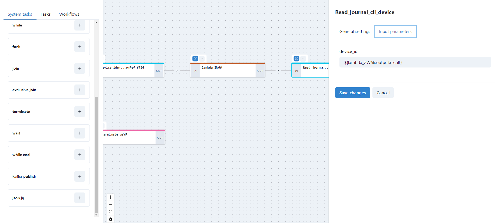

11) The output from **Read_journal_cli_device** is concatenated with *END*, as is the output from **terminated**. Thus we have closed our custom workflow.


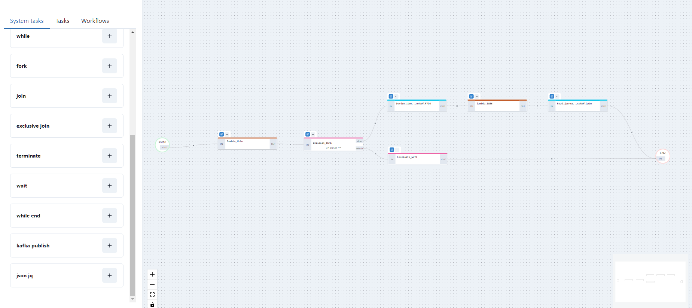

12) Save and run your workflow.

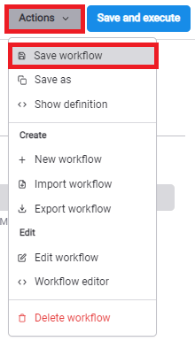


Next steps:

Finding your new workflow and running it with multiple different inputs such as 10 000, 10 002, 10 012, etc.

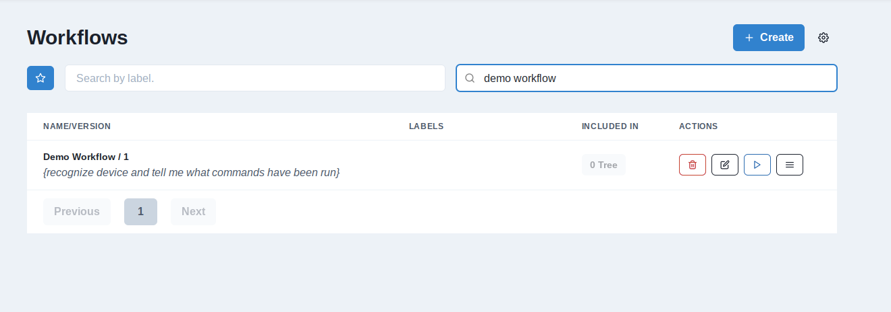

For different ports, you can see different devices with other run commands in memory.


