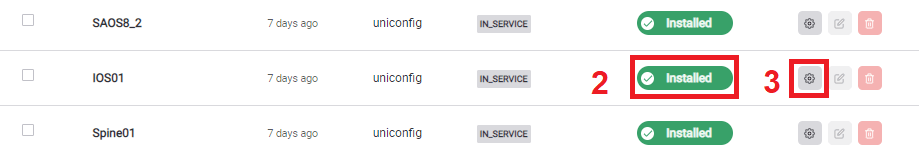
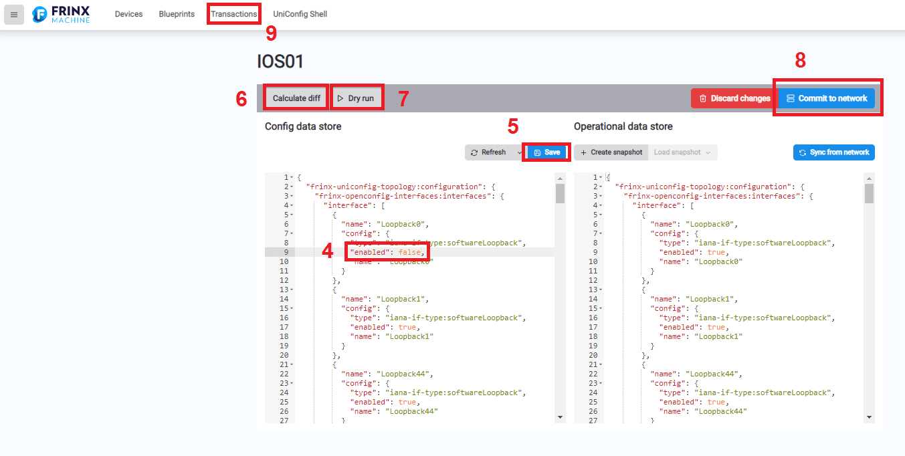

## Demo Config Manager UI

Using the Demo Config Manager:

1) On the FRINX Machine main page, select **Explore & configure devices**.
2) Make sure that the device you want to configure is installed. If not, select **Install** first.
3) For this demo, we use the **IOS01** device. Locate the device in the list and select the corresponding gear icon on the right. (If you see a message saying **Transaction expired**, select **Refresh**).

4) For the **Loopback0** interface, change the **enabled** status to *false*.
5) Select **Save** to save your changes.
6) To review your changes, select **Calculate diff**.
7) To view the set of commands used for the change, select **Dry run**.
8) To apply changes to the device, select **Commit to network**. You can also see the changes in the Operational data store.

To revert changes made to the device configuration:

9) Select **Transactions**.
10) Select the **Revert** icon for your transaction.
11) Select **Revert changes**.
