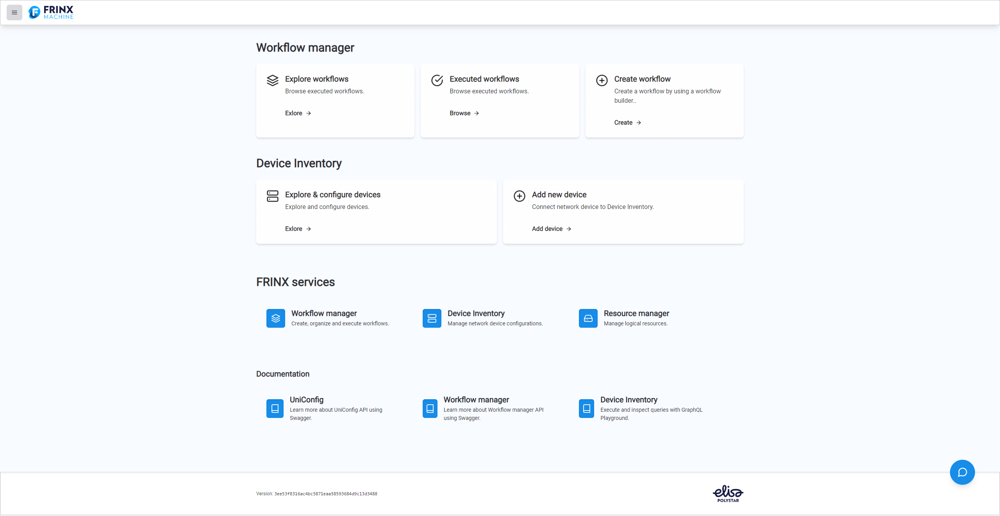

# Demo Use Cases

There are several ways of installing device/devices in FRINX Machine. You
can run a pre-packaged workflow to install a network device. You can
add devices to Device inventory and install devices from there - you can install a single device
or you can install several selected devices simultaneously.

To start installing devices open up FRINX Machine UI.

## Open FRINX Machine UI

Note: you can use our demo at https://demo.frinx.io 

Open your browser and go to `[host_ip]` if installed locally go to
`https://localhost`. This is the GUI (UniConfig UI) for managing all of
your devices. You should see a screen like this:

[](fm2.0_dashboard.png)

!!!
For Demo Use Cases, please download repository [fm-workflows](https://github.com/FRINXio/fm-workflows)

Make sure FRINX-machine is running, navigate to

```
 cd fm-workflows
```

and execute

```
 ./startup.sh
```

Imported workflows and tasks will appear in FRINX-Machine UI,
immediately after the import finishes.
!!!

In the following articles, you will learn how to install a device to
UniConfig and how to install all devices from Device inventory to UniConfig. 
Device inventory is automatically filled with sample devices for you when you start FRINX Machine with [fm-workflows](https://github.com/FRINXio/fm-workflows).

Later we will learn how to create a loopback address on the devices
that we previously stored in Device inventory and how to read the journals
of these devices.

Then we will take a look at how to obtain data from the
devices that you have in the network.

Lastly  we will take a look at how you can add devices to your inventory
manually. This might be useful if you want to play around with the
FRINX Machine a bit and try to install your own networking devices.
