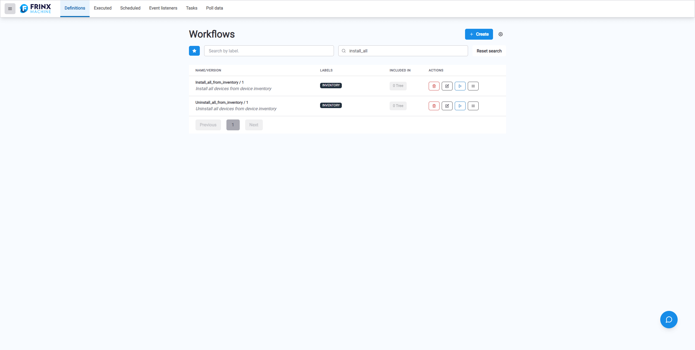
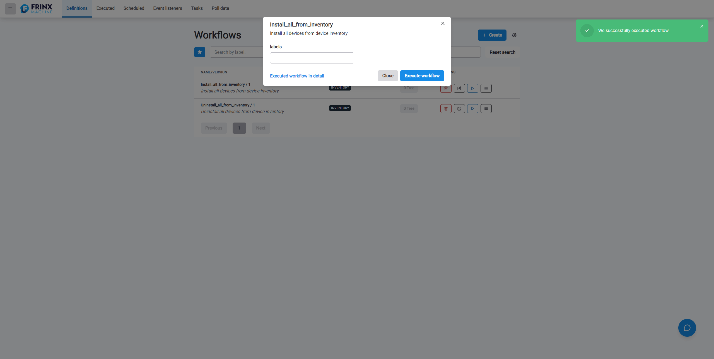

# Install all devices from inventory

When **Device Inventory** contains a lot of devices, it can be tedious to install them one by one.
To make things easier, there is a workflow which allows to install all devices present in the inventory.

Follow these instructions to use the workflow:

At the FRINX Machine **Dashboard** under **Workflow Manage** section click on **Explore workflows** panel. The page titled **Workflow definitions** opens.
Use **Search workflow by name** input box and fill in **Install_all_from_inventory** and click **Search** button.

The list of workflows narrows down to two items - workflows Install_all_from_inventory and Uninstall_all_from_inventory. Click blue `Execute` button (blue play icon) located on the row next to the workflow. The form titled with the name of workflow **Install_all_from_inventory** appears and optionally you can fill in the input parameter **labels** which allows to select a subset of devices to install. (You can specify a device label while adding devices to Device Inventory.) We want to install all uninstalled devices - do not fill in the input **labels** and click **Execute workflow** button. As a result to the left of the **Execute workflow** button will appear the link **Executed workflow in detail**. 

After you click the link **Executed workflow in detail** you will be navigated to a page with details of the executed workflow - it displays individual tasks for this workflow, it is possible to click whatever task and examine its inputs and outputs, whether it was successful or unsuccessful etc. 

Note: Similarily you can use workflow **Uninstall_all_from_inventory** to uninstall all devices at once.
