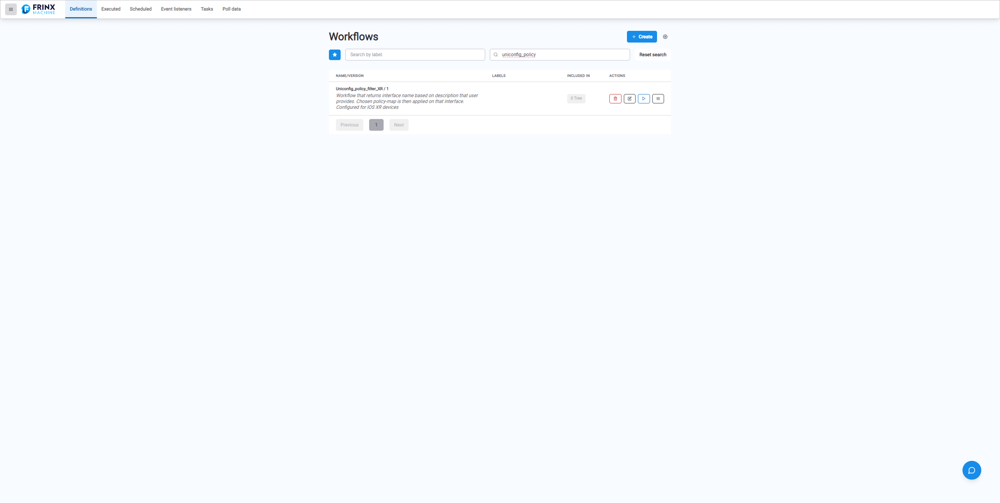
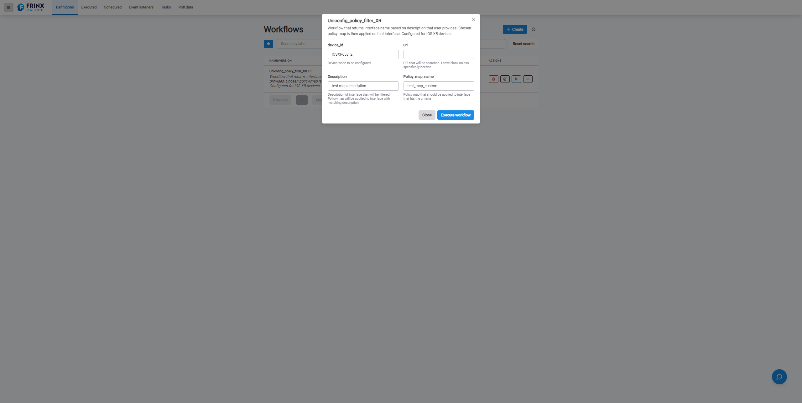
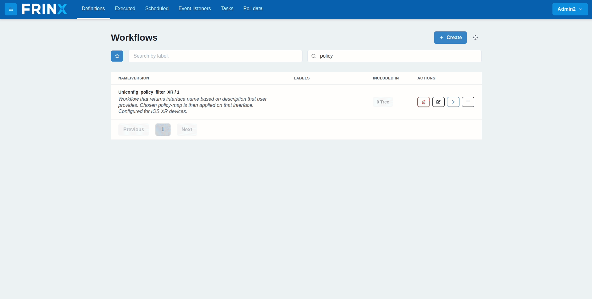

# Policy filter XR

This workflow uses UniConfig to showcase the filtering capabilities of some of
our system tasks. It filters through the interfaces of the device, returns the
name of the interface based on its user-provided description and applies the
chosen policy on that interface.

**Supported device**: ios-xr

This workflow can be tested on the following devices: 
**ISOXR653_1, ISOXR653_2, ISOXR663_1**

When inserting the data into the input, we recommend using 
`/Cisco-IOS-XR-ifmgr-cfg:interface-configurations` in the URI.

For testing purposes, you can use the following:
- Description: `FrinxDescription`
- Policy_map_name: `Custom_policy_map`.

*Before running this workflow, make sure that the testing device is already
installed.*

!!!danger
Policy creation is not part of this workflow. The chosen policy must exist on
the device before this workflow is run.
!!!

## Searching the workflow



## Sync & Replace

For all workflows that interact with devices, we consider it best practice to
start with the tasks **Sync from network** and **Replace config with oper**.
This ensures that the internal databases of FRINX Machine are in sync with the
latest configuration of the device. The input for these tasks is simply the name
of the node (device).

## Read device data

The next part is reading the device config. In the
**UNICONFIG_read_structured_device_data** task, you can specify which part of
the config to read with the URI. In this case, we leave the **URI** input field
empty.

## jsonJQ filter

jsonJQ is one of the system tasks that is useful for filtering data. We use the
following query expression:

```
.["frinx-uniconfig-topology:configuration"]["Cisco-IOS-XR-ifmgr-cfg:interface-configurations"] . "interface-configuration" | select(. != null) | .[] | select(.description == "${workflow.input.Description}") | {interface: ."interface-name"}
```

We search through the whole config, and under the
**Cisco-IOS-XR-ifmgr-cfg:interface-configurations** model we find the interface
with a description given by the user. The task returns the name of that
interface.

## Lambda

Lambda is a generic task that can process any JS code. In this case, we use it
to parse the output of the jsonJQ task. jsonJQ returns the name of the interface
in a standard decoded format, for example `TenGigE0/0/0/0`. However, as we will
be using that interface in the URI, it must be encoded. You can do this with a
simple JS script:

```
{return(encodeURIComponent($.lambdaValue));}
```

As an example, we take the interface name `TenGigE0/0/0/0` and encode it to
`TenGigE0%2F0%2F0%2F0`.

## Write & commit

Lastly, we use the output of the lambda task for the configuration. We apply a
policy to the interface filtered based on its description.

## Example input



## Execution flow


## Run the workflow

- device_id: `IOSXR653_1`
- Policy_map_name: `test_map_custom`


