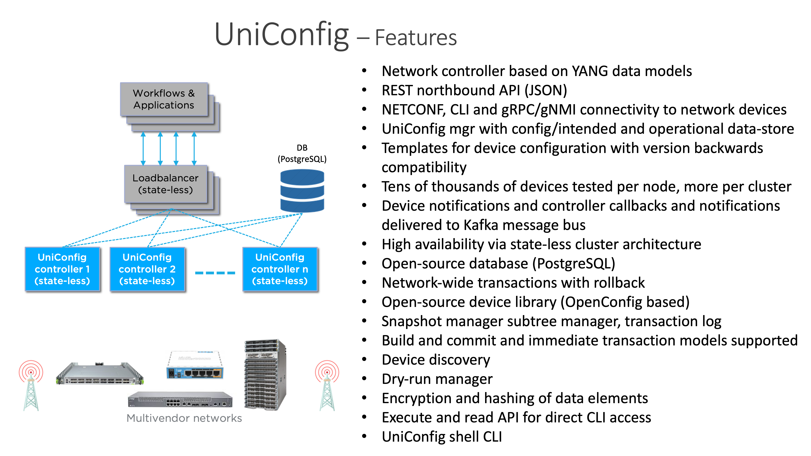

# FRINX UniConfig introduction

The purpose of UniConfig is to manage the configuration state and retrieve the operational state of physical and virtual networking devices.

UniConfig provides a single API for many different devices in the network. It can be run as an application on bare metal in a VM or a container, stand-alone, or as part of our automation solution, FRINX Machine. UniConfig has a built-in data store that can be run in-memory or with an external database.



## UniConfig key features

-   Retrieves and stores current startup and running configuration from mounted network devices
-   Pushes configuration data to devices via NETCONF, CLI or gNMI
-   Allows for diffs to be built between actual and intended execution of atomic configuration changes
-   Retrieves operational data from devices via NETCONF, CLI or gNMI
-   Provides subtree filtering capabilities in NETCONF
-   Transactions can be managed on one or multiple devices
-   Offers the ability to do a dry-commit to evaluate the functionality of a configuration before it is executed on devices
-   Provides snapshots of previous configurations for rollback
-   Translates between CLI, native model and standard data models (i.e., OpenConfig) via our open-source [device library](https://github.com/FRINXio/cli-units)
-   A "Lazy CLI" feature to suspend and resume connections without having to maintain keepalives
-   Can read and store proprietary data models from network devices that follow the YANG data model
-   Data export and import via blacklist and whitelist functions
-   Provides templates for device configuration
-   Supports PostgreSQL as an external database
-   Support for YANG 1.1 and Tail-f actions
-   Subscribe to NETCONF notifications via web sockets
-   Subscribe to gNMI notifications 
-   Support for gNOI
-   Support for 3-phase commit by using NETCONF confirmed-commit
-   High availability
-   The ability to log specific devices as needed
-   Can execute commands in parallel on multiple devices
-   Choose between NETCONF or RESTCONF to connect to devices
-   The UniConfig client allows for simple, full-service access to UniConfig features
-   Python microservices are used to integrate with the FRINX machine
-   The UniConfig UI allows users to interact with the network controller using a web-based user interface

UniConfig allows users to communicate with their network infrastructure in four different ways:

*  **Execute & Read API** - Unstructured data via SSH and Telnet
*  **OpenConfig API** – Translation provided by our open source device library
*  **UniConfig Native API** – Direct access to vendor specific YANG data models that are native to the connected devices as well as UniConfig functions (diff, commit, snapshots, etc.)
*  **UniConfig Native CLI API** – Programmatic access to the CLI without the need for translation units (experimental)

**Execute & Read capable API:** Like Ansible, TCL Scripting or similar products, strings can be passed and received through SSH or Telnet via REST API. UniConfig provides the authentication and transportation of data without interpreting it.

**OpenConfig API:** An API that is translated into device-specific CLI or YANG data models. The installation of "translation units" on devices is required. FRINX provides an open-source library of devices from a variety of network vendors. The open-source framework allows anyone to contribute or consume the contents of the expanding list of supported network devices.

**UniConfig Native API:** Vendor-specific YANG data models are absorbed by UniConfig to allow configuration of mounted devices. UniConfig maps vendor-specific "native" models into it's data store to provide stateful configuration capabilities to applications and users.

**UniConfig Native CLI API:** Allows for programmatic interaction with a device's CLI via the API and without the use of 'translation units'. Only a schema file is needed. (This option is currently experimental. Contact FRINX for more information.)


## UniConfig in a Docker container

### Download and activate FRINX UniConfig

To download, activate and start UniConfig in a Docker container:

```
docker pull frinx/uniconfig:5.0.7
docker pull postgres:12.2
docker run -it -d --hostname postgres --name postgres -p 26257:5432 -e POSTGRES_PASSWORD=unipass -e POSTGRES_USER=uniremote -e POSTGRES_DB=uniconfig postgres:12.2
docker run -it --hostname uniconfig --name uniconfig -p 8181:8181 --network host frinx/uniconfig:5.0.7
```

### Stop the container

To stop the container:

```
docker stop uniconfig
```

## UniConfig as a Java process in a VM or on a host

### Download FRINX UniConfig

To download UniConfig, please contact: marketing@elisapolystar.com

By downloading, you accept the [FRINX software agreement](https://frinx.io/eula).

### Activate FRINX UniConfig

To activate UniConfig, unzip the file, open the directory and run the following command:

```
./run_uniconfig.sh
```

!!!
For more information on the different arguments, run the startup script with the `-h` flag
!!!

## OpenAPI

UniConfig distributions contain a **.yaml** file that generates a list of all usable RPCs and their examples. You can view it locally or on our hosted version that always shows the latest OpenAPI version.

The file can be found here:

```
/uniconfig-x.x.x/openapi
```

See [OpenAPI](https://docs.frinx.io/frinx-uniconfig/user-guide/operational-procedures/openapi/) for more information.

