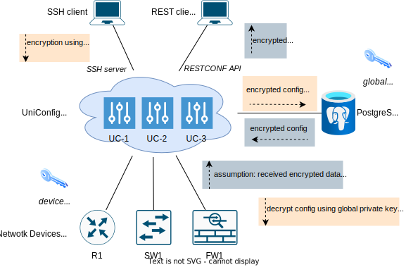
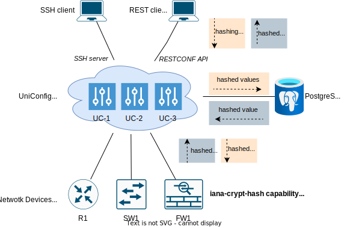

# Data Security Models

UniConfig supports encryption and hashing of leaf/leaf-list values via SSH and
RESTCONF API. The following sections describe the supported security models in
depth.

## Data encryption

UniConfig uses asymmetric encryption to ensure confidentiality of selected leaf
and leaf-list values. Currently only RSA ciphers are supported, both global
UniConfig and device-level key-pairs. Encryption is supported for the
`uniconfig`, `unistore`, and `templates` topologies.

### Global-device encryption architecture

Both the UniConfig and device sides use PKI for data encryption:

* **UniConfig side**: All selected leaves are encrypted using a global public key
  when the data enters UniConfig via RESTCONF API or UniConfig SSH shell API.
  Afterwards, the data is stored in the database in encrypted format. UniConfig
  also has access to a private key used internally for decrypting data that is
  already encrypted.
* **Device side**: The device exposes a public key, which UniConfig uses to
  re-encrypt data before it is sent to the device (**commit** and
  **checked-commit** operations). However, the device does not expose its
  private key, and UniConfig is therefore not able to detect changes to
  encrypted data (updated leaves/leaf-lists) but can only detect if data was
  removed or created. Because of this, UniConfig assumes that encrypted data
  read from the device was encrypted using the same public key as that used by
  UniConfig.

The figure below depicts data transformations performed on UniConfig
interfaces:



### Global-only encryption architecture

In contrast to the global-device encryption architecture, this model uses only
a global key-pair to encrypt data. Devices contain only plaintext data.

* A **public key** is used to encrypt data received via RESTCONF, UniConfig shell
  API and when syncing configurations from device to UniConfig transaction
  (**sync-from-network** operation).
* A **private key** is used to decrypt encrypted data before forwarding this
  configuration to a device (**commit** and **checked-commit** operations).

The figure below depicts data transformations performed on UniConfig interfaces:


!!!
Reading operational data directly from the device (GET under `yang-ext:mount`)
shows data in unencrypted format. Application gateways should restrict access to
mountpoints for such use cases.
!!!

### YANG support

Leaves and leaf-lists whose values should be encrypted must be marked using a
YANG extension with no parameters. Currently, only leaves of the `string` type
are supported (direct/indirect with custom type definitions), as encrypted
values are base64 encoded. Also, be aware that type constraints must accept
encrypted values.

**Example** - YANG module that defines one `encrypt` extension:

```yang frinx-encrypt@2021-12-15
module frinx-encrypt {
    yang-version 1.1;
    namespace urn:ietf:params:xml:ns:yang:frinx-encrypt;
    prefix frinx-encrypt;

    revision 2021-12-15 {
        description "Initial revision";
    }

    extension encrypt {
    }
}
```

Using the extension in the `config` module:

```yang config@2021-12-15
module config {
    yang-version 1.1;
    namespace urn:ietf:params:xml:ns:yang:config;
    prefix config;

    import frinx-encrypt {
        prefix fe;
        revision-date 2021-12-15;
    }

    revision 2021-12-15 {
        description "Initial revision";
    }

    typedef secret-string {
        type string;
    }

    container config {
        list properties {
            key property-id;

            leaf property-id {
                type string;
            }
            leaf enabled {
                type boolean;
            }
            leaf value {
                type string;
                fe:encrypt;
            }
        }

        container routing {
            container eigrp {
                leaf process-id {
                    type uint16;
                }
                leaf password {
                    type secret-string;
                    fe:encrypt;
                }
            }

            leaf-list neighbor-key {
                type leafref {
                    path "../../properties/value";
                }
                fe:encrypt;
            }
        }
    }
}
```

Oftentimes it is not possible to modify existing YANG files, as they are already
deployed on a device (for example, a device running with a NETCONF server). In
this case, you can still mark which leaves should be encrypted using an
additional YANG module that contains deviations.

**Example**

```yang encrypted-paths@2019-11-10
module encrypted-paths {
    yang-version 1.1;
    namespace urn:ietf:params:xml:ns:yang:encrypted-paths;
    prefix ep;

    import snmp {
        prefix snmp;
        revision-date 2019-11-10;
    }
    import frinx-encrypt {
        prefix fe;
        revision-date 2021-12-15;
    }

    revision 2019-11-10 {
        description "Initial revision";
    }

    deviation "/snmp:snmp/snmp:usm/snmp:remote/snmp:user/snmp:auth/snmp:protocol/snmp:md5/snmp:md5/snmp:key-type/snmp:password/snmp:password" {
        deviate add {
            fe:encrypt;
        }
    }

    deviation "/snmp:snmp/snmp:usm/snmp:remote/snmp:user/snmp:auth/snmp:protocol/snmp:md5/snmp:md5/snmp:key-type/snmp:key/snmp:key" {
        deviate add {
            fe:encrypt;
        }
    }

    deviation "/snmp:snmp/snmp:usm/snmp:remote/snmp:user/snmp:auth/snmp:protocol/snmp:sha/snmp:sha/snmp:key-type/snmp:password/snmp:password" {
        deviate add {
            fe:encrypt;
        }
    }

    deviation "/snmp:snmp/snmp:usm/snmp:remote/snmp:user/snmp:auth/snmp:protocol/snmp:sha/snmp:sha/snmp:key-type/snmp:key/snmp:key" {
        deviate add {
            fe:encrypt;
        }
    }
}
```

Afterwards, there are two options to couple this module with modules from the
device (NETCONF):

1. Explicitly specifying the side-loaded module in the **install-node** request
   using the `netconf-node-topology:yang-module-capabilities` settings. See
   **Device installation** section below for more information.
2. Automatically detecting the side-loaded module - UniConfig looks for the
   specific capability on the NETCONF server, inherits its revision and looks
   for a side-loaded module with a specific name and inherited revision (see
   **Configuration** section below). This option is preferred if the deployment
   contains multiple versions of devices and the list of encrypted paths is
   different on each version.

### Configuration

The global RSA key-pair is stored inside PEM-encoded files in the `rsa`
directory under UniConfig root. The private key must be named `encrypt_key` and
the public key `encrypt_key.pub`. If these files are not provided, UniConfig
automatically generates its own key-pair with a length of 2048 bits. All
UniConfig instances in the cluster must use the same key-pair.

Encryption settings are stored in the **config/application.properties** file.

**Example:**

```properties
crypto.encrypt-enabled=true
crypto.encrypt-extension-id=frinx-encrypt:encrypt
crypto.netconf-reference-module-name=system
crypto.netconf-encrypted-paths-module-name=encrypted-paths
```

* `encrypt-enabled` - If `false`, encryption is disabled regardless of other
  settings or **install-node** parameters. If `true`, encryption is enabled. The
  default value is `true`.
* `encrypt-extension-id` - If not specified, encryption is disabled regardless
  of other settings or **install-node** parameters. Uses the format
  `[module-name]:[extension-name]`, which specifies the extension used to mark
  encrypted leaves/leaf-lists in YANG modules. The corresponding YANG module
  containing this extension can be part of device/unistore YANG schemas or,
  alternatively, can be side-loaded during installation of the NETCONF device as
  an imported module from the `default` repository.
* `netconf-reference-module` - Name of the module that the NETCONF client looks
  for during the mounting process. If UniConfig finds a module with this name in
  the list of received capabilities, it uses its revision in the lookup process
  for the correct YANG module with encrypted paths (using deviations).
* `netconf-encrypted-paths-module-name` - Name of the module which contains
  deviations with paths to encrypted leaves/leaf-lists. There can be multiple
  revisions of this file prepared in the `default` NETCONF repository. The
  NETCONF client in UniConfig chooses the correct revision based on the
  `netconf-reference-module-name` setting. Together,
  `netconf-reference-module-name` and `netconf-encrypted-paths-module-name` can
  be used to autoload encrypted paths for different versions of devices.

!!!
If the `default` YANG repository contains a module with `encrypted-paths` and
without defined YANG revision, and the device does not already provide
encryption capability, the `encrypted-paths` module is used as last resort during
device installation (`netconfReferenceModuleName` and matching of revisions are
ignored).
!!!

### Change encryption status

!!! For this RPC to function correctly, it is necessary to enable notifications
using the following parameter:

```settings
notifications.enabled=true
```
!!!

Encryption can be enabled or disabled using the following parameter:

```settings
crypto.encrypt-enabled=true
```

The value of this parameter can be changed with the **change-encryption-status**
RPC request.

The following request can be used to enable encryption:

```bash RPC request: change-encryption-status to enable
curl --location --request POST 'http://127.0.0.1:8181/rests/operations/crypto:change-encryption-status' \
--header 'Content-Type: application/json' \
--header 'Accept: application/json' \
--data-raw '{
    "input": {
        "encryption-enabled": true
    }
}'
```
After this command is called, all UniConfig instances will set this parameter
using the notification service to the value sent via RPC (in this case, `true`).

Correspondingly, the following request can be used to disable encryption:

```bash RPC request: change-encryption-status to disable
curl --location --request POST 'http://127.0.0.1:8181/rests/operations/crypto:change-encryption-status' \
--header 'Content-Type: application/json' \
--header 'Accept: application/json' \
--data-raw '{
    "input": {
        "encryption-enabled": false
    }
}'
```

The following request is used to check the current encryption status:

```bash POST request: get encryption-enabled-actual-status
 curl --location --request POST 'http://127.0.0.1:8181/rests/operations/crypto:change-encryption-status' \
--header 'Content-Type: application/json' \
--header 'Accept: application/json'
```

```json POST response
{
  "output": {
    "encryption-enabled-actual-status": true
  }
}
```
To check the functionality of this RPC after calling the **install-device RPC**,
you can request the password for the node:
- If encryption is enabled, the password is returned encrypted.
- If encryption is disabled, the password is returned as plaintext.

```bash GET request: get netconf-node-topology:password with enabled encryption
curl --location --request GET 'http://127.0.0.1:8181/rests/data/network-topology:network-topology/topology=topology-netconf/node=dev01/netconf-node-topology:password' \
--header 'Accept: application/json'
```

```json GET response
{
    "netconf-node-topology:password": "rsa_gFXLXIxbeA9Vt8p0+JlprK1YUznBjk9DHRVlZ6Bm2nP0Fi/jUjsAUsGU814QyAZhXBiK6MY7ul75bE1EEI4uj0PlWT4xFYTXaKaMwgdHSCOnE/I6CGakuzGVGgzztKcSA/AsP8/bgXO0Rellw/S6z9U6h8blIG4Ff73GJOr53slWqoqMvAaXgSQtSbYB0EsPey1YqcukKuZnufJAazbHNHuxU1TFxcN/Cn1vTUEr8IATCAohfO7k5MOn0Ds/gYKt63RBO6000gcSP5PS9LRWhucSdLYc4b2+3soz0VXUCGEMPNSrmDXyWKUftI1S3qLfHthHoGEN1YXKGll5ccxW9g=="
}
```

### Change encryption keys (private and public)

If it is necessary to change the encryption keys, use the
**change-encryption-keys RPC**.

The process of changing encryption keys requires rebooting one of the UniConfig
instances or enabling a new instance of UniConfig after calling the
**change-encryption-keys RPC**. Rotation of encrypted data in the database for
new encryption keys occurs if UniConfig is started after the
**change-encryption-keys RPC** is executed. During key rotation, if some data in
the database cannot be decrypted with the old key, those data will remain
unchanged. 

```bash RPC request: change-encryption-keys to new public and private keys
curl --location --request POST 'http://127.0.0.1:8181/rests/operations/crypto:change-encryption-status' \
--header 'Content-Type: application/json' \
--header 'Accept: application/json' \
--data-raw '{
    "input": {
        "new-encryption-public-key": "MIIBIjANBgkqhkiG9w0BAQEFAAOCAQ8AMIIBCgKCAQEAypJ4HB0kpxTvvEtOlT1jmtqTU2iY3m6VRx+xRJfP9UuGMT0qBC8/D5a/MRgTeSyJtZbmn8Jvu5ZNefDcHOgtv0yZ+BqRdew5sXd7xdzFAN0dgaBdvEAT9HXn+dKI9HGh7CMjH3JV1eNRwPLu5u3CbYiIrV3UM/2ogiZwsQsBHZcprbGlpdRa6yy+AXdB61BEGvdBQDvT0ND0q36sQkpG9qQokDxk77HyFx6b3YS8O+LXeb+Aka71sF/voTEhbMiUIF6jaWosoWYse4B0hZ2P0i+3CPtScgCA3n9XCcGXKj6g9wY/tEywsCfnS03KRTpVhpIjZb/xMKEcMOVl2BFA1wIDAQAB",
        "new-decryption-private-key":"MIIEowIBAAKCAQEAypJ4HB0kpxTvvEtOlT1jmtqTU2iY3m6VRx+xRJfP9UuGMT0qBC8/D5a/MRgTeSyJtZbmn8Jvu5ZNefDcHOgtv0yZ+BqRdew5sXd7xdzFAN0dgaBdvEAT9HXn+dKI9HGh7CMjH3JV1eNRwPLu5u3CbYiIrV3UM/2ogiZwsQsBHZcprbGlpdRa6yy+AXdB61BEGvdBQDvT0ND0q36sQkpG9qQokDxk77HyFx6b3YS8O+LXeb+Aka71sF/voTEhbMiUIF6jaWosoWYse4B0hZ2P0i+3CPtScgCA3n9XCcGXKj6g9wY/tEywsCfnS03KRTpVhpIjZb/xMKEcMOVl2BFA1wIDAQABAoIBAQCSwKWPCHXjLUG4UX4uk/iy2KJejKoiik5O5mDP5oNbm0kuJrdnrKqsqnL8KAsDgAaLrTSKjJvRdEPQkXOE5ZcuvVnV6blzip0JOhxK7XMy+v1DSWBe3rUWJszVqXZaUHAT2Ci7wWL5vuMdO2Fjnt955q3Nmun+eEc5cou1VtmKCwvCIG857+FTzTdlmWcdDXTWIqbE7/OyuLcBYGmqlXnKLGx9+devRDNMwg3vTNDAeDY6b5WJWVtZjIaHLzMtXr3Rjkposu1eF8yFcGVW9AQpwecGsiMmCVOYwIKxGTe0xNOrw2LUnuAcD8unUTpI4y7MRM4tZexhG8+Pb4wSpyjhAoGBAPaMZZUdfVQ/8zQpqgxSYtbYHR3luYO2mDLEgTx7K3whuOFFIr3NrfOMUxhRmCATYZHfLSDVbym7eFn2f5+9XXlB14z8R61wiCpHWtxKyl/Ai4yWcIqxjGgWf0iCe0BDVZuPihM9cTRFDwK/P5BtsU8afH0ufggr4KuhNDxjHyRvAoGBANJWfkcxwq+k5wYn5oEwutyK95LJRx3NcBSdWX5Xb4TVxRQDeLGOEkIm/jochafJg8qkTMZJHXIycD/GNGZuXr16jJZtJix+fpmJ8yHj667QVVd9HWkOmifCfTJVTW5TJVKSKYW5EoX3xja8fgZ0sUiCWEJghCr/+/PhpN7zEW4ZAoGAHh9DHffPYya5CQt6Gi1KpCMdU5TImJ4LdFBr1b7arjzUgLlYqEXj1di0Ikl9w5V6mz7gHZ3WCgw8hQlHyHVzYSg5NKFyBG+2QywansWIejBlHFUZBOjyVZlCDdLbShuv7uSXowgjt5YkYlqJYpT0T8zVntm6TjdGKNH2NtaJbIMCgYA85jwTou2qa0VUe/L6TsCboETEJDDKCTQ9U72Ynfo07Kvt+n9UcT0KGD4dVyq/hNH6tw1fj8XNzZrAbEO5sJUPqU7RMvMNiOZg0BcsJdCUQc+j0B7WzxqFDoOvMhGEMuCogpcxF3+seCvUp0iZ1+mIg+zH8yfxR0KMvzU8NAZE6QKBgFuv6zSsGOCqm7pTdb4YWsd944ZtXWQ3YTFUWl+iRsUJ2le3FLXVZ06oLPLQZyNHzhCr0FRxsmyAXaKZ0JTULYpq5ee63RJFnp5+gxJNNdvzxlw9e29uMz+/o1sRB6tqj2ZunrOtf1W0khKJ1y7U0PAYa0ha9LwERWeoemJqggQ7"
    }
}'
```

* The default value of the `new-encryption-cipher-type` parameter is `RSA`, so
  there is no need to add this parameter to the request body.

To check if UniConfig must be restarted or if a new UniConfig instance must be
added, run the following query:

```bash POST request: get need-rotation-of-encryption-certificate
 curl --location --request POST 'http://127.0.0.1:8181/rests/operations/crypto:change-encryption-keys' \
--header 'Content-Type: application/json' \
--header 'Accept: application/json'
```

```json POST response
{
  "output": {
    "need-rotation-of-encryption-certificate": true
  }
}
```

After key rotation and when UniConfig is started, data encrypted with the old
key is overwritten with the new encryption keys and all other UniConfig
instances in the cluster will use the new keys for encryption.

During key rotation, UniConfig reads and updates encrypted configurations in
batches. The size of these batches is set by the following parameter:

```settings
crypto.encryption-rotation-batch-size=10
```

### Device installation

There are two settings related to encryption in the **install-node RPC**
request:

* `uniconfig-config:crypto` - Specifies a path to the public key on the device:
    - `public-key-path` - Leaf with RFC-8040 path. If a path to the public key is
  specified and exists on the device, the global-device encryption model is
  used. Otherwise, the global-only encryption model is used.
    - `public-key-cipher-type` - Cipher type (RSA is used by default).
* `netconf-node-topology:yang-module-capabilities` - If autoloading of YANG
  modules with encrypted paths is not used and the device itself does not
  specify encrypted leaves, it is necessary to side-load the YANG module with
  encrypted paths. This parameter is relevant only for NETCONF nodes. Side-loaded
  modules must be expressed in the format of NETCONF capabilities.

The following request shows an **install-node** request that specifies a path to the
public key and the side-loaded YANG module `encrypted-paths` with revision
`2021-12-15` and namespace `urn:ietf:params:xml:ns:yang:encrypted-paths`.

```bash RPC request: install device
curl --location --request POST 'http://127.0.0.1:8181/rests/operations/connection-manager:install-node' \
--header 'Content-Type: application/json' \
--header 'Accept: application/json' \
--data-raw '{
    "input": {
        "node-id": "dev01",
        "netconf": {
            "netconf-node-topology:host": "10.103.5.47",
            "netconf-node-topology:port": 2022,
            "netconf-node-topology:keepalive-delay": 5,
            "netconf-node-topology:max-connection-attempts": 1,
            "netconf-node-topology:connection-timeout-millis": 60000,
            "netconf-node-topology:default-request-timeout-millis": 60000,
            "netconf-node-topology:tcp-only": false,
            "netconf-node-topology:username": "admin",
            "netconf-node-topology:password": "admin",
            "netconf-node-topology:sleep-factor": 1.0,
            "uniconfig-config:uniconfig-native-enabled": true,
            "netconf-node-topology:edit-config-test-option": "set",
            "uniconfig-config:crypto": {
                "public-key-path": "/crypto/pki/config-keys=config_key/pub-key",
                "public-key-cipher-type": "RSA"
            },
            "netconf-node-topology:yang-module-capabilities": {
                "capability": [
                    "urn:ietf:params:xml:ns:yang:encrypted-paths?module=encrypted-paths&amp;revision=2021-12-15"
                ]
            }
        }
    }
}'
```

During installation, UniConfig tries to download the public key from the device.
The public key can be verified using a GET request:

```bash GET request: reading synced public key from device
curl --location --request GET 'http://127.0.0.1:8181/rests/data/network-topology:network-topology/topology=uniconfig/node=dev01/crypto:crypto?content=nonconfig' \
--header 'Accept: application/json'
```

```json GET response
{
    "crypto": {
        "encryption-public-key": "MIIBIjANBgkqhkiG9w0BAQEFBAOCAQ8AMIIBCgKCAQEAngAPZy+xJRhwzyC3NuiDQ6mXXhHD797wGt8L91v7jU+IZigggiRJIYOHwEUVkvPKErULIi8ZQhi2pykuSoJu6733GUoqct22M9uYOe9I5Y+9uL16dSVrn90Vy2vk9/CqAC+cKbIdEMpowhb/nap7e9+m8owcttH0trkWV1qMSTrQIIsIAo48jxLfxjtOLHwyCGE4JOSvBg3RSNUWVH7SAwk5b3zv0JM2lV1ctF2kiDs1RP2ASXgLnCjCUH6EdXfbgORrImd58kO+931RbdhGwPUlt8+ij6UxvE6kJBm9wnIBVyiDrRmPcuHd41hCFooMEmoCRxr1ZGDxcTEh3DndUwIDAQAB",
        "encryption-cipher-type": "RSA"
    }
}
```

### Format for encrypted data

- Encrypted values are stored and displayed via RESTCONF or UniConfig shell with
  the `rsa_` prefix. The prefix is used by UniConfig to see if posted data needs
  to be encrypted or is encrypted already.
- The encrypted string is encoded using Base64 encoding.

```bash GET request: reading encrypted leaf
curl --location --request GET 'http://127.0.0.1:8181/rests/data/network-topology:network-topology/topology=uniconfig/node=dev01/config/secret' \
--header 'Accept: application/json'
```

```json GET response
{
    "secret": "rsa_TrmM1CFS3nSWnNqVYL4SYCF2I8rvMBg+zsN8iMXq3o/GQwcU2DTTMpLix9LpMsbXO9JsGq06jAy8nTIl80hv7g=="
}
```

### Example: Global-device model

This example shows encryption of values marked by the `frinx-encrypt:encrypt`
extension on both UniConfig server side and device side. The NETCONF device
directly exposes the `frinx-encrypt` YANG module and leaves with applied
extension (side-loading of encrypted paths is not necessary).

YANG model used for simulating the YANG device:

```yang config2021-12-15
module config {
    yang-version 1.1;
    namespace urn:ietf:params:xml:ns:yang:config;
    prefix config;

    import frinx-encrypt {
        prefix fe;
        revision-date 2021-12-15;
    }

    revision 2021-12-15 {
        description "Initial revision";
    }

    typedef secret-string {
        type string;
    }

    container keys {
        config false;
        leaf public-key {
            type binary;
        }
    }

    container config {
        leaf test {
            type string;
        }

        list properties {
            key property-id;

            leaf property-id {
                type string;
            }
            leaf enabled {
                type boolean;
            }
            leaf value {
                type string;
                fe:encrypt;
            }
        }

        container routing {
            container rip {
                leaf version {
                    type uint8;
                }
                leaf auto-summary {
                    type boolean;
                    fe:encrypt; // only string is supported for encryption - ignored
                }
            }
            container eigrp {
                leaf process-id {
                    type uint16;
                }
                leaf password {
                    type secret-string;
                    fe:encrypt;
                }
            }

            leaf-list neighbor-key {
                type leafref {
                    path "../../properties/value";
                }
                fe:encrypt;
            }
        }
    }
}
```

```bash 1. Install new device with a specified path to public key
curl --location --request POST 'http://127.0.0.1:8181/rests/operations/connection-manager:install-node' \
--header 'Content-Type: application/json' \
--header 'Accept: application/json' \
--data-raw '{
    "input": {
        "node-id": "testtool",
        "netconf": {
            "netconf-node-topology:host": "127.0.0.1",
            "netconf-node-topology:port": 36000,
            "netconf-node-topology:keepalive-delay": 5,
            "netconf-node-topology:max-connection-attempts": 1,
            "netconf-node-topology:connection-timeout-millis": 60000,
            "netconf-node-topology:default-request-timeout-millis": 60000,
            "netconf-node-topology:tcp-only": false,
            "netconf-node-topology:username": "admin",
            "netconf-node-topology:password": "admin",
            "netconf-node-topology:sleep-factor": 1.0,
            "uniconfig-config:install-uniconfig-node-enabled": true,
            "uniconfig-config:uniconfig-native-enabled": true,
            "uniconfig-config:crypto": {
                "public-key-path": "/keys/public-key"
            }
        }
    }
}'
```

```json RPC response
{
    "output": {
        "status": "complete"
    }
}
```

```bash 2. Create new transaction
curl --location --request POST 'http://127.0.0.1:8181/rests/operations/uniconfig-manager:create-transaction'
```

```text RPC response (UNICONFIGTXID=5e75d4e9-382e-4852-905e-9b5c4db57107)
5e75d4e9-382e-4852-905e-9b5c4db57107
```

```bash 3. Write plaintext data with leaves that must be encrypted
curl --location --request PUT 'http://127.0.0.1:8181/rests/data/network-topology:network-topology/topology=uniconfig/node=testtool/configuration/config/properties' \
--header 'Content-Type: application/json' \
--header 'Cookie: UNICONFIGTXID=5e75d4e9-382e-4852-905e-9b5c4db57107; Path=/rests/' \
--data-raw '{
    "properties": [
        {
            "property-id": "id1",
            "enabled": true,
            "value": "test1"
        },
        {
            "property-id": "id2",
            "enabled": false,
            "value": "test2"
        }
    ]
}'
```

```text PUT reponse
Status: 201
```

```bash 4. Read already-encrypted data in the same transaction
curl --location --request GET 'http://127.0.0.1:8181/rests/data/network-topology:network-topology/topology=uniconfig/node=testtool/configuration/config/properties?content=config' \
--header 'Accept: application/json' \
--header 'Cookie: UNICONFIGTXID=5e75d4e9-382e-4852-905e-9b5c4db57107; Path=/rests/'
```

```json GET response
{
    "properties": [
        {
            "property-id": "id1",
            "value": "rsa_hJVw+MLPnB4K9dlH67khBXMt8LW7p2+oXCFLVq19TelOVXf4Oad6XfO36wD4gTjF0VpgGp3/95SYX25NrBT5U8vW8AQ33OdFo99TF+g+bAjYE8bBX9ND8Nwdyxu86AKmPGzJWHKlz3SIf0KzX+hC9LvdDiD4nmkPiS27ZGVOnaN9wNFHEt9Oa9Z4SvKSPq8ZpxVoCpHfZ08CS7DPuMqaMRPzi+7QWIsMSIBXoNbWDlg5YTN68tgcOCwtof1lSYaZHnpNWHAvR59HMh2vL+L4BWRvnQgVWoYYuC3aPWMbF+Z8Q5CVqdzcD67VUzhKcGKEiag9u1suy0IBTLAhJPHD+g==",
            "enabled": true
        },
        {
            "property-id": "id2",
            "value": "rsa_YMoUZ5fOIYA8Uii34hg+CJ5BsEGlu82y0MJDb8ETbz3lcnlDxevrVLHtT6TdwkU+6wUed80FRfrD9FCPWfq6E19hC7fyq9kV8nS7IO02kuafZ0fsKIFKHSQqsOJTe9dACOunWmo6ZqzRjUHn2tVBY0rrydtusk7fJ4GrmK8X73e3EXOlWYOtqxZj88Egf6FrrpN17sJZJCHMHI+tN0GMEykjYhklnW2QxaLyXjrI88PcJwPUEOQouG5tSOVDw7xAKu/yPGikTUrlIZGaT7PJTXkKOMC8TomJybVD7mA8e9ytcJO4jQVJD10JxO2PJe1L1humgi4qbOzv3xQ+Mmsfhg==",
            "enabled": false
        }
    ]
}
```

```bash 5. Commit changes to device
curl --location --request POST 'http://127.0.0.1:8181/rests/operations/uniconfig-manager:commit' \
--header 'Accept: application/json' \
--header 'Content-type: application/json' \
--header 'Cookie: UNICONFIGTXID=5e75d4e9-382e-4852-905e-9b5c4db57107; Path=/rests/' \
--data-raw '{
    "input": {
        "target-nodes": {
        }
    }
}'
```

```json RPC response
{
    "output": {
        "node-results": {
            "node-result": [
                {
                    "node-id": "testtool",
                    "configuration-status": "complete"
                }
            ]
        },
        "overall-status": "complete"
    }
}
```

```bash 6. Read committed configuration from device (immediate-commit model)
curl --location --request GET 'http://127.0.0.1:8181/rests/data/network-topology:network-topology/topology=topology-netconf/node=testtool/yang-ext:mount/config/properties?content=config' \
--header 'Accept: application/json'
```

```json GET response
{
    "properties": [
        {
            "property-id": "id1",
            "value": "BsscbpHaTAR3JBnUjuWPcIiUXmpakK9rvmEiTh5+yInezkzIEPQJNyIlVONMjRABv2cs5a0rIfcJAIpwKfmGwB1hfPRSYEUJrMuvSY2SvOhgEAYAcVrMGsVLtmSpZymvDQw1ZUAp1ANT2r3NgH+FELWmATaGmKMtBJLyt8OexXmpCmENmGf+Hdj0450a6WwW+qPcJnLclR+KUR6yHSOzIZVPGBdp0zw5bEwCsYPWLtBgEw4U9/QxzO+ELhO8o9bEJx44EVax5zSZpmr5+9TineRB99GLaBpTnbDEUDKB6qDzmmutuQfaqUCdIpeBPOHIkY2R1Eos2Bagx2mAv/QXWw==",
            "enabled": true
        },
        {
            "property-id": "id2",
            "value": "UM3pBX/zsmwBoYUQPFLMl3XciPIbAKU2Z3rFlDaHNWotxwjci2Sc4E42Mz/hfTBbJOsrDhwDf9542dUcnNZ0VQZHSZ6QSm8YZYkLgwTC0jIz+kC/aLP8yHdax8pSUrWf1oqGgYAD18wC6CLL8Jvptu4YFH7oxxVAk1b6RX3LcU41UMrxbGTdkPq8iUAMgI5d3+YKVRzy00xOAyhMo3rrRK6VDtTZ+jwxvTK4V9xo7AEgxjCQXhEnTQPWVESGRiq0WP4wRX4QlwB6b7uiwcQYa+L6ZGU83CJeA8fDb9YSsRzKkIQJ+6cKaiNXupvDTn7nMy0lhG45oJfGUB059RAaKQ==",
            "enabled": false
        }
    ]
}
```

```bash 7. Read committed configuration from database (immediate-commit model)
curl --location --request GET 'http://127.0.0.1:8181/rests/data/network-topology:network-topology/topology=uniconfig/node=testtool/configuration/config/properties?content=config' \
--header 'Accept: application/json'
```

```json GET reponse
{
    "properties": [
        {
            "property-id": "id1",
            "value": "rsa_hJVw+MLPnB4K9dlH67khBXMt8LW7p2+oXCFLVq19TelOVXf4Oad6XfO36wD4gTjF0VpgGp3/95SYX25NrBT5U8vW8AQ33OdFo99TF+g+bAjYE8bBX9ND8Nwdyxu86AKmPGzJWHKlz3SIf0KzX+hC9LvdDiD4nmkPiS27ZGVOnaN9wNFHEt9Oa9Z4SvKSPq8ZpxVoCpHfZ08CS7DPuMqaMRPzi+7QWIsMSIBXoNbWDlg5YTN68tgcOCwtof1lSYaZHnpNWHAvR59HMh2vL+L4BWRvnQgVWoYYuC3aPWMbF+Z8Q5CVqdzcD67VUzhKcGKEiag9u1suy0IBTLAhJPHD+g==",
            "enabled": true
        },
        {
            "property-id": "id2",
            "value": "rsa_YMoUZ5fOIYA8Uii34hg+CJ5BsEGlu82y0MJDb8ETbz3lcnlDxevrVLHtT6TdwkU+6wUed80FRfrD9FCPWfq6E19hC7fyq9kV8nS7IO02kuafZ0fsKIFKHSQqsOJTe9dACOunWmo6ZqzRjUHn2tVBY0rrydtusk7fJ4GrmK8X73e3EXOlWYOtqxZj88Egf6FrrpN17sJZJCHMHI+tN0GMEykjYhklnW2QxaLyXjrI88PcJwPUEOQouG5tSOVDw7xAKu/yPGikTUrlIZGaT7PJTXkKOMC8TomJybVD7mA8e9ytcJO4jQVJD10JxO2PJe1L1humgi4qbOzv3xQ+Mmsfhg==",
            "enabled": false
        }
    ]
}
```


```bash 8. Write plaintext data with leaf-list that must be encrypted (immediate-commit model)
curl --location --request PUT 'http://127.0.0.1:8181/rests/data/network-topology:network-topology/topology=uniconfig/node=testtool/configuration/config/routing/neighbor-key' \
--header 'Content-type: application/json' \
--data-raw '{
    "neighbor-key": [
        "neigh1",
        "neigh2",
        "neigh2"
    ]
}'
```

```text PUT response
Status: 201
```

```bash 9. Read committed configuration from device (immediate-commit model)
curl --location --request GET 'http://127.0.0.1:8181/rests/data/network-topology:network-topology/topology=topology-netconf/node=testtool/yang-ext:mount/config/routing/neighbor-key?content=config' \
--header 'Accept: application/json'
```

```json GET response
{
    "neighbor-key": [
        "JD+6+DCBf97NIJqxekkrpdspQzgpZ9/G9ckV39hmnLyUS2rc7KULFMX/zw6drLsyV8ZgKyLXUjA0aiQq0k2FvicujJAAwSX/GRjKkN51P/kV4AA0hTxX1eVOC3RR392lRCzRmcIaaniHj9zXOJciY/Ki5UvKW0VOwcaPN47iZKJ2fcBbyNwMcQfXAP0ScBQOCxH/MVtp7vq/0tJCS6CS4CSNOx/LarSaq+MGgKgQroWQ9LONnJ5BCWsZsO6h5RhhBOjn5AT4cNrmvEAvbGohkTJCibdSmAO28AfIdVqidoRABGA8z8fEOu0vgdFmKXJFaawE7kpZBgvnm3EN5nr/6A==",
        "X24s8vRw3tJB6pK5cLaT6SnFXoGG1HlMUOs91k8DCGSVxMlV98l5W3WWnGEuQnJdH8n6dNhC3qaXO4vEd2CUT97HnMpP25mbKvBuJot12xoMj7lMDg+J0+FuhKiy+ibim1o059wbbayAU7IsxiKIVgbHIwVovI5vub331Ya5TGpuUVOAMRXasnvymGRbbWuS2aTkwDWt/148549C9ofTqOr0kFL0TVD+Ze8BSdi33+GKTskAvrk44vNJjZI/mITggWezHKi2xfu8R+vEK+pCaelcjmMuwYXYEu6l+fI8E+wU9/CRAK/EpGHjBKljuae8Q1UmeY3TeQ8/ahwCw1UqLQ==",
        "RoG/5szzENbFh0/ZWhw+f8Wg+dQyXpQ1RR2rIEfLOBZkVkNq55LTuB0NwgLfw/PBirUZVZHtPzGNMmOnuqoyfRZ8AUu8t6mgxaKKRROAaEKQOJ069Gl5klRn4kryMzDLihcoHWfnJqcb+SbQ8SIoeeUZdd0yJkgkegJMYWyWECOGbWlPX7YaKg7sd6QWzHh+SBXyZg5tYyG5qm7i6XiXysyB1CAtuQRLk2EKkE4Ce5Wo6+JT2vflx3x+CcQAB3qH6ZAa4Mc5TzPSsajTlJ+yxicKvKGz3HuV5c6qn7961+pADXlpuiV69O1nK8+yh+3+NdFE/7THpoy5FkmQ70/hGg=="
    ]
}
```

```bash 10. Read committed configuration from database (immediate-commit model)
curl --location --request GET 'http://127.0.0.1:8181/rests/data/network-topology:network-topology/topology=uniconfig/node=testtool/configuration/config/routing/neighbor-key?content=config' \
--header 'Accept: application/json'
```

```json GET response
{
    "neighbor-key": [
        "rsa_DLvDUR3de+dqdOw3/MwokDVFa2yuw3kySFYIMFZ4Fk61F3Fp4DU5ePFxu5J1tWPeJWs769Ms11/ugTbE7SSKd5kB+NaJv2pjvsnaEg06DDXw46hEM5OiAMsW0XbkkqC1jAP2locXZRgt095x0mNV9o8ssIhLwwvw7QC625CnWma/L3fmDbk7ZyvpyAdyovkLbY2b5IbO3Iusbtkga41cTmRKbtjZ7h9fMzVSVunWj2Q4X8nwihinUI7ytiPWFvpZ9Ehhldth8kVs8t4XiRjrzSPGDsqR7jg0NnGJQMFpXxG/QVkhZSJhegxFVBvAwhTOSfu19mfR7ghSR8pYRKEtbQ==",
        "rsa_RP9tOlIDgBo2rIHoQ+JFyYVDHs69cDAh8i+2Upml+/i1XDAku6L7oCj2nQNPmutiv/GNoDZo7K3Zoq1tff8N3eqB+xVtkIyYY2YsURJb6GGOlEKRYAUtVGdVxdTnxiie19FCasNrabI/+HgU9KLopjCb9jkuDg2m/pbn14rdzM5JT0XSiuInj6jvKT4qf+/mt4tqrpPT/Y1XePAOTNotZMMXu5ocSV6gxLUk360/Eo19Lv0qSNRLis5xIpjtFPWkF1po13kM3F9kq5QeVB41XbU9ZcTpBi/EeQLmcX0JeDZiIhrSVSmrMw0JsnHlv8V550Jo8rWr/v3Q8hXpgCPr0Q==",
        "rsa_kgG8T63FBrtvORJl80HJZ86y/QTnOsOCqebNyEV1nJGgszIffUS3DrZk/xBz1ldeChMGbEzz0M7ERD9Lg7LAQGwbdci0ZlbXufdSDdGR0PTCfSly/kq2AQ6748ZQhSiEO6wjY1I5ADh3xJJoWaZTb7C9RM6YgezCQweJt41N6Yr4NMhAIEjto4b4iuHv6MjTLLOsjJKkGFZRzPZBo5B/ojMWqrBVBLc5lQqfeJ4vF2jNRaNMlLsh0wttekMjqcdBanpQh4Nov0KvCQ5Y5u4rzAQ/IS3MdD0A+fUioTW1wZhcvsi4b8Us0pIQ1lQmQVZCR/4F/YnuvuraSxq53ln+nA=="
    ]
}
```

### Example: Global-only model

This example shows encryption of values marked by the `frinx-encrypt:encrypt`
extension only on the UniConfig server side. The NETCONF device directly exposes
the `frinx-encrypt` YANG module and leaves with applied extension (side-loading
of encrypted paths is not necessary).

The YANG model used for simulation of the YANG device is the same as in the
previous example.

```bash 1. Install new device without public key
curl --location --request POST 'http://127.0.0.1:8181/rests/operations/connection-manager:install-node' \
--header 'Content-Type: application/json' \
--header 'Accept: application/json' \
--data-raw '{
    "input": {
        "node-id": "testtool",
        "netconf": {
            "netconf-node-topology:host": "127.0.0.1",
            "netconf-node-topology:port": 36000,
            "netconf-node-topology:keepalive-delay": 5,
            "netconf-node-topology:max-connection-attempts": 1,
            "netconf-node-topology:connection-timeout-millis": 60000,
            "netconf-node-topology:default-request-timeout-millis": 60000,
            "netconf-node-topology:tcp-only": false,
            "netconf-node-topology:username": "admin",
            "netconf-node-topology:password": "admin",
            "netconf-node-topology:sleep-factor": 1.0,
            "uniconfig-config:install-uniconfig-node-enabled": true,
            "uniconfig-config:uniconfig-native-enabled": true
        }
    }
}'
```

```json RPC response
{
    "output": {
        "status": "complete"
    }
}
```

```bash 2. Create new transaction
curl --location --request POST 'http://127.0.0.1:8181/rests/operations/uniconfig-manager:create-transaction'
```

```text RPC response (UNICONFIGTXID=782eb86d-3c11-4c77-bfdf-e8b0bf283830)
782eb86d-3c11-4c77-bfdf-e8b0bf283830
```


```bash 3. Write plaintext data with leaves that must be encrypted
curl --location --request PUT 'http://127.0.0.1:8181/rests/data/network-topology:network-topology/topology=uniconfig/node=testtool/configuration/config/properties' \
--header 'Content-Type: application/json' \
--header 'Cookie: UNICONFIGTXID=782eb86d-3c11-4c77-bfdf-e8b0bf283830; Path=/rests/' \
--data-raw '{
    "properties": [
        {
            "property-id": "id1",
            "enabled": true,
            "value": "test1"
        },
        {
            "property-id": "id2",
            "enabled": false,
            "value": "test2"
        }
    ]
}'
```

```text PUT reponse
Status: 201
```

```bash 4. Read already-encrypted data in the same transaction
curl --location --request GET 'http://127.0.0.1:8181/rests/data/network-topology:network-topology/topology=uniconfig/node=testtool/configuration/config/properties?content=config' \
--header 'Accept: application/json' \
--header 'Cookie: UNICONFIGTXID=782eb86d-3c11-4c77-bfdf-e8b0bf283830; Path=/rests/'
```

```json GET response
{
    "properties": [
        {
            "property-id": "id1",
            "value": "rsa_G+a03obgOIUJ0iVZRj5raw6umiDGCfmiaoufAw7QhqI/T7EH6ZSv+yV+7QgPqj278gjtC9Dy8ajTDihI8CMQstpXUrWPHnQe9KfgBfcepL7BBfYJUluJJzCdAXwlwDi7eab9VPBIyBEtz7+S/jqycbjRCBILWrJT7jxw7Pba9ar49KuaHYkclau6L6baOkbNSnF9VeQjecz51EUS5aOPvXghHzYlcHdLdkoEKoFUfEdD0UzY679cPyMojJ2bZzpdRwIIrZQRcXQxhFNIMGwuKlY0TaHF5215A68I3gbtr0/zSWu4EVZbYP8UCLKR7RdiOnbonrjB5tfekCn/1FnqSQ==",
            "enabled": true
        },
        {
            "property-id": "id2",
            "value": "rsa_dqORW1ld4lf8PPnGSXhkVIoL9/i1uH9s8mKtEINmt4N1wC3pmSElhqC06Al/TdvN/ocjOcQd8J3ULw9eDh1fnfiggMofhVsFYtQTl90pGtiZ47pMy23gWNHYf3VSBNJQTmGVPc2QV8AJVcgvZSknjlLqUW9yQ5mVPrU6NOHQSfB7ba6gp5wdY1iwnEJcrD4LYbeBzHhrrMr3QNUNSaeEyD/FHEoqzsl7p7wWIOvLZhhqiKfqkov86TGfD3U0MZE+j4FfSifxrEZQPh2O8UHMJ4ir2wFMB5TeDTqEFdBHEo1m/vlzh41dPReUVTU+/hf9Zzw2YSnaxh8ZvC4FW2bieQ==",
            "enabled": false
        }
    ]
}
```

```bash 5. Commit changes to device
curl --location --request POST 'http://127.0.0.1:8181/rests/operations/uniconfig-manager:commit' \
--header 'Accept: application/json' \
--header 'Content-type: application/json' \
--header 'Cookie: UNICONFIGTXID=782eb86d-3c11-4c77-bfdf-e8b0bf283830; Path=/rests/' \
--data-raw '{
    "input": {
        "target-nodes": {
        }
    }
}'
```

```json RPC response
{
    "output": {
        "node-results": {
            "node-result": [
                {
                    "node-id": "testtool",
                    "configuration-status": "complete"
                }
            ]
        },
        "overall-status": "complete"
    }
}
```

```bash 6. Read committed configuration from device (immediate-commit model)
curl --location --request GET 'http://127.0.0.1:8181/rests/data/network-topology:network-topology/topology=topology-netconf/node=testtool/yang-ext:mount/config/properties?content=config' \
--header 'Accept: application/json'
```

```json GET response
{
    "properties": [
        {
            "property-id": "id1",
            "value": "test1",
            "enabled": true
        },
        {
            "property-id": "id2",
            "value": "test2",
            "enabled": false
        }
    ]
}
```

```bash 7. Read committed configuration from database (immediate-commit model)
curl --location --request GET 'http://127.0.0.1:8181/rests/data/network-topology:network-topology/topology=uniconfig/node=testtool/configuration/config/properties?content=config' \
--header 'Accept: application/json'
```

```json GET reponse
{
    "properties": [
        {
            "property-id": "id1",
            "value": "rsa_G+a03obgOIUJ0iVZRj5raw6umiDGCfmiaoufAw7QhqI/T7EH6ZSv+yV+7QgPqj278gjtC9Dy8ajTDihI8CMQstpXUrWPHnQe9KfgBfcepL7BBfYJUluJJzCdAXwlwDi7eab9VPBIyBEtz7+S/jqycbjRCBILWrJT7jxw7Pba9ar49KuaHYkclau6L6baOkbNSnF9VeQjecz51EUS5aOPvXghHzYlcHdLdkoEKoFUfEdD0UzY679cPyMojJ2bZzpdRwIIrZQRcXQxhFNIMGwuKlY0TaHF5215A68I3gbtr0/zSWu4EVZbYP8UCLKR7RdiOnbonrjB5tfekCn/1FnqSQ==",
            "enabled": true
        },
        {
            "property-id": "id2",
            "value": "rsa_dqORW1ld4lf8PPnGSXhkVIoL9/i1uH9s8mKtEINmt4N1wC3pmSElhqC06Al/TdvN/ocjOcQd8J3ULw9eDh1fnfiggMofhVsFYtQTl90pGtiZ47pMy23gWNHYf3VSBNJQTmGVPc2QV8AJVcgvZSknjlLqUW9yQ5mVPrU6NOHQSfB7ba6gp5wdY1iwnEJcrD4LYbeBzHhrrMr3QNUNSaeEyD/FHEoqzsl7p7wWIOvLZhhqiKfqkov86TGfD3U0MZE+j4FfSifxrEZQPh2O8UHMJ4ir2wFMB5TeDTqEFdBHEo1m/vlzh41dPReUVTU+/hf9Zzw2YSnaxh8ZvC4FW2bieQ==",
            "enabled": false
        }
    ]
}
```

```bash 8. Write plaintext data with leaf-list that must be encrypted (immediate-commit model)
curl --location --request PUT 'http://127.0.0.1:8181/rests/data/network-topology:network-topology/topology=uniconfig/node=testtool/configuration/config/routing/neighbor-key' \
--header 'Accept: application/json' \
--data-raw '{
    "neighbor-key": [
        "neigh1",
        "neigh2",
        "neigh2"
    ]
}'
```

```text PUT response
Status: 201
```

```bash 9. Read committed configuration from device (immediate-commit model)
curl --location --request GET 'http://127.0.0.1:8181/rests/data/network-topology:network-topology/topology=topology-netconf/node=testtool/yang-ext:mount/config/routing/neighbor-key?content=config' \
--header 'Accept: application/json'
```

```json GET response
{
    "neighbor-key": [
        "neigh1",
        "neigh2"
    ]
}
```

```bash 10. Read committed configuration from database (immediate-commit model)
curl --location --request GET 'http://127.0.0.1:8181/rests/data/network-topology:network-topology/topology=uniconfig/node=testtool/configuration/config/routing/neighbor-key?content=config' \
--header 'Accept: application/json'
```

```json GET response
{
    "neighbor-key": [
        "rsa_gq4bEcMd45BAr4aT2M4bCUvYyJHmMDIJzepeKWQoK05POgZRQyxpz1wTYbeaAju+SQnFphShibIYULjKtuCRXiL6w4mt7JaAxQJwrNN9DeZrypDKWTl5sIXB7r3VCRplfqQUByzXseWbMiwJGq/StboWAnq2YMiFm1DcZVwquymMRGwQl2cwPzZXRkoAVruaEpmOyIOI0fun3u2EkPuagpGT+wB4MRhB3WcsZ7e7ieAQPdjosUoNhoSdZZcwISwXG2ken1bSyEXWYKTvGyHTopq+PhfDKWqTZ09kOr+ufyGfN+rYSQvar2Q3+J02TMb9eMD161f7RO06BBviSXGwVQ==",
        "rsa_jdX0haiadPEl2psy1pfwU4xWNyy4g0PA+QTUzJeWPtOVz4lMj6HfiGypWvpNNTaVdpOfb0R5cx6ns+i+oPWPEesodWreTj5BYX42xyFINzcB2zTbNzAOFE8zpeKNHweA0a3kDVCvJOYF5haGSA8ggjzu/ajxi6dN4hDXN9e8ixThB2hB8/Yhss6xK6Tmbxx9syajAqh3HqF9r5/IctBcQkeDAQ0XyVqjJztK6aPx2hDFZ/qSnxS8Mt+zN+rLgUuaY2SaNdEZG3lkQZyRpzlMNyNqebB8anTwtuFd4NtpAHprEVnv7f4Mnvvcj7xR1Cxld4GfmXTSljhBzKzV4cPIrQ==",
        "rsa_hgeLRb889fVXV96z2fEVaMZ/QGeFIZk9Jv9Nexjl06NqWhBn7j8RwDE/ygL1OUifWDd6xj0aRc3F6AhJR/SJHNvHDaltmHK5UqA0iYVR4kxElWi/XI3Q/aNJela1HGURc6sIv1VdEyDrlJ8r80i+wHSbxi/EG10tCYK+HkJDUQ8nTQ7T337QBRKlGDowz2CPrwSM72VBJUgax1IiFI8JW2757pxK8uyZM7q+u+Wl1M+MuTPumNEBmzwULaIgx9jNjiQkrLwQqEMS+x8igDgBaglQPOPHxRNEWt6zaKQcacFXWfdYDWMZogtJNu4wEbSFYM5UiojjqPLGzNTSAdEFfQ=="
    ]
}
```

## Data hashing

UniConfig supports the `iana-crypt-hash` YANG model for specificying hashed
values in the data-tree using the type definition `crypt-hash`. Hashing works in
the `uniconfig` and `unistore` topologies.

Only NETCONF devices are currently supported, as CLI cannot be natively used to
report device capabilities that would contain supported the hashing function.

### Architecture

Hashing is done only in the RESTCONF layer after writing data that contains
leaves/leaf-lists with the `crypt-hash` type. Afterwards, UniConfig stores,
uses, and writes to the device only the hashed representation of these values.



### YANG support

YANG module `iana-crypt-hash`:
http://www.iana.org/assignments/yang-parameters/iana-crypt-hash@2014-08-06.yang

All three hash functions are implemented (`MD5`, `SHA-256` and `SHA-512`). For
the `uniconfig` topology, the hashing function is selected based on the reported
feature in the NETCONF capability. For the `unistore` topology, UniConfig
enforces the `SHA-512` hashing function.

### Device installation

Hashing is enabled by default on NETCONF devices that report the
`iana-crypt-hash` model-based capability. It is not necessary to add the entry
setting in the **install-node** request.

After successfully installing the device, you can check the loaded hashing
function that will be used to store hashed values. Use the following GET
request:

```bash Read synced hashing function from device
curl --location --request GET 'http://127.0.0.1:8181/rests/data/network-topology:network-topology/topology=uniconfig/node=dev01/crypto:hash?content=nonconfi' \
--header 'Accept: application/json'
```

```json GET response
{
    "hash": {
        "algorithm": "SHA-512"
    }
}
```

### Example: Hashing input values

This example demonstrates hashing input values with the `crypt-hash` type using
the RESTCONF API.

```bash 1. Create new transaction
curl --location --request POST 'http://127.0.0.1:8181/rests/operations/uniconfig-manager:create-transaction'
```

```text RPC response (UNICONFIGTXID=1ed7ea30-362e-4297-a93f-b1c35b3f376d)
1ed7ea30-362e-4297-a93f-b1c35b3f376d
```

```2. Write new user with password that has type 'crypt-hash'
curl --location --request PUT 'http://127.0.0.1:8181/rests/data/network-topology:network-topology/topology=uniconfig/node=dev01/configuration/system/users=frinx' \
--header 'Content-Type: application/json' \
--header 'Cookie: UNICONFIGTXID=1ed7ea30-362e-4297-a93f-b1c35b3f376d; Path=/rests/' \
--data-raw '{
    "system:users": [
        {
            "name": "frinx",
            "role": "admin",
            "login": "shell",
            "password": "secret"
        }
    ]
}'
```

```text PUT response
Status: 201
```

```bash 3. Read hashed data from transaction
curl --location --request GET 'http://127.0.0.1:8181/rests/data/network-topology:network-topology/topology=uniconfig/node=dev01/configuration/system/users=frinx?content=config' \
--header 'Accept: application/json' \
--header 'Cookie: UNICONFIGTXID=1ed7ea30-362e-4297-a93f-b1c35b3f376d; Path=/rests/'
```

```json GET response
{
    "system:users": [
        {
            "name": "frinx",
            "role": "admin",
            "password": "$6$Nmd5tbv5KOkc9lud$gK6NX6Sj/5gZwdhEh6I9Ff0z0CBpIiXDYwjB9U8vIG4cQM/bWFCfcAQlKmlt86NFfZ0megJGX67UealuD95wB0",
            "login": "shell"
        }
    ]
}
```

```bash 4. Commit changes to device
curl --location --request POST 'http://127.0.0.1:8181/rests/operations/uniconfig-manager:commit' \
--header 'Accept: application/json' \
--header 'Content-type: application/json' \
--header 'Cookie: UNICONFIGTXID=1ed7ea30-362e-4297-a93f-b1c35b3f376d; Path=/rests/' \
--data-raw '{
    "input": {
        "target-nodes": {
        }
    }
}'
```

```json RPC response
{
    "output": {
        "node-results": {
            "node-result": [
                {
                    "node-id": "testtool",
                    "configuration-status": "complete"
                }
            ]
        },
        "overall-status": "complete"
    }
}
```

```bash 5. Read committed configuration from device (immediate-commit model)
curl --location --request GET 'http://127.0.0.1:8181/rests/data/network-topology:network-topology/topology=topology-netconf/node=dev01/yang-ext:mount/system/users=frinx?content=config' \
--header 'Accept: application/json'
```

```json GET response
{
    "system:users": [
        {
            "name": "frinx",
            "role": "admin",
            "password": "$6$Nmd5tbv5KOkc9lud$gK6NX6Sj/5gZwdhEh6I9Ff0z0CBpIiXDYwjB9U8vIG4cQM/bWFCfcAQlKmlt86NFfZ0megJGX67UealuD95wB0",
            "login": "shell"
        }
    ]
}
```
