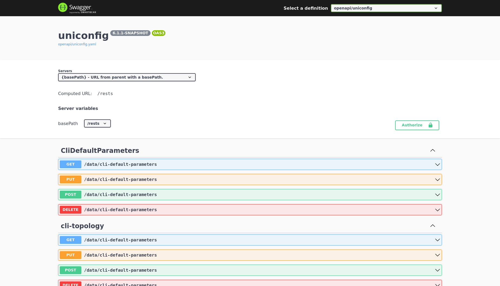

# OpenAPI

The OpenAPI file located in the **openapi** folder contains all the RPCs
and data manipulating requests (CRUD operations), and their respective 
examples. A shell script (named **start\_uniconfig\_swagger.sh**) was 
created that automatically checks if the file is present and runs
a Swagger UI instance inside a docker container. After running 
the shell script, open any browser and type **localhost:12345** in the URL bar.

The website should look like on the screenshot below:

Alternatively, the OpenAPI file can be accessed at
[localhost:8181/rests/openapi/uniconfig](http://localhost:8181/rests/openapi/uniconfig)
or in a Swagger UI environment at
[localhost:8181/swagger-ui.html](http://localhost:8181/swagger-ui.html)
when an instance of UniConfig is running.

Lastly, you can look at our live instance of the site that always
displays latest version of the API.

!!!success
Overview of our OpenAPI along with all parameters and expected returns
[can be found here](https://app.swaggerhub.com/apis-docs/Frinx/uniconfig/latest#)
!!!

