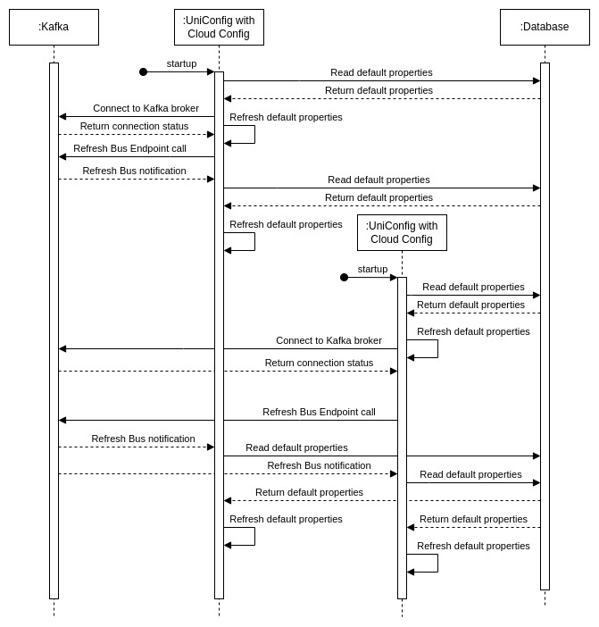
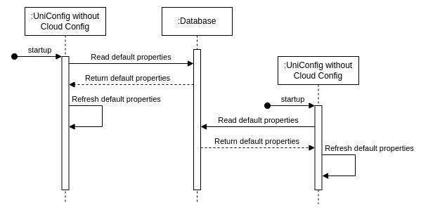

# Uniconfig Properties

## Introduction

UniConfig has input parameters to configure it precisely.
All these parameters are located in the *application.properties* file.
These parameters are divided into 2 groups - immutable parameters, 
which are the majority, and mutable parameters, which can be
changed in runtime without restarting UniConfig with *UniConfig Cloud Config*.

Mutable properties consist of *crypto*, *schema-settings*, *callbacks*,
*notifications.kafka*, *netconf-default-parameters*, *gnmi-default-parameters*
and *cli-default-parameters* property prefixes. These properties are stored
in the database in the table *properties* and are known as *default properties*.
User can read *default properties* with *read-properties RPC* and update it with *update-properties RPC*.

!!!
After starting UniConfig, if the database contains these properties, 
UniConfig will use the values of these properties from the database. But if these 
parameters are not in the database, then the values from first UniConfig instance 
right after its startup will be used (by application.properties file or env variables) 
and saved to the database for the next UniConfig instances.
!!!

## UniConfig Cloud Config

UniConfig Cloud Config is pretty the same technology as Spring Cloud Config with JDBC backend:
https://docs.spring.io/spring-cloud-config/reference/4.1/server/environment-repository/jdbc-backend.html 
and Spring Cloud Bus: https://docs.spring.io/spring-cloud-bus/docs/current/reference/html/.

The main difference between these two, is that UniConfig Cloud Config Server and 
Cloud Config Client are in the same project, while Spring requires the use of a separate
Cloud Config Server application.

It works as follows:




* First, before starting UniConfig, we must enable Cloud Config using the following properties

```
# Uniconfig cloud settings - depends on kafka connection
uniconfig.cloud.config.enabled=true
uniconfig.cloud.config.fail-fast=false
uniconfig.cloud.config.application-name=uniconfig
spring.cloud.bus.enabled=true
spring.kafka.bootstrap-servers=http://localhost:9092
management.endpoints.web.exposure.include=bus-refresh
# Disable cloud connection to Kafka for testing purpose, property spring.cloud.bus.enabled must be false
#spring.autoconfigure.exclude=org.springframework.cloud.stream.function.FunctionConfiguration
```

* When UniConfig starts, it will first check if there are any *default properties* in the database that it could configure
  * If *default properties* are in the database -> UniConfig instance will use it
  * If not -> UniConfig instance will use its properties and, once loaded, will save them to a database 
    for a next UniConfig instances.
* At the end of Spring initialisation the *Refresh Bus Endpoint* will be called. It refreshes *default properties* 
  to the database values in all UniConfig instances connected via kafka refresh topic.
* At application runtime, if user uses *update-properties RPC* with *default properties* on input -> UniConfig will
  update the properties in database and then use the *Refresh Bus Endpoint* call, which will reload properties in all
  connected via kafka UniConfig instances.

How to disable UniConfig Cloud Config and how the properties will be set up:



* First, before starting UniConfig, we must disable Cloud Config using the following properties

```
# Uniconfig cloud settings - depends on kafka connection
uniconfig.cloud.config.enabled=false
uniconfig.cloud.config.fail-fast=false
uniconfig.cloud.config.application-name=uniconfig
spring.cloud.bus.enabled=false
spring.kafka.bootstrap-servers=http://localhost:9092
management.endpoints.web.exposure.include=bus-refresh
# Disable cloud connection to Kafka for testing purpose, property spring.cloud.bus.enabled must be false
spring.autoconfigure.exclude=org.springframework.cloud.stream.function.FunctionConfiguration
```

* When UniConfig starts, it will first check if there are any *default properties* in the database that it could configure
  * If *default properties* are in the database -> UniConfig instance will use it
  * If not -> UniConfig instance will use its properties and, once loaded, will save them to a database
  for a following UniConfig instances.
* At the end of Spring initialisation the *Refresh Bus Endpoint* wouldn't be called.
* At application runtime, if user uses *update-properties RPC* with *default properties* on input -> UniConfig will
  update the properties in database, but will not update properties inside application, so it will have affect only
  for next UniConfig instance, which will be started after properties update.
