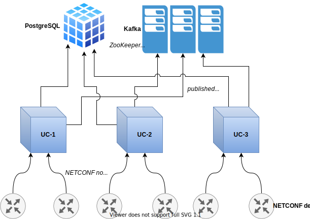
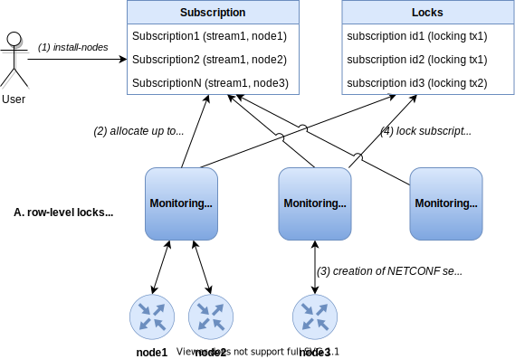

# Kafka Notifications

NETCONF and gNMI devices produce notifications, which UniConfig can collect to
create its own UniConfig notifications about specific events. Notifications from
both NETCONF and gNMI devices and UniConfig are published using Kafka.

The following notification types are available:

- NETCONF notifications
- gNMI notifications
- Notifications about transactions
- Audit logs (RESTCONF notifications)
- Data change events
- Connection notifications

Each notification type is stored in its own topic in Kafka. Additionally, all
notifications are stored in one table in the database.



## Kafka

Apache Kafka is a publish–subscribe-based, durable messaging system that sends
messages between processes, applications and servers. Within Kafka, you can
define topics (categories) and applications can add, process and reprocess
records.

In our particular case, UniConfig publishes notifications. Each type of
notification is stored in a separate topic and can therefore be subscribed to
independently. The names of topics and connection data are configurable in the
**lighty-uniconfig-config.json** file.

## NETCONF notifications

[RFC 5277](https://tools.ietf.org/html/rfc5277) defines a mechanism where a
NETCONF client indicates an interest in receiving event notifications from a
NETCONF server by subscribing to event notifications. The NETCONF server sends a
reply about whether the subscription request was successful and, if so, starts
sending event notifications to the NETCONF client as events occur within the
system. Event notifications are sent until either the NETCONF session or the
subscription is terminated.

NETCONF notifications are categorized as so-called streams. The subscriber can
choose which streams to receive. The default stream is `NETCONF`.

## gNMI notifications

The gNMI specification defines a
[mechanism](https://github.com/openconfig/reference/blob/master/rpc/gnmi/gnmi-specification.md#35-subscribing-to-telemetry-updates)
where the gNMI client indicates an interest in receiving updates about the state
of data instances via a subscribe RPC. If the subscription is successfully
created, the gNMI server replies with the state of data instances according to
specified paths. 

The session remains open until it UniConfig closes it (releasing the
subscription) or an error occurs on the device side.  However, UniConfig will
try to recreate the session.

The following fields are mandatory for the `install-node` request:
- `stream-name`
- `paths`

```json Notification response
{
  "source": "10.19.0.24:8080",
  "subscription-name": "default-1680174672",
  "timestamp": 1680174553095998547,
  "time": "2023-03-30T13:09:13.095998547+02:00",
  "prefix": "openconfig-interfaces:interfaces",
  "updates": [
    {
      "Path": "interface[name=Ethernet72]/state/counters/out-multicast-pkts",
      "values": {
        "interface/state/counters/out-multicast-pkts": 0
      }
    },
    {
      "Path": "interface[name=Ethernet72]/config/enabled",
      "values": {
        "interface/config/enabled": false
      }
    }
  ]
}
```

## Notifications about transactions

This type of notification is generated after each commit in UniConfig.

It contains the following:

- transaction id
- calculate diff result
- commit result

## Audit logs (RESTCONF notifications)

This type of notification is generated after each RESTCONF operation.

It contains the following:

- transaction id
- request data
    - uri
    - http method
    - source address
    - source port
    - query parameters
    - user id
    - body
- response data
    - status code
    - query parameters
    - body

The response body can be included or excluded from notifications with the
`includeResponseBody` parameter in the **application.properties** file.
Similarly, the calculation difference result is included if the parameter
`includeCalculateDiffResult` parameter is set to `true` in
**application.properties**.

Below are **three examples** of notifications with the response body and the
calculation difference result.

**Example 1** - Created data

```json
{
  "eventTime": "2023-02-09T10:00:59.39924-00:00",
  "nodeId": "UC-25be4cb4-2426-493c-97d9-ba16a735d810",
  "streamName": "RESTCONF",
  "identifier": "audit-log",
  "body": {
    "request": {
      "host": {
        "source-port": 48094,
        "source-address": "127.0.0.1"
      },
      "body": "{\n    \"network\": [\n        {\n            \"name\": \"BB1\",\n            \"interfaces\": [\n                \"vni-0/3.72\"\n            ]\n        }\n    ]\n}",
      "uri-data": {
        "uri": "http://127.0.0.1:8181/rests/data/network-topology:network-topology/topology=uniconfig/node=vnf20/configuration/networks/network=BB1",
        "http-method": "PUT"
      }
    },
    "transaction-id": "e0956588-bb94-46a3-a0e0-adecca318dfe",
    "response": {
      "status-code": 201
    },
    "calc-diff": {
      "createdData": {
        "path": "network-topology:network-topology/topology=uniconfig/node=vnf20/frinx-uniconfig-topology:configuration/native-schemas-vnf20-network:networks/network=BB1",
        "data": {
          "network": [
            {
              "name": "BB1",
              "interfaces": [
                "vni-0/3.72"
              ]
            }
          ]
        }
      }
    }
  }
}
```

**Example 2** - Deleted data

```json
{
  "eventTime": "2023-02-09T10:00:48.62214-00:00",
  "nodeId": "UC-25be4cb4-2426-493c-97d9-ba16a735d810",
  "streamName": "RESTCONF",
  "identifier": "audit-log",
  "body": {
    "request": {
      "host": {
        "source-port": 48094,
        "source-address": "127.0.0.1"
      },
      "body": "{\n    \"network\": [\n        {\n            \"name\": \"BB1\",\n            \"interfaces\": [\n                \"vni-0/3.72\"\n            ]\n        }\n    ]\n}",
      "uri-data": {
        "uri": "http://127.0.0.1:8181/rests/data/network-topology:network-topology/topology=uniconfig/node=vnf20/configuration/networks/network=BB1",
        "http-method": "DELETE"
      }
    },
    "transaction-id": "e0956588-bb94-46a3-a0e0-adecca318dfe",
    "response": {
      "status-code": 204
    },
    "calc-diff": {
      "deletedData": {
        "path": "network-topology:network-topology/topology=uniconfig/node=vnf20/frinx-uniconfig-topology:configuration/native-schemas-vnf20-network:networks/network=BB1",
        "data": {
          "network": [
            {
              "name": "BB1",
              "interfaces": [
                "vni-0/3.72"
              ]
            }
          ]
        }
      }
    }
  }
}
```

**Example 3** - Updated data

```json
{
  "eventTime": "2023-02-09T10:00:37.40739-00:00",
  "nodeId": "UC-25be4cb4-2426-493c-97d9-ba16a735d810",
  "streamName": "RESTCONF",
  "identifier": "audit-log",
  "body": {
    "request": {
      "host": {
        "source-port": 48094,
        "source-address": "127.0.0.1"
      },
      "body": "{\n    \"network\": [\n        {\n            \"name\": \"BB1\",\n            \"interfaces\": [\n                \"vni-0/3.72\"\n            ]\n        }\n    ]\n}",
      "uri-data": {
        "uri": "http://127.0.0.1:8181/rests/data/network-topology:network-topology/topology=uniconfig/node=vnf20/configuration/networks/network=BB1",
        "http-method": "PUT"
      }
    },
    "transaction-id": "e0956588-bb94-46a3-a0e0-adecca318dfe",
    "response": {
      "status-code": 204
    },
    "calc-diff": {
      "updatedData": {
        "path": "network-topology:network-topology/topology=uniconfig/node=vnf20/frinx-uniconfig-topology:configuration/native-schemas-vnf20-network:networks/network=BB1",
        "dataBefore": {
          "native-schemas-vnf20-network:interfaces": [
            "vni-0/3.1"
          ]
        },
        "dataAfter": {
          "native-schemas-vnf20-network:interfaces": [
            "vni-0/3.72"
          ]
        }
      }
    }
  }
}
```

## Shell notifications

This type of notification is generated after each shell operation. It contains
the following:

- transaction id
- request data
    - source address
    - source port
    - prompt
    - executed command
- response data
    - output

```json
{
  "eventTime": "2022-08-08 17:45:26.62239+00",
  "nodeId": "UC-5b4d0cec-6493-4e3d-bd1c-348a3ce83600",
  "streamName": "SHELL",
  "identifier": "shell-notification",
  "body": {
    "request": {
      "host": {
        "source-port": 2022,
        "source-address": "127.0.0.1"
      },
      "prompt": "show-netconf>",
      "executed-command": "abcd interfaces abc abc-1"
    },
    "response": {
      "output": "{  \"name\": \"abc-1\",  \"enable\": true}"
    },
    "transaction-id": "2d090dc4-9ee9-4a14-abb9-506a7ff1d414"
  }
}
```

## Data change events

A subscription step is required before data change events are generated and
published into Kafka.

With the subscription, a user can specify which subtrees are observed for data
changes. Afterwards, data change events are generated by UniConfig instances
when a transaction is committed and the committed changes contain subscribed
subtrees.

A sample data change event captured by Kafka console consumer:

```json
{
  "eventTime": "2022-02-14T07:36:39.55857-00:00",
  "nodeId": "UC-f057f8fa-8024-499a-94e9-904ce37fca78",
  "streamName": "DCE",
  "identifier": "data-change-event",
  "body": {
    "subscription-id": "f2a786a6-eea3-419c-8341-750d388181a0",
    "transaction-id": "634ac8c3-c20b-4d83-a283-a31fe0bed1a6",
    "edit": [
      {
        "subtree-path": "/process=p3",
        "data-after": "{\n  \"process\": [\n    {\n      \"uid\": \"p3\"\n    }\n  ]\n}",
        "operation": "CREATE",
        "node-id": "node",
        "topology-id": "uniconfig"
      },
      {
        "subtree-path": "/process=p2",
        "data-before": "{\n  \"process\": [\n    {\n      \"uid\": \"p2\"\n    }\n  ]\n}",
        "operation": "DELETE",
        "node-id": "node",
        "topology-id": "uniconfig"
      },
      {
        "subtree-path": "/process=p1/address/bus-size",
        "data-after": "{\n  \"config:bus-size\": 2048\n}",
        "data-before": "{\n  \"config:bus-size\": 1024\n}",
        "operation": "UPDATE",
        "node-id": "node",
        "topology-id": "uniconfig"
      },
      {
        "subtree-path": "/process=p1/address/bus-id",
        "data-after": "{\n  \"config:bus-id\": \"0xFFFF\"\n}",
        "data-before": "{\n  \"config:bus-id\": \"0x451FE\"\n}",
        "operation": "UPDATE",
        "node-id": "node",
        "topology-id": "uniconfig"
      }
    ]
  }
}
```

For data change events, `streamName` is always `DCE` and the identifier for the
YANG notification is `data-change-event`.

The body contains the following:

- `subscription-id` - Identifier for the subscription that triggers the
  generation of a data change event. The subscription identifier makes it easier
  to associate subscriptions and received data change events compared to using a
  combination of multiple fields such as node identifier, topology identifier
  and subtree path.
- `transaction-id` - Identifier for the committed transaction that triggered the
  data change event after commit or checked-commit UniConfig operations.
- `edit` - List of captured modifications done in the committed transaction.

Fields under `edit`:

- `subtree-path` - Relative path to the data-tree element where the data change
  occurred. The path is relative to the subtree path specified during
  subscription.
- `data-before` - JSON representation of subtree data before changes were made.
  If this field is not specified, `data-after` represents created data.
- `data-after` - JSON representation of subtree data including the changes. If
  this field is not specified, `data-before` represents removed data.
- `operation` - Operation type for the data change event.
- `node-id` - Node identifier for the data change event.
- `topology-id` - Topology identifier for the node. Either `uniconfig` or
  `unistore`.

## Connection notifications

Connection notification are generated whenever the status of a node changes. For
connection notifications, `streamName` is always `CONNECTION` and the identifier
for the YANG notification is `connection-notification`.

Contains the following:

- topology id
- node id
- connection status
- connection message

Supported topologies are `cli`, `netconf` and `gnmi`.

Sample connection notifications captured by Kafka console consumer:

**CLI disconnect notification:**

```json
{
  "eventTime": "2022-02-17T10:09:28.76615-00:00",
  "nodeId": "UC-5b4d0cec-6493-4e3d-bd1c-348a3ce83600",
  "streamName": "CONNECTION",
  "identifier": "connection-notification",
  "body": {
    "connection-status": "disconnected",
    "node-id": "R1",
    "connection-message": "",
    "topology": "cli"
  }
}
```

**NETCONF connect notification:**

```json
{
  "eventTime": "2022-02-17T10:09:51.41777-00:00",
  "nodeId": "UC-5b4d0cec-6493-4e3d-bd1c-348a3ce83600",
  "streamName": "CONNECTION",
  "identifier": "connection-notification",
  "body": {
    "connection-status": "connecting",
    "node-id": "R2",
    "connection-message": "Connecting",
    "topology": "topology-netconf"
  }
}
```

## Database entities

The following **three tables** in the database are related to notifications:

- notification table
- settings table
- subscription table

The **notification table** is where notifications are stored. It contains the
following columns:

- stream name - Name of the notification stream 
- node id - Identifier for the NETCONF/gNMI device or, for other types of
  notifications, the UniConfig instance
- identifier - Name of the YANG notification for NETCONF or path to the received
  config top node for gNMI
- body - Full notification body in JSON format
- event time - Time when the notification was generated

**Example** - Request for reading notifications using RESTCONF:

```bash Request
curl --location --request GET 'http://localhost:8181/rests/data/notifications:notification' \
--header 'Accept: application/json' \
--header 'Content-Type: application/json'
``` 

The **settings table** contains two columns: `identifier` and `config`. Records
with the `kafka` identifier contain configurations for Kafka that can be
modified at runtime.

**Example** - Request for reading Kafka settings using RESTCONF:

```bash Request
curl --location --request GET 'http://localhost:8181/rests/data/kafka-brokers:kafka-settings' \
--header 'Accept: application/json' \
--header 'Content-Type: application/json'
``` 

The **subscription table** is used to track NETCONF and gNMI notification
subscriptions. It contains the following columns:

- node id - Identifier for the NETCONF/gNMI node where notifications are
  collected
- UniConfig instance id - Identifier for the UniConfig instance that collects
  notifications from the NETCONF/gNMI device
- stream name - NETCONF/gNMI stream name
- creation time - Time when the subscription was created
- start time - Start time for collecting notifications
- end time - End time for collecting notifications

**Example** - Request for reading subscriptions using RESTCONF:

```bash Request
curl --location --request GET 'http://localhost:8181/rests/data/subscriptions:subscription' \
--header 'Accept: application/json' \
--header 'Content-Type: application/json'
```

## NETCONF subscriptions

A subscription is required to receive NETCONF notifications from a NETCONF
device.

Subscriptions are created with an installation request:

```bash Request
curl --location --request POST 'http://localhost:8181/rests/operations/connection-manager:install-node' \
--header 'Accept: application/json' \
--header 'Content-Type: application/json' \
--data-raw '{
    "input":{
        "node-id":"versa_2",
        "netconf":{
            "netconf-node-topology:host":"10.103.5.202",
            "netconf-node-topology:port":2022,
            "netconf-node-topology:session-timers": {
                "netconf-node-topology:keepalive-delay": 5,
                "netconf-node-topology:max-connection-attempts":1,
                "netconf-node-topology:initial-connection-timeout":60,
                "netconf-node-topology:request-transaction-timeout":60,
                "netconf-node-topology:reconnection-attempts-multiplier":1.0
            },
            "netconf-node-topology:other-parameters": {
                "netconf-node-topology:edit-config-test-option":"set"
            },
            "netconf-node-topology:tcp-only":false,
            "netconf-node-topology:username":"admin",
            "netconf-node-topology:password":"versa123",
            "uniconfig-config:UniConfig-native-enabled":true,
            "uniconfig-config:blacklist":{
                "extension":[
                    "tailf:display-when false"
                ]
            },
            "stream":[
                {
                    "stream-name":"NETCONF",
                    "start-time":"2021-11-08T02:00:00+00:00",
                    "stop-time":"2021-11-08T22:00:00+00:00"
                },
                {
                    "stream-name":"oam"
                }
            ]
        }
    }
}'
``` 

Subscriptions to notification streams are defined as a list with the name
`stream`. There is one record for each stream.

The only mandatory parameter is `stream-name`. Other parameters are optional:

- `start-time` - Must be specified to enable replay and should start at the
  specified time.
- `stop-time` - Used with the optional replay feature to indicate the newest
  notifications of interest. If no stop time is specified, notifications will
  continue until the subscription is terminated. Must be used with and set to be
  later than `start-time`. Values in the future are valid.

!!!
If a new subscription to a stream is created, all existing subscriptions to the
stream are terminated.
!!!

## gNMI subscriptions

A subscription is required to receive gNMI notifications from a gNMI device.

Subscriptions are created with an installation request:

```bash Request
curl --location 'http://localhost:8181/rests/operations/connection-manager:install-node' \
--header 'Content-Type: application/json' \
--header 'Authorization: Basic YWRtaW46YWRtaW4=' \
--data '{
    "input": {
        "node-id": "gnmiNode",
        "gnmi": {
            "schema-cache-directory": "gnmi-topology",
            "uniconfig-config:whitelist": {
                "path": [
                    "openconfig-interfaces:interfaces",
                    "openconfig-network-instance:network-instances",
                    "openconfig-relay-agent:relay-agent",
                    "openconfig-port-group:port-groups",
                    "openconfig-mclag:mclag",
                    "openconfig-lldp:lldp"
                ]
            },
            "uniconfig-config:uniconfig-native-enabled": true,
            "uniconfig-config:sequence-read-active": false,
            "connection-parameters": {
                "host": "10.19.0.252",
                "port": "8080",
                "device-type" : "sonic",
                "connection-type": "INSECURE",
                "credentials": {
                    "username": "<username>",
                    "password": "<password>"
                }
            },
            "session-timers": {
                "request-timeout": 10,
                "internal-transaction-timeout": 10
            },
            "extensions-parameters": {
                "gnmi-parameters": {
                    "use-model-name-prefix": true
                },
                "force-cached-capabilities": [
                    null
                ]
            },
            "stream":[
                {
                    "stream-name":"GNMI_if",
                    "paths" : [
                        "openconfig-interfaces:interfaces/interface=$.*/config"
                    ],
                    "start-time":"2023-10-31T10:47:00+01:00",
                    "stop-time":"2023-10-31T10:49:00+01:00"
                }
            ]
        }
    }
}'
``` 

Subscriptions to notification streams are defined as a list with the name
`stream`. There is one record for each stream.

There are two required parameters, `stream-name` and `paths`. Other parameters
are optional:

- `start-time` - Start time for telemetry streaming.
- `stop-time` - Telemetry streaming stops if the timestamp of the notification
  is later than this time. If no stop time is specified, notifications will
  continue until the subscription is terminated. Must be used with and set to be
  later than `start-time`. Values in the future are valid.

## Monitoring system - processing NETCONF/gNMI subscriptions

In UniConfig, subscriptions to NETCONF and gNMI notifications are processed
in an infinite loop within the monitoring system.

An iteration of the monitoring system loop consists of following steps:

1. Check global setting for NETCONF/gNMI notifications.
    - If turned off, release all NETCONF/gNMI subscriptions and end current
      iteration.
2. Release cancelled subscriptions.
3. Query free subscriptions from DB, and for each one:
    1. Create a notification session (create mountpoint and register listeners).
    2. Lock the subscription (set UniConfig instance).

!!!
There is a hard limit on the number of sessions that a single UniConfig node can
handle. If the limit is reached, the UniConfig node refuses any additional
subscriptions.
!!!

The loop interval, hard subscription limit and maximum number of subscriptions
processed per interval can be set in the **lighty-uniconfig-config.json** file.

### Dedicated NETCONF session for subscription

A NETCONF device may have the interleave capability that indicates support for
interleaving other NETCONF operations within a notification subscription. This
means that the NETCONF server can receive, process and respond to NETCONF
requests on a session with an active notification subscription.

As not all devices include support for this capability, the common approach for
devices with and without interleave capability is to track notifications with a
separate NETCONF session. To support this functionality, UniConfig creates a
separate NETCONF session with a separate mountpoint for every subscription.
These mountpoints and sessions are automatically terminated when the
corresponding subscription is closed.



## Subscriptions to data change events

### Create a new subscription

Subscriptions to data change events are created using the
**create-data-change-subscription RPC**. After a subscription is created,
UniConfig listens to data change events on selected nodes and subtrees and
distributes the corresponding messages to a dedicated Kafka topic.

RPC input contains the following:

- `node-id` - Identifier for the node from which data change events are
  generated. If not specified, a global subscription is created and data change
  events are generated for all nodes under the topology. This field is optional. 
- `topology-id` - Identifier for the topology where the specified node is
  placed.
- `subtree-path` - Path to the subtree from which the user would like to receive
  data change events. The default value is `/`, which captures data change
  events from the entire node configuration.
- `data-change-scope` - Data-tree scope that specifies how granular data change
  events should be captured and propagated to Kafka. There are three options:
    - `SUBTREE`: Represents a change of the node or any of its child nodes,
      direct and nested. This scope is a superset of `ONE` and `BASE`. This is
      the default value.
    - `ONE`: Represent a change (an addition, replacement or deletion) of the
      node on the subtree-path or one of its direct child elements.
    - `BASE`: Represents only a direct change of the node on the subtree-path,
      such as replacement of a node, addition or deletion.

RPC output contains only the generated subscription identifier in UUID format.
This identifier represents a token that can be used for the following:

- Display information about a created subscription using the RPC
- Delete an existing subscription
- Sort received Kafka messages

**Example** - Create a subscription to the `device1` node  in the `uniconfig`
topology, and to the whole `/interfaces` configuration subtree:

```bash RPC Request
curl --location --request POST 'http://127.0.0.1:8181/rests/operations/data-change-events:create-data-change-subscription' \
--header 'Content-Type: application/json' \
--data-raw '{
    "input": {
        "node-id": "device1",
        "topology-id": "uniconfig",
        "subtree-path": "/interfaces",
        "data-change-scope": "SUBTREE"
    }
}'
```

```json RPC response, Status: 200
{
  "output": {
    "subscription-id": "8e82453d-4ea8-4c26-a74e-50d855a721fa"
  }
}
```

**Example** - Create a subscription to the `uniconfig` topology and to the whole
`/interfaces` configuration subtree:

```bash RPC Request
curl --location --request POST 'http://127.0.0.1:8181/rests/operations/data-change-events:create-data-change-subscription' \
--header 'Content-Type: application/json' \
--data-raw '{
    "input": {
        "topology-id": "uniconfig",
        "subtree-path": "/interfaces",
        "data-change-scope": "SUBTREE"
    }
}'
```

```json RPC response, Status: 200
{
  "output": {
    "subscription-id": "1920770c-671d-4d2e-8126-6309ab73ff10"
  }
}
```

### Remove a subscription

Existing subscriptions can be removed using the
**delete-data-change-subscription RPC** and the provided `subscription-id`. After
a subscription is removed, UniConfig stops generating new data change events
related to the subscribed path.

RPC input contains only the `subscription-id`, which is a unique identifier for
the subscription to data change events.

RPC output does not contain a body. The RPC returns a 404 error if no
subscription exists for the provided identifier.

**Example** - Remove a subscription:

- Successful example:

```bash RPC Request
curl --location --request POST 'http://127.0.0.1:8181/rests/operations/data-change-events:delete-data-change-subscription' \
--header 'Content-Type: application/json' \
--data-raw '{
  "input": {
    "subscription-id": "8e82453d-4ea8-4c26-a74e-50d855a721fa"
  }
}'
```

```RPC response, Status: 204
```

- Failed example:

```bash RPC Request
curl --location --request POST 'http://127.0.0.1:8181/rests/operations/data-change-events:delete-data-change-subscription' \
--header 'Content-Type: application/json' \
--data-raw '{
  "input": {
    "subscription-id": "8e82453d-4ea8-4c26-a74e-50d8bad-id721fa"
  }
}'
```

```json RPC response, Status: 400
{
  "errors": {
    "error": [
      {
        "error-type": "application",
        "error-tag": "data-missing",
        "error-message": "Subscription with specified identifier doesn't exist"
      }
    ]
  }
}
```

### Show information about a subscription

The **show-subscription-data RPC** is used to display information about a
created subscription.

RPC input contains an identifier for the target subscription.

RPC output for existing subscriptions contains the following:
- `topology-id`
- `node-id`
- `subtree-path`
- `data-change-scope`

These are the same fields that can be specified as input for the
**create-data-change-subscription RPC**.

If no subscription exists with the specified ID, the RPC returns a 404 status
code with a standard RESTCONF error container.

**Successful example:**

```bash RPC Request
curl --location --request POST 'http://127.0.0.1:8181/rests/operations/data-change-events:show-subscription-data' \
--header 'Content-Type: application/json' \
--data-raw '{
  "input": {
    "subscription-id": "8e82453d-4ea8-4c26-a74e-50d855a721fa"
  }
}
```

```json RPC response, Status: 200
{
  "output": {
    "subtree-path": "/interfaces",
    "topology-id": "uniconfig",
    "data-change-scope": "SUBTREE",
    "node-id": "device1"
  }
}
```

**Failed example:**

```bash RPC Request
curl --location --request POST 'http://127.0.0.1:8181/rests/operations/data-change-events:show-subscription-data' \
--header 'Content-Type: application/json' \
--data-raw '{
  "input": {
    "subscription-id": "8e82453d-4ea8-4c26-a74e-50d8bad-id721fa"
  }
}
```

```json RPC response, Status: 400
{
  "errors": {
    "error": [
      {
        "error-type": "application",
        "error-tag": "data-missing",
        "error-message": "Subscription with specified ID does not exist"
      }
    ]
  }
}
```

It is also possible to fetch all created subscriptions under a specific node or
topology by sending a GET request to the `data-change-subscriptions` list under
the `node` list item (operational data).

**Example** - Two subscriptions under the `device1` node

```bash GET request
curl --location --request GET 'http://127.0.0.1:8181/rests/data/network-topology:network-topology/topology=uniconfig/node=device1/data-change-subscriptions?content=nonconfig' \
--header 'Accept: application/json'
```

```json GET response, Status: 200
{
  "data-change-events:data-change-subscriptions": [
    {
      "subscription-id": "8e82453d-4ea8-4c26-a74e-50d855a721fa",
      "subtree-path": "/interfaces",
      "data-change-scope": "SUBTREE"
    },
    {
      "subscription-id": "3b3ad917-f1a1-4cc4-83b9-3c8b62929b81",
      "subtree-path": "/ospf",
      "data-change-scope": "ONE"
    }
  ]
}
```

```bash GET request
curl --location --request GET 'http://127.0.0.1:8181/rests/data/network-topology:network-topology/topology=uniconfig/data-change-subscriptions?content=nonconfig' \
--header 'Accept: application/json'
```

```json GET response, Status: 200
{
  "data-change-events:data-change-subscriptions": [
    {
      "subscription-id": "4058acac-1a2a-4c49-abe9-bcdbd14fe933",
      "subtree-path": "/events:event",
      "data-change-scope": "SUBTREE"
    },
    {
      "subscription-id": "a2561773-c02e-403c-a090-fe6542926fed",
      "subtree-path": "/events:event",
      "data-change-scope": "BASE"
    }
  ]
}
```

## Configuration

Configurations for notifications are in the **lighty-uniconfig-config.json**
file, under the `notifications` property.

The entire configuration looks like this:

```json
{
  "notifications": {
    "enabled": true,
    "kafka": {
      "username": "kafka",
      "password": "kafka",
      "kafkaServers": [
        {
          "brokerHost": "127.0.0.1",
          "brokerListeningPort": 9092
        }
      ],
      "netconfNotificationsEnabled": true,
      "auditLogsEnabled": true,
      "transactionNotificationsEnabled": true,
      "dataChangeEventsEnabled": true,
      "netconfNotificationsTopicName": "netconf-notifications",
      "auditLogsTopicName": "auditLogs",
      "transactionsTopicName": "transactions",
      "dataChangeEventsTopicName": "data-change-events",
      "blockingTimeout": 60000,
      "requestTimeout": 30000,
      "deliveryTimeout": 120000,
      "maxThreadPoolSize": 8,
      "queueCapacity": 2048,
      "embeddedKafka": {
        "enabled": true,
        "installDir": "/tmp/embedded-kafka",
        "archiveUrl": "https://dlcdn.apache.org/kafka/3.0.0/kafka_2.12-3.0.0.tgz",
        "dataDir": "./data/embedded-kafka",
        "cleanDataBeforeStart": true,
        "partitions": 1
      }
    },
    "auditLogs": {
      "includeResponseBody": true
    },
    "notificationDbTreshold": {
      "maxCount": 10000,
      "maxAge": 100
    },
    "netconfSubscriptionsMonitoringInterval": 5,
    "maxNetconfSubscriptionsPerInterval": 10,
    "maxNetconfSubscriptionsHardLimit": 5000,
    "rebalanceOnUCNodeGoingDownGracePeriod": 120,
    "optimalNetconfSubscriptionsApproachingMargin": 0.05,
    "optimalNetconfSubscriptionsReachedMargin": 0.10
  }
}
```

All notifications, as well as the monitoring system, can be enabled or disabled
using the `enabled` flag.

**Properties related to the monitoring system:**

- `subscriptionsMonitoringInterval` - How often the monitoring system loop is
  run and how often it attempts to acquire free subscriptions (in seconds). The
  default value is 5.
- `maxSubscriptionsPerInterval` - The maximum number of free subscriptions that
  can be acquired in a single iteration of the monitoring system loop. If the
  number of free subscriptions is smaller than this value, all free
  subscriptions are processed. If the number of free subscriptions is larger
  than this value, only the specified number of subscriptions are acquired. The
  rest can be acquired during the next iterations of the monitoring system loop
  or by other UniConfing instances in the cluster. The default value is 10.
- `maxNetconfSubscriptionsHardLimit` - Maximum number of subscriptions that  a
  single UniConfig node can handle.

**Properties related to the monitoring system in clustered environments:**

- `rebalanceOnUCNodeGoingDownGracePeriod` - Grace period for a UniConfig node
  going down (in seconds). Other nodes will not restart subscriptions until the
  grace period has passed after a dead Uniconfig node was last seen. The default
  value is 120.
- `optimalNetconfSubscriptionsApproachingMargin` - Lower margin to calculate
  optimal range start. The default value is 0.05.
- `optimalNetconfSubscriptionsReachedMargin` - Upper margin to calculate optimal
  range end. The default value is 0.10.

**Properties related to message timeout to Kafka:**

- `blockingTimeout` - How long the `send()` method and the creation of a
  connection for reading metadata methods will block (in milliseconds).
- `requestTimeout` - How long the producer waits for acknowledgement of a
  request (in milliseconds). If no acknowledgement is received before the
  timeout period has passed, the producer resends the request or, if retries are
  exhausted, fails the request.
- `deliveryTimeout` - Upper bound on the time to report success or failure after
  a call to `send()` returns (in milliseconds). Sets a limit on the total time
  that a record will be delayed prior to sending, the time to wait for
  acknowledgement from the broker (if expected) and the time allowed for
  retriable send failures.

**Properties related to the thread pool executor required to send messages to Kafka:**

- `maxThreadPoolSize` - Maximum thread pool size in the executor.
- `queueCapacity` - Maximum capacity for the work queue in the executor.

**Properties used to limit the number of records in the notifications table in the database:**

- `maxCount` - Maximum number of records in the notifications table. If the
  number of records exceeds this value, the oldest record in the table is
  deleted. The default value is 10,000.
- `maxAge` - Maximum age of a record in the notifications table (in hours).
  Records older than this value are deleted. The default value is 100.

  These properties are under `notificationDbTreshold`. Both are implemented
  using database triggers. Triggers are running on inserts to the notifications
  table.

Audit log settings are under the `auditLogs` property. Currently there is only
one flag, `includeResponseBody`, which is used to enable or disable logging the
body of RESTCONF responses.

All settings related to Kafka are grouped under `kafka` property. For
authentication, there are the `username` and `password` properties. For the
Kafka connection, there is the `kafkaServers` property which contains a list of
Kafka servers as a combination of `brokerHost` and `brokerListeningPort`. The
broker host can be either an IP address or hostname.

Enable or disable each type of notification independently of others by using the
following flags:

- `netconfNotificationsEnabled`
- `auditLogsEnabled`
- `transactionNotificationsEnabled`
- `dataChangeEventsEnabled`

Configure the names of all topics for every notification type by using the
following flags:

- `transactionsTopicName` - Topic name for transactions about notifications
- `netconfNotificationsTopicName` - Topic name for NETCONF notifications
- `auditLogsTopicName` - Topic name for audit logs
- `dataChangeEventsTopicName` - Topic name for data change events

You can also to set up embedded Kafka using these setting grouped under the
`embeddedKafka` property:

- `enabled` - Enable or disable embedded Kafka
- `installDir` - Where Kafka files should be placed
- `archiveUrl` - Where to download Kafka from
- `dataDir` - Kafka data directory
- `cleanDataBeforeStart` - Whether or not to clear Kafka config before start

Kafka settings are also stored in the database. This way they can be changed at
runtime using RESTCONF or UniConfig shell. Kafka setting are stored in the
**settings table**.

## Kafka client - Example

To read notifications from Kafka, you can use the command line consumer.

Run the following command in the Kafka installation directory:

```bash
bin/kafka-console-consumer.sh \
 --bootstrap-server localhost:9092 \
 --topic netconf-notifications
```

It is important to properly set up the hostname, port and topic name.

Output after a NETCONF notification is created:

```json
{
  "eventTime": "2021-12-03T08:16:45.75600-00:00",
  "nodeId": "R1",
  "streamName": "NETCONF",
  "identifier": "netconf-session-start",
  "body": {
    "session-id": 191,
    "source-host": "10.255.246.85",
    "username": "admin"
  }
}
```
