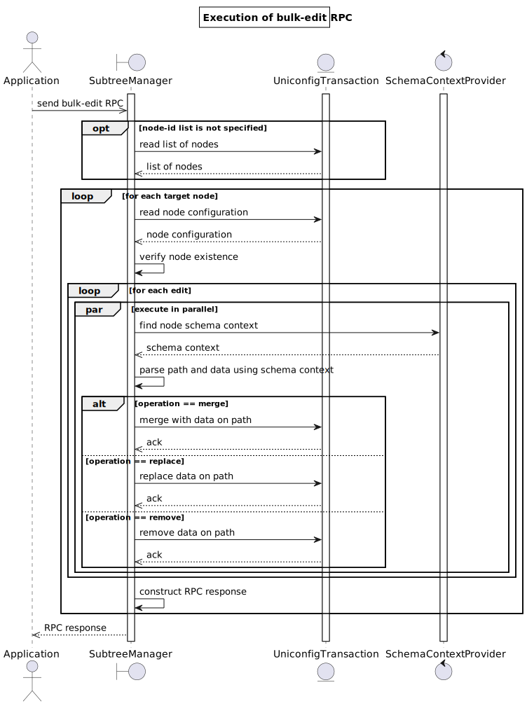

# RPC bulk-edit

The bulk-edit operation modifies multiple configuration subtrees under multiple target nodes in the `uniconfig`, `templates` or `unistore` topology. The same modifications are applied to all target nodes.

The operation is executed atomically so that either all modifications are applied on all target nodes successfully, or the operation fails and the configuration is not touched in the UniConfig transaction. This RPC also benefits from parallel processing of changes per target node.



## RPC input

RPC input specifies a list of target nodes and a list of modifications to be applied to target nodes.

RPC input fields:

* **topology-id** (mandatory): Identifier for the topology that contains all target nodes. Currently supported topologies are `uniconfig`, `templates` and `unistore`.
* **node-id** (optional): List of target nodes identifiers residing in the specified topology. If this field is not specified or is left empty, the RPC is executed on all available nodes in the specified topology.
* **edit** (mandatory with at least one entry): List of modifications. Each modification is uniquely identified by the `path` key. Modifications are applied in the user-defined order.

Parameters for the **edit** field:

* **path** (mandatory): Path encoded using the RFC-8040 format. Specified as a relative path to the root `configuration` container. If this leaf contains a single character `/`, the path points to the whole configuration. If this path contains a list node without key, the operation is applied to all list node elements.
* **operation** (mandatory): Operation to be executed on the specified path. Supported operations are `merge`, `replace`, and `remove`. Merge and replace operations also require the **data** input.
* **data** (optional): Content of the replaced or merged data without wrapping parent element. The last element of the path is not declared in. See other cases for examples of how to specify the content of this leaf.

Supported operations:

* **merge**: The supplied value is merged with the target data node.
* **replace**: The supplied value is used to replace the target data node.
* **remove**: Delete target node if it exists.

## RPC output

RPC output contains the global status of the executed operation and per-node status.

Fields in the **node-result** entry:

* **error-type**: Error type.
* **error-tag** : Error tag.
* **error-message**: Reason for the failure. Included in output only if RPC execution failed on target node.
* **error-info**: Additional information about the error, such as node identification.

## RPC examples

### Successful example

The following request demonstrates the application of six (6) modifications to four (4) templates:

1. Replace the value of the `description` leaf.
2. Remove the `snmp` container.
3. Replace the whole `ssh` container.
4. Merge the configuration of the `routing-protocol` list entry.
5. Merge the whole `tree` list with the specified multiple list entries.
6. Replace the leaf-list `services` with the provided array of strings.

```bash RPC request
curl --location --request POST 'http://127.0.0.1:8181/rests/operations/subtree-manager:bulk-edit' \
--header 'Accept: application/json' \
--header 'Content-Type: application/json' \
--header 'Cookie: UNICONFIGTXID=7bb3fbdf-23b0-488e-8d59-8d0b2757da73' \
--data-raw '{
    "input": {
        "topology-id": "templates",
        "node-id": [
            "tpl_1",
            "tpl_2",
            "tpl_3",
            "tpl_4"
        ],
        "edit": [
            {
                "path": "/sfc:service-node-groups/service-node-group/type",
                "operation": "replace",
                "data": "test"
            },
            {
                "path": "/groups/group=test/description",
                "operation": "replace",
                "data": "test"
            },
            {
                "path": "/snmp/config",
                "operation": "remove"
            },
            {
                "path": "/system/netconf/ssh",
                "operation": "replace",
                "data": {
                    "ip": "10.10.10.10",
                    "enabled": false,
                    "port": 2243
                }
            },
            {
                "path": "/routing-protocol/routing-protocol=test",
                "operation": "merge",
                "data": {
                    "@": {
                        "template-tags:operation": "create"
                    },
                    "name": "test"
                }
            },
            {
                "path": "/snmp/view=internet/tree",
                "operation": "merge",
                "data": [
                    {
                        "oid": "1.4",
                        "included": true
                    },
                    {
                        "oid": "1.5",
                        "included": false
                    }
                ]
            },
            {
                "path": "/router/services",
                "operation": "replace",
                "data": [
                    "dhcp",
                    "rarp"
                ]
            }
        ]
    }
}'
```

All modifications have been successfully written into the UniConfig transaction.

```RPC response: Status: 200
```

### Failed example

RPC input does not contain the mandatory `topology-id` field.

```bash RPC request
curl --location --request POST 'http://127.0.0.1:8181/rests/operations/subtree-manager:bulk-edit' \
--header 'Accept: application/json' \
--header 'Content-Type: application/json' \
--header 'Cookie: UNICONFIGTXID=7bb3fbdf-23b0-488e-8d59-8d0b2757da73' \
--data-raw '{
    "input": {
        "node-id": [
            "R1",
            "R2"
        ],
        "edit": [
            {
                "path": "/dhcp/profile=test-profile",
                "operation": "replace",
                "data": {
                    "name": "test-profile",
                    "description": "test"
                }
            },
            {
                "path": "/settings",
                "operation": "remove"
            }
        ]
    }
}'
```

```json RPC Response: Status: 400
{
  "errors": {
    "error": [
      {
        "error-type": "application",
        "error-tag": "missing-element",
        "error-message": "Topology-id is not specified"
      }
    ]
  }
}
```

### Failed example

This example demonstrates the execution of a bulk-edit operation that fails on parsing one of the paths using YANG schemas of the R2 device.

```bash RPC request
curl --location --request POST 'http://127.0.0.1:8181/rests/operations/subtree-manager:bulk-edit' \
--header 'Accept: application/json' \
--header 'Content-Type: application/json' \
--header 'Cookie: UNICONFIGTXID=7bb3fbdf-23b0-488e-8d59-8d0b2757da73' \
--data-raw '{
    "input": {
        "node-id": [
            "R1",
            "R2"
        ],
        "topology-id": "uniconfig",
        "edit": [
            {
                "path": "/dhcp/profile=test-profile",
                "operation": "replace",
                "data": {
                    "name": "test-profile",
                    "description": "test"
                }
            },
            {
                "path": "/settings",
                "operation": "remove"
            }
        ]
    }
}'
```

There is one error message in the result for R2. Note that no modifications are written to R1 because another node (R2) failed during execution of the operation.

```json RPC response
{
  "errors": {
    "error": [
      {
        "node-id": "dev01",
        "error-type": "application"
      },
      {
        "node-id": "dev02",
        "error-message": "Failed to parse path: Could not parse path 'network-topology:network-topology/topology=uniconfig/node=R2/frinx-uniconfig-topology:configuration/dhcp/profile=test-profile'. Offset: '108': Reason: List entry '(test-ns?revision=2018-09-12)dhcp' requires key or value predicate to be present",
        "error-type": "application"
      }
    ]
  }
}
```