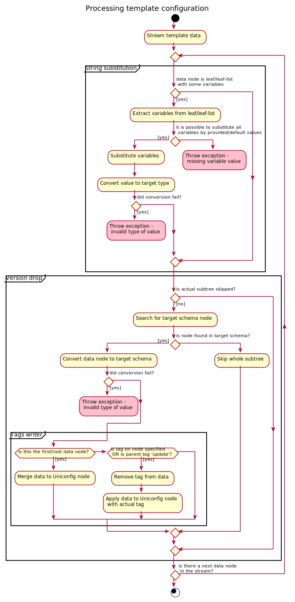

# Applying a template

Template can be applied to UniConfig nodes using the `apply-template` RPC.
This procedure contains the following steps:

1. **Read template** - Reads a template configuration from the
   *templates* topology in the *Configuration* datastore.
2. **String-substitution** - Substitutes variables with provided
   or default values. If no values are provided for
   some variables and leaf/leaf-list defines a default values. If some
   variables cannot be substituted (for example, if not input value is specified
   for a variable), returns an error.
3. **Version-drop** - Converts a template into a target schema context
   used by the target UniConfig node. Also drops
   unsupported data from the input template. Because of this, the template
   can be applied to different versions of devices
   with different revisions of YANG schemas but with similar structure.
   Version-drop is also aware of the `ignoredDataOnWriteByExtensions`
   RESTCONF filtering mechanism.
4. **Apply tags** - Streams the data-tree of the template and recursively
   applies data to the target UniConfig node based on tags set on data elements.
   The UniConfig node configuration is updated only in the *Configuration* datastore.

RPC input fields:

- **template-node-id**: Name of the existing input template.
- **uniconfig-node**: List of target UniConfig nodes to which the template
  is applied (`uniconfig-node-id` is the key).
- **uniconfig-node-id**: Target UniConfig node identifier.
- **variable**: List of variables and substituted values that must be
  used when the template is applied to a UniConfig node. Variables
  must be set per target UniConfig node, as it is common that
  values of variables are different between devices. Leaf
  'variable-id' represents the key of this list.
- **variable-id**: Unescaped variable identifier.
- **leaf-value**: Scalar value of the variable. Special characters
  ('\$', '{', '}') must be escaped.
- **leaf-list-values**: List of values - it can be used only with
  leaf-lists. Special characters ('\$', '{', '}') must be escaped.

RPC output fields:

- Successful response: Returns http status code 200 without fields.

- Failed response: Returns http status code 400-500 and error with
  the following fields:
   - **error-type** : Type of the error.
   - **error-tag** : Tag of the error, also determining http status code.
   - **error-message** : Description of the error that occurred during
     application of template.
   - **error-info** : Additional information related to error. For example,
     node identification, topology identification.

The following sequence diagram and nested activity diagram show process
of the `apply-template` RPC in detail.




## RPC examples

### Successful example

Successful application of the `SERVICE_GROUP` template to two UniConfig
nodes (R1 and R2).

```bash RPC Request
curl --location --request PUT 'http://localhost:8181/rests/operations/template-manager:apply-template' \
--header 'Accept: application/json' \
--header 'Content-Type: application/json' \
--data-raw '{
    "input": {
        "template-node-id": "SERVICE_GROUP",
        "uniconfig-node": [
            {
                "uniconfig-node-id": "R1",
                "variable": [
                    {
                        "variable-id": "svc-id",
                        "leaf-value": 1
                    },
                    {
                        "variable-id": "svc-1",
                        "leaf-value": "my-sng"
                    },
                    {
                        "variable-id": "svc-type",
                        "leaf-value": "other"
                    },
                    {
                        "variable-id": "svc-service",
                        "leaf-list-values": [
                            "sdwan",
                            "cgnat"
                        ]
                    }
                ]
            },
            {
                "uniconfig-node-id": "R2",
                "variable": [
                    {
                        "variable-id": "svc-id",
                        "leaf-value": 1
                    },
                    {
                        "variable-id": "svc-1",
                        "leaf-value": "custom-sng"
                    },
                    {
                        "variable-id": "svc-type",
                        "leaf-value": "internal"
                    },
                    {
                        "variable-id": "svc-service",
                        "leaf-list-values": [
                            "sdwan"
                        ]
                    }
                ]
            }
        ]
    }
}'
```

```RPC Response, Status: 200
```

### Failed example

Failed application of the `TEMP1` template: Template does not exist.

```bash RPC Request
curl --location --request PUT 'http://localhost:8181/rests/operations/template-manager:apply-template' \
--header 'Accept: application/json' \
--header 'Content-Type: application/json' \
--data-raw '{
    "input": {
        "template-node-id": "TEMP1",
        "uniconfig-node": [
            {
                "uniconfig-node-id": "R1",
                "variable": [
                    {
                        "variable-id": "remote-ip",
                        "leaf-value": "172.30.15.1"
                    },
                    {
                        "variable-id": "mode",
                        "leaf-value": "vpn"
                    }
                ]
            }
        ]
    }
}'
```

```json RPC Response, Status: 404
{
  "errors": {
    "error": [
      {
        "error-type": "application",
        "error-tag": "data-missing",
        "error-message": "Template with node ID 'TEMP1' is not present in CONFIG datastore.",
        "error-info": {
          "node-id": "R1"
        }
      }
    ]
  }
}
```

### Failed example

Failed application of the template `REDUNDANCY_TEMPLATE` to two UniConfig nodes
(R1 and R2): Missing values for some required variables.

```bash RPC Request
curl --location --request PUT 'http://localhost:8181/rests/operations/template-manager:apply-template' \
--header 'Accept: application/json' \
--header 'Content-Type: application/json' \
--data-raw '{
    "input": {
        "template-node-id": "REDUNDANCY_TEMPLATE",
        "uniconfig-node": [
            {
                "uniconfig-node-id": "R1",
                "variable": [
                    {
                        "variable-id": "local-ip",
                        "leaf-value": "172.30.15.1"
                    },
                    {
                        "variable-id": "redundant-mode",
                        "leaf-value": "service"
                    }
                ]
            },
            {
                "uniconfig-node-id": "R2",
                "variable": [
                    {
                        "variable-id": "local-ip",
                        "leaf-value": "172.30.15.1"
                    },
                    {
                        "variable-id": "redundant-mode",
                        "leaf-value": "service"
                    },
                    {
                        "variable-id": "min-interval",
                        "leaf-value": 100
                    }
                ]
            }
        ]
    }
}'
```

```json RPC Response, Status: 500
{
  "errors": {
    "error": [
      {
        "error-type": "application",
        "error-tag": "operation-failed",
        "error-message": "String substitution failed: Node /network-topology:network-topology/topology=templates/node=redundancy_template/frinx-uniconfig-topology:configuration/ha:redundancy/intra-chassis/bfd-liveness-detection/transmit-interval/minimum-interval has defined variable/s: '[min-interval]', but there is not provided or default value for all of these variables",
        "error-info": {
          "node-id": "R2"
        }
      }
    ]
  }
}
```

### Failed example

Failed application of the template `redundancy_template` to a UniConfig
node (dev1): Invalid type of substituted variable value (failed
regex constraint).

```bash RPC Request
curl --location --request PUT 'http://localhost:8181/rests/operations/template-manager:apply-template' \
--header 'Accept: application/json' \
--header 'Content-Type: application/json' \
--data-raw '{
    "input": {
        "template-node-id": "redundancy_template",
        "uniconfig-node": [
            {
                "uniconfig-node-id": "dev1",
                "variable": [
                    {
                        "variable-id": "local-ip",
                        "leaf-value": "172.30.15.1s"
                    },
                    {
                        "variable-id": "redundant-mode",
                        "leaf-value": "service"
                    },
                    {
                        "variable-id": "control-mode",
                        "leaf-value": "vcn1"
                    },
                    {
                        "variable-id": "min-interval",
                        "leaf-value": "50"
                    }
                ]
            }
        ]
    }
}'
```

```json RPC Response, Status: 500
{
  "errors": {
    "error": [
      {
        "error-type": "application",
        "error-tag": "operation-failed",
        "error-message": "Value '172.30.15.1s' cannot be applied to leaf /network-topology:network-topology/topology=templates/node=redundancy_template/frinx-uniconfig-topology:configuration/ha:redundancy/inter-chassis/local-ip - it accepts only values with following YANG types: [type: string, constraints: [Length[[0..2147483647]], PatternConstraintImpl{regex=^(?:(([0-9]|[1-9][0-9]|1[0-9][0-9]|2[0-4][0-9]|25[0-5])\\.){3}([0-9]|[1-9][0-9]|1[0-9][0-9]|2[0-4][0-9]|25[0-5])(%[\\p{N}\\p{L}]+)?)$, errorAppTag=invalid-regular-expression}], type: string, constraints: [Length[[0..2147483647]], PatternConstraintImpl{regex=^(?:((:|[0-9a-fA-F]{0,4}):)([0-9a-fA-F]{0,4}:){0,5}((([0-9a-fA-F]{0,4}:)?(:|[0-9a-fA-F]{0,4}))|(((25[0-5]|2[0-4][0-9]|[01]?[0-9]?[0-9])\\.){3}(25[0-5]|2[0-4][0-9]|[01]?[0-9]?[0-9])))(%[\\p{N}\\p{L}]+)?)$, errorAppTag=invalid-regular-expression}, PatternConstraintImpl{regex=^(?:(([^:]+:){6}(([^:]+:[^:]+)|(.*\\..*)))|((([^:]+:)*[^:]+)?::(([^:]+:)*[^:]+)?)(%.+)?)$, errorAppTag=invalid-regular-expression}]]",
        "error-info": {
          "node-id": "dev1"
        }
      }
    ]
  }
}
```
