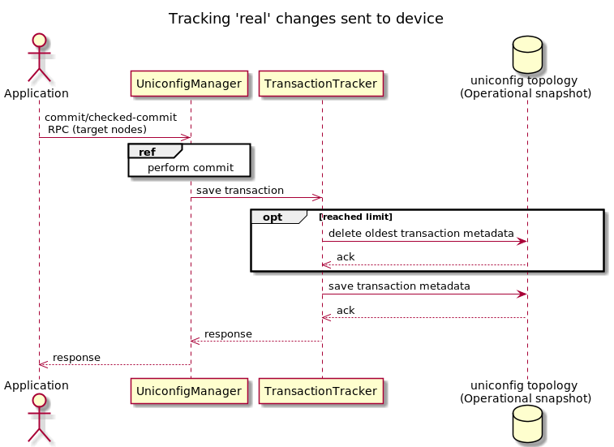

# Transaction tracker

The transaction tracker is responsible for saving transaction metadata to the
**Operational** snapshot after a successfully executed **commit** or
**checked-commit RPC**. Transaction metadata contains information about
performed transactions, such as the following:

- `transaction-id` - Identifier for transaction.
- `type-of-commit-time` - Timestamp for either `last-commit-time` (if the
    transaction was successful) or `failed-commit-time` (if the transaction
    failed). If multiple devices are configured, `last-commit-time` contains a
    timestamp for the last update on the last device.
- `metadata` - Items in this field represent nodes configured in the
    transaction. Each item contains a `diff` item with additional information.
- `diff` - Items in this field are specific changes. Each item contains a path
    to changes, data before the change and data after the change. For failed
    transactions, this information is not included.
- `topology` - Which topology the node is installed on. Either `uniconfig` or
  `unistore`.

!!!
`Data-before` is visible only if data was updated or deleted. `Data-after` is
visible only if data was updated or created.
!!!

]

## Configuration

By default, UniConfig stores transaction metadata. 
Their removal depends only on the `transactions.max-transaction-age` parameter.

```properties
# Grouped settings that are related to UniConfig transactions

# Time after transaction can be closed [seconds] by transaction cleaner.
transactions.transaction-idle-time-out=300
# Maximum transaction age before it can be evicted from transaction registry [seconds].
# Configuring '0' disables cleaning of UniConfig transactions.
transactions.max-transaction-age=0
# Interval at which expired transactions are closed and cleaned [seconds].
# Expired transaction: transaction which age exceeds 'maxTransactionAge' setting.
# Only dedicated UniConfig transactions (initialized using 'create-transaction' RPC)
# are cleaned - shared transaction is never removed or invalidated.
# Configuring '0' disables cleaning of UniConfig transactions.
transactions.cleaning-interval=0
# Boolean value if the Immediate Commit Model is enabled or not. Default value is true.
# If disabled, only manually created transactions can exist.
transactions.immediate-commit-enabled=true
```

### Show transaction-metadata

The response to this GET request contains all stored transaction metadata,
transaction ids and other items such as node id, updated data before and after
update, etc.

```bash RPC Request
curl --location --request GET 'http://localhost:8181/rests/data/transaction-log:transactions-metadata' \
--header 'Accept: application/json'
```

```json RPC Response, Status: 200
{
  "transactions-metadata": {
    "transaction-metadata": [
      {
        "transaction-id": "221aa4a5-e32e-46fd-921a-83314b190e89",
        "status": "SUCCESS",
        "metadata": [
          {
            "node-id": "xr6unistore",
            "diff": [
              {
                "path": "/Cisco-IOS-XR-ifmgr-cfg:interface-configurations/interface-configuration=act,Bundle-Ether1/description",
                "data-after": "{\n  \"Cisco-IOS-XR-ifmgr-cfg:description\": \"bundle-ether1-description-create\"\n}"
              },
              {
                "path": "/Cisco-IOS-XR-ifmgr-cfg:interface-configurations/interface-configuration=act,Bundle-Ether2/description",
                "data-before": "{\n  \"Cisco-IOS-XR-ifmgr-cfg:description\": \"bundle-ether2-description-before\"\n}",
                "data-after": "{\n  \"Cisco-IOS-XR-ifmgr-cfg:description\": \"bundle-ether2-description-after\"\n}"
              }
            ],
            "topology": "unistore"
          }
        ],
        "last-commit-time": "2021-Mar-09 10:53:59.102 +0100"
      },
      {
        "transaction-id": "869df9d6-9025-4849-b30b-9db4d8fb26ec",
        "status": "SUCCESS",
        "metadata": [
          {
            "node-id": "xr5",
            "diff": [
              {
                "path": "/frinx-openconfig-interfaces:interfaces/interface=Loopback123/config",
                "data-before": "{\n  \"frinx-openconfig-interfaces:config\": {\n    \"type\": \"iana-if-type:softwareLoopback\",\n    \"enabled\": true,\n    \"name\": \"Loopback123\"\n  }\n}",
                "data-after": "{\n  \"frinx-openconfig-interfaces:config\": {\n    \"type\": \"iana-if-type:softwareLoopback\",\n    \"enabled\": true,\n    \"description\": \"test-description\",\n    \"name\": \"Loopback123\"\n  }\n}"
              }
            ],
            "topology": "uniconfig"
          }
        ],
        "last-commit-time": "2021-Mar-09 11:06:58.000 +0100"
      },
      {
        "transaction-id": "88878588-ad67-424a-9a16-5e7360df7df0",
        "status": "FAILED",
        "failed-commit-time": "2022-Mar-11 14:39:32.813 +0100"
      }
    ]
  }
}
```
