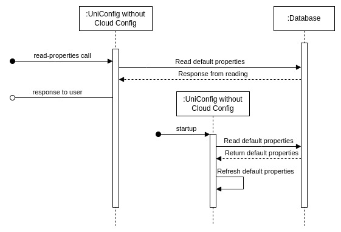

# RPC read-properties

This RPC reads default properties from the database. If a specified property key
does not exist in the database, the key is returned under `Ignored keys`. The
RPC works the same whether UniConfig Cloud Config is enabled or disabled.



!!!
If UniConfig Cloud Config is disabled, this RPC reads property values from the
database. These values may differ from values in the application instance.
!!!

## RPC examples

### Successful example

RPC input contains default property keys.

```bash RPC Request
curl --location --request POST 'http://localhost:8181/rests/operations/uniconfig-manager:read-properties' \
--header 'Accept: application/json' \
--header 'Content-Type: application/json' \
--data-raw '{
    "input": {
        "property-keys": [
          "notifications.kafka.audit-logs-enabled",
          "notifications.kafka.netconf-notifications-enabled", 
          "notifications.kafka.gnmi-notifications-enabled"
        ]
    }
}'
```

```json RPC Response, Status: 200
{
  "output": {
    "read-properties-status": "There are 3 from 3 properties read successfully. Ignored keys: []",
    "properties-map": [
      {
        "key": "notifications.kafka.audit-logs-enabled",
        "value": "true"
      },
      {
        "key": "notifications.kafka.netconf-notifications-enabled",
        "value": "true"
      },
      {
        "key": "notifications.kafka.gnmi-notifications-enabled",
        "value": "true"
      }
    ]
  }
}
```

### Successful example

RPC input contains properties that are not default properties or are private
(crypto keys and crypto types).

```bash RPC Request
curl --location --request POST 'http://localhost:8181/rests/operations/uniconfig-manager:read-properties' \
--header 'Accept: application/json' \
--header 'Content-Type: application/json' \
--data-raw '{
    "input": {
        "property-keys": ["crypto.actual-encryption-cipher-type", "crypto.encrypt-enabled"]
    }
}'
```

```json RPC Response, Status: 200
{
  "output": {
    "read-properties-status": "There are 1 from 2 properties read successfully. Ignored keys: [crypto.actual-encryption-cipher-type]",
    "properties-map": [
      {
        "key": "crypto.encrypt-enabled",
        "value": "true"
      }
    ]
  }
}
```

### Successful example

RPC input consists of properties that do not exist in the database.

```bash RPC Request
curl --location --request POST 'http://localhost:8181/rests/operations/uniconfig-manager:read-properties' \
--header 'Accept: application/json' \
--header 'Content-Type: application/json' \
--data-raw '{
    "input": {
        "property-keys": ["bbb", "aaa"]
    }
}'
```

```json RPC Response, Status: 200
{
  "output": {
    "read-properties-status": "There are 0 from 2 properties read successfully. Ignored keys: [bbb, aaa]"
  }
}
```
