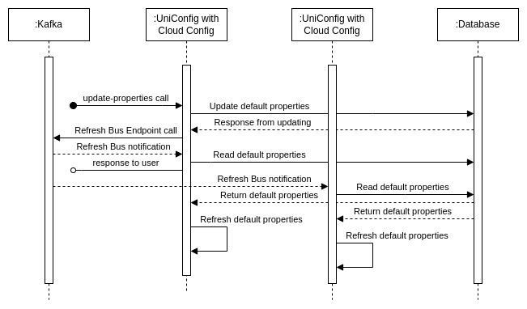
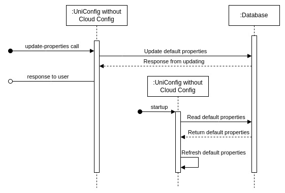

# RPC update-properties

The **update-properties** RPC is used to update property values. If UniConfig Cloud Config is enabled, it also calls *Refresh Bus Endpoint* to update properties in runtime for all connected UniConfig instances.

The RPC only updates **default properties**, except for *crypto* properties for which there are separate RPCs  (**change-encryption-status** and **change-encryption-keys**).

RPC sequence diagram with UniConfig Cloud Config enabled:



!!!
If *UniConfig Cloud Config* is disabled, the RPC only updates property values in the the database. The application instance continues to use the old property values, which can cause confusion.

Additionally, if a new UniConfig instance is started after properties have been updated, that instance will use the updated property values from the database. UniConfig instances will therefore use different values for the same property, as described in the diagram below.

We recommend that you use this RPC with UniConfig Cloud Config. The exception is *callbacks.access-token*, which is always up to date.
!!!

RPC sequence diagram with UniConfig Cloud Config disabled:



## RPC examples

### Successful example

RPC input contains the default properties with correct values.

```bash RPC Request
curl --location --request POST 'http://localhost:8181/rests/operations/uniconfig-manager:update-properties' \
--header 'Accept: application/json' \
--header 'Content-Type: application/json' \
--data-raw '{
    "input": {
       "properties-map": [
            {
                "key": "netconf-default-parameters.session-timers.between-attempts-timeout",
                "value": "1500"
            },
            {
                "key": "gnmi-default-parameters.session-timers.internal-transaction-timeout",
                "value": "1000"
            },
            {
                "key": "notifications.kafka.transaction-notifications-enabled",
                "value": "false"
            }
       ]
    }
}'
```

```json RPC Response, Status: 200
{
  "output": {
    "update-properties-status": "There are 3 updated and 0 inserted properties successfully. Ignored keys: []"
  }
}
```

### Successful example

RPC input contains the *crypto* default property.

```bash RPC Request
curl --location --request POST 'http://localhost:8181/rests/operations/uniconfig-manager:update-properties' \
--header 'Accept: application/json' \
--header 'Content-Type: application/json' \
--data-raw '{
    "input": {
       "properties-map": [
            {
                "key": "crypto.encrypt-enabled",
                "value": "true"
            },
            {
                "key": "crypto.actual-encryption-public-key",
                "value": "aaaaaaaaaaaaaaaaaaaaaaaaaaaaaaaaaaaaaaa"
            }
       ]
    }
}'
```

```json RPC Response, Status: 200
{
  "output": {
    "update-properties-status": "There are 0 updated and 0 inserted properties successfully. Ignored keys: [crypto.encrypt-enabled, crypto.actual-encryption-public-key]"
  }
}
```

### Successful example

RPC input contains an incorrect property key.

```bash RPC Request
curl --location --request POST 'http://localhost:8181/rests/operations/uniconfig-manager:update-properties' \
--header 'Accept: application/json' \
--header 'Content-Type: application/json' \
--data-raw '{
    "input": {
       "properties-map": [
            {
                "key": "aaa",
                "value": "1000"
            }
       ]
    }
}'
```

```json RPC Response, Status: 200
{
  "output": {
    "update-properties-status": "There are 0 updated and 0 inserted properties successfully. Ignored keys: [aaa]"
  }
}
```

### Failed example

RPC input contains default properties with incorrect values.

```bash RPC Request
curl --location --request POST 'http://localhost:8181/rests/operations/uniconfig-manager:update-properties' \
--header 'Accept: application/json' \
--header 'Content-Type: application/json' \
--data-raw '{
    "input": {
       "properties-map": [
            {
                "key": "netconf-default-parameters.session-timers.between-attempts-timeout",
                "value": "1500"
            },
            {
                "key": "gnmi-default-parameters.session-timers.internal-transaction-timeout",
                "value": "true"
            }
       ]
    }
}'
```

```json RPC Response, Status: 400
{
  "errors": {
    "error": [
      {
        "error-tag": "invalid-value",
        "error-info": "For input string: \"true\"",
        "error-message": "Integer property has invalid value true.",
        "error-type": "rpc"
      }
    ]
  }
}
```

### Failed example

RPC input contains default properties with incorrect values.

```bash RPC Request
curl --location --request POST 'http://localhost:8181/rests/operations/uniconfig-manager:update-properties' \
--header 'Accept: application/json' \
--header 'Content-Type: application/json' \
--data-raw '{
    "input": {
       "properties-map": [
            {
                "key": "notifications.kafka.transaction-notifications-enabled",
                "value": "1000"
            }
       ]
    }
}'
```

```json RPC Response, Status: 400
{
  "errors": {
    "error": [
      {
        "error-tag": "invalid-value",
        "error-info": "The String did not match either specified value",
        "error-message": "Boolean property has invalid value 1000.",
        "error-type": "rpc"
      }
    ]
  }
}
```
