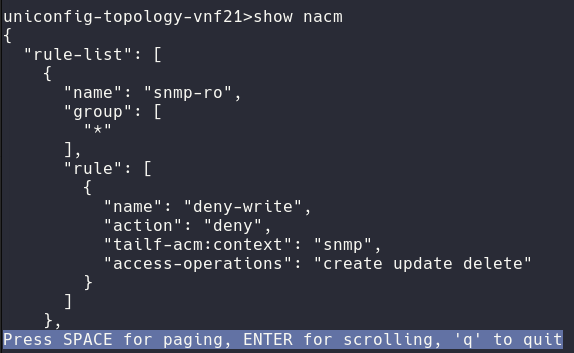

# UniConfig shell

UniConfig shell is a command-line interface for Uniconfig. Accessible over SSH,
it allows users to interact with Uniconfig features including the following:

* Read operational data of devices
* Manipulate device configurations
* Manipulate configuration templates
* Manipulate data stored in Unistore
* Invoke device or UniConfig operations
* Manipulate global UniConfig settings

Uniconfig shell is model-driven, therefore its interface is mostly
auto-generated from YANG schemas (e.g., tree structure of data-nodes or
available RPC/action operations).
 
## Configuration

UniConfig shell is disabled by default. To enable it, set the configuration
parameter `cli-shell.ssh-server.enabled` to `true` in the
**application.properties** file.

All available settings and descriptions are listed below:

```properties UniConfig shell configuration (config/application.properties)
# CLI shell config
cli-shell.ssh-server.enabled=false
cli-shell.default-unistore-node-id=system
cli-shell.default-callbacks-repository=callbacks
cli-shell.enable-scrolling=false
cli-shell.history-size=500
cli-shell.history-file-size=1000
cli-shell.ssh-server.port=2022
cli-shell.ssh-server.inet-address=127.0.0.1
cli-shell.ssh-server.idle-timeout=600
cli-shell.ssh-server.auth-timeout=120
cli-shell.ssh-server.username-password-auth.username=admin
cli-shell.ssh-server.username-password-auth.password=secret
cli-shell.shell-colors.description-color=default
cli-shell.shell-colors.error-color=default
cli-shell.shell-colors.info-color=default
cli-shell.shell-colors.warning-color=default
```

After starting UniConfig, the SSH server listens for connections on port 2022
and the loopback interface.
UniConfig Shell has two connection timeouts:
- Authorization timeout, after which the connection is closed if the other party
  has not been authenticated (in seconds). The default value is 120 seconds.
- Idle timeout, after which the connection is closed if idle (in seconds). The
  default value is 600 seconds.

## Navigating in the shell

* Every command line starts with a command prompt that ends with the `>`
  character. The identifier of the command prompt changes based on the current
  shell mode and the state of execution in this mode.
* The `exit` and `quit` commands are available in all shell modes:
    * `exit` returns the state to the parent state
    * `quit` returns the state to the nearest parent mode (e.g., configuration
      mode, root mode, operational show mode). If the current state of the shell
      represents some mode, `quit` and `exit` have the same effect of returning
      to the parent mode.
* Typed commands are sent to UniConfig using the `ENTER` key. UniConfig
  processes the command and may send a response to the console depending on the
  command. All commands are processed synchronously, meaning that multiple
  commands cannot be executed in parallel in the same SSH session.
* `CTRL-A` and `CTRL-E` move the cursor to the beginning or end of the current
  line.
* `CTRL-L` clears the shell screen.
* Arrow keys `UP/DOWN` load previous commands in the command history.
* `CTRL-C` cancels the current line and moves to a new blank line.
* `TAB` loads suggestions in the current context. Hit `TAB` again to navigate
  through suggested commands using the arrow keys and select using `ENTER`.
  Leave the submode with suggestions using the shortcut `CTRL-E`. The text in
  brackets contains a description of the next command.

```shell Loading available suggestions in 'uniconfig-topology-vnf21>' under 'show' command
uniconfig-topology-vnf21>show 
>                                                (output to file)   interfaces                             (Interfaces configuration)
SNMP-NOTIFICATION-MIB                                               nacm               (Parameters for NETCONF Access Control Model.)
SNMP-TARGET-MIB                                                     ntp                                           (NTP configuration)
SNMP-VIEW-BASED-ACM-MIB                                             redundancy                             (Redundancy Configuration)
aaa                                              (AAA management)   service-node-groups (Service Node Gateway Services Configuration)
alarms                                      (Alarm configuration)   snmp    (Simple Network Management Protocol (SNMP) configuration)
alias                                     (Create command alias.)   system                      (System configuration and statistics)
confdConfig                                (ConfD configuration.)   |                                                          (pipe)
event                                             (Event scripts)
```

If the output is longer than the length of the command line window, it is
displayed with scrolling capability. Use `ENTER` to display the next line and
`SPACE` to display the next page. Use the `q` key to leave scrolling mode. You
can only scroll only in one direction, towards the end of the output.



## Root mode

Root mode is the initial mode after successful authentication.

Example: Log into UniConfig shell:

```shell Connecting to UniConfig shell using SSH client
Connection to 127.0.0.1 closed.
[jtoth@JT-WORK ~]$ ssh admin@127.0.0.1 -p 2022
Password authentication
(admin@127.0.0.1) Password:
uniconfig>
```

```shell Root mode overview
uniconfig>
configuration-mode      (opening configuration mode)
exit
hide-get          (Setting item to be hidden in get)
hide-set          (Setting item to be hidden in set)
show                      (reading data from device)
show-history (show history [max number of commands])
unhide-get      (Setting item to be unhidden in get)
unhide-set      (Setting item to be unhidden in set)
```

The `exit` command is used to exit the UniConfig shell interface altogether
(disconnecting SSH client).

* Example - Exit UniConfig shell:

```shell Leaving UniConfig shell
uniconfig>exit
Console closed. Press any key to exit!
Connection to 127.0.0.1 closed by remote host.
Connection to 127.0.0.1 closed.
```

!!!
Currently, only username/password single-user authentication is supported as
configured in the **application.properties** file.
!!!

### Accessing sub-modes

Root mode acts as a gateway to open the configuration and show modes.

* Example - Switch to configuration mode:

```shell Opening configuration mode
uniconfig>configuration-mode
config>
```

### Show command history

The `show-history` command is used to display a list of N last invoked commands.
This command is also available in configuration mode.

* Example - Show the last five executed commands:

```shell Show history
config>show-history 5
----- History of commands -----
10-05-2022 14:48:14 : configuration-mode
10-05-2022 14:48:16 : request
10-05-2022 14:48:17 : exitr
10-05-2022 14:48:18 : exit
10-05-2022 14:48:24 : show-history 5
```

!!!
Note that the list of invoked commands persists across UniConfig restarts and
SSH connections.
!!!

### Unhide and hide operations

The following commands are used to unhide and hide attributes in application
properties:

* `unhide-get` is used to unhide an attribute hidden in application properties
  for read purposes (restconf.schema-filters.hidden-data-on-read-by-extensions).
* `unhide-set` is used to unhide an attribute hidden in application properties
  for write purposes (restconf.schema-filters.ignored-data-on-write-by-extensions).
* `hide-get` is used to hide attributes that were unhidden with `unhide-get`.
* `hide-set` is used to hide attributes that were unhidden with `unhide-set`.

When unhide is set for a GET or SET operation, the request URL for the operation
contains the `unhide` query parameter. In the following example, the `unhide`
parameter is set to `all`:

  http://localhost:8181/rests/data/network-topology:network-topology/topology=uniconfig/node=vnf21/configuration?unhide=all

This is also available for callbacks. Request and set operations for callbacks uses
`restconf.schema-filters.ignored-data-on-write-by-extensions` and show operations uses
`restconf.schema-filters.hidden-data-on-read-by-extensions`.

The command also gives confirmation that the attribute was added to or removed
from the unhidden list.

!!!
When `unhide-get` or `hide-get` are called without parameters, the output
contains a list of all unhidden parameters. The same applies to `unhide-set` and
`hide-set`.
!!!

```shell 'unhide-get' and 'unhide-set' with parameters
uc>unhide-get deprecated 
Attribute tailf:hidden deprecated was added to unhidden get list.
uc>unhide-set full 
Attribute tailf:hidden full was added to unhidden set list.
```

```shell 'hide-get' and 'hide-set' with parameters
uc>hide-get deprecated 
Attribute tailf:hidden deprecated was removed from unhidden get list.
uc>hide-set full 
Attribute tailf:hidden full was removed from unhidden set list.
```

```shell 'unhide-get' and 'unhide-set' without parameters (same output for 'hide-get' and 'hide-set')
uc>unhide-get
unhidden get:
tailf:hidden deprecated
tailf:hidden debug
uc>unhide-set
unhidden set:
tailf:hidden full
```

!!!
When used with the parameter `all`, the unhide operation applies to all
parameters defined in application properties for read or write purposes.
!!!

### Examples

**Example** - Attempt to show hidden callbacks field details with unhide

```Show hidden callbacks field details with unhide
uc>unhide-get deprecated 
Attribute tailf:hidden deprecated was added to unhidden get list.
uc>configuration-mode
Transaction with id: fe30f909-82bd-4037-b262-a5e147034ab6 was successfully created
uc(config)#show callbacks vnms system details 
{
  "path": "/vnms/system/details",
  "headers": {
    "host": "127.0.0.1:8443",
    "user-agent": "Java-http-client/21.0.1",
    "accept": "application/json",
    "authorization": "Bearer abcdefghijklmn",
    "content-type": "application/json"
  },
  "method": "GET",
  "body": "",
  "fresh": false,
  "hostname": "127.0.0.1",
  "ip": "::1",
  "ips": [],
  "protocol": "https",
  "query": {},
  "subdomains": [],
  "xhr": false,
  "os": {
    "hostname": "f8278c7a721b"
  },
  "connection": {
    "servername": false
  },
  "clientCertificate": {}
}
uc(config)#
```

**Example** - Attempt to show hidden callbacks field details without unhide

```Show hidden callbacks field details without unhide
uc>hide-get deprecated 
Attribute tailf:hidden deprecated was removed from unhidden get list.
uc>configuration-mode
Transaction with id: fe30f909-82bd-4037-b262-a5e147034ab6 was successfully created
uc(config)#show callbacks vnms system details
Unknown arguments: details
uc(config)#
```

**Example** - Attempt to set hidden callbacks field reset-password with unhide

```Set hidden callbacks field reset-password with unhide
uc>unhide-set full
Attribute tailf:hidden full was added to unhidden set list.
uc>configuration-mode 
Transaction with id: fe30f909-82bd-4037-b262-a5e147034ab6 was successfully created
uc(config)#set callbacks vnms system reset-password 
Failed to send request to remote server; Body is not specified!
uc(config)#

```

**Example** - Attempt to set hidden callbacks field reset-password without unhide

```Set hidden callbacks field reset-password without unhide
uc>hide-set full 
Attribute tailf:hidden full was removed from unhidden set list.
uc>configuration-mode 
Transaction with id: fe30f909-82bd-4037-b262-a5e147034ab6 was successfully created
uc(config)#set callbacks vnms reset-password
Unknown arguments: reset-password
uc(config)#

```

**Example** - Attempt to request hidden callbacks field unlock-user with unhide

```Request hidden callbacks field unlock-user with unhide
uc>unhide-set full
Attribute tailf:hidden full was added to unhidden set list.
uc>configuration-mode 
Transaction with id: fe30f909-82bd-4037-b262-a5e147034ab6 was successfully created
uc(config)#request callbacks vnms system unlock-user 
Request body is needed
uc(config)#

```

**Example** - Attempt to request hidden callbacks field unlock-user without unhide

```Request hidden callbacks field unlock-user without unhide
uc>hide-set full 
Attribute tailf:hidden full was removed from unhidden set list.
uc>configuration-mode
Transaction with id: fe30f909-82bd-4037-b262-a5e147034ab6 was successfully created
uc(config)#request callbacks vnms system unlock-user
Unknown arguments: unlock-user
uc(config)#

```

## Configuration mode

Configuration mode provides access to the following:
  
1. CRUD operations on top of persisted UniConfig, UniStore and template nodes
2. CRUD operations on top of persisted UniConfig settings
3. UniConfig RPC operations such as `commit` or `calculate-diff`

After opening configuration mode, a new UniConfig transaction is created. All
operations invoked in configuration mode are executed in the scope of the
created transaction. The transaction is automatically closed after leaving
configuration mode (`exit` or `quit` command).

If `commit` or `checked-commit` are invoked, the transaction is automatically
refreshed. The user stays in configuration mode with a newly created
transaction.

```shell Configuration mode overview
config>
others
callbacks                           (operations on callbacks)
exit                                  (return to parent mode)
quit                                    (return to root mode)
request                                   (execution of RPCs)
settings                             (operations on settings)
show-history          (show history [max number of commands])
template-topology       (operations on the template topology)
uniconfig-topology     (operations on the uniconfig topology)
unistore-topology       (operations on the unistore topology)
aliases
diff (alias for 'request calculate-diff target-nodes/node *')
```

Commands like `SET`, `SHOW` and `DELETE` are now available only on a specific device
and are not accessible in root configuration mode.

```shell Set / show / delete commands overview
config>uniconfig-topology test-node-1
uniconfig-topology-test-node-1>
SNMP-NOTIFICATION-MIB                                               nacm               (Parameters for NETCONF Access Control Model.)
SNMP-TARGET-MIB                                                     ntp                                           (NTP configuration)
SNMP-VIEW-BASED-ACM-MIB                                             quit                                        (return to root mode)
aaa                                              (AAA management)   redundancy                             (Redundancy Configuration)
alarms                                      (Alarm configuration)   service-node-groups (Service Node Gateway Services Configuration)
alias                                     (Create command alias.)   set                                               (set operation)
confdConfig                                (ConfD configuration.)   show                                  (show data in current path)
delete                                         (delete operation)   show-history              (show history [max number of commands])
event                                             (Event scripts)   snmp    (Simple Network Management Protocol (SNMP) configuration)
exit                                      (return to parent mode)   system                      (System configuration and statistics)
interfaces                             (Interfaces configuration)
```

### Show configuration

The `show` operation is used to display selected subtrees.

The subtree path can be constructed interactively with the help of shell
suggestions/auto-completion mechanism. Construction of the path works the same
way for `SET`, `SHOW` and `DELETE` operations.

**Example** - Display the configuration of a selected container:
  
1. First move into a specific topology on a specific device:

```shell Move to a specific topology
config>uniconfig-topology
nodes
test-node-1   test-node-2
```

```shell Move to a specific device
config>uniconfig-topology test-node-1
uniconfig-topology-test-node-1>
```

2. After this, the `show` operation is available:

```shell Show operation: Select a root data container
uniconfig-topology-test-node-1>show 
>                                                (output to file)   interfaces                             (Interfaces configuration)
SNMP-NOTIFICATION-MIB                                               nacm               (Parameters for NETCONF Access Control Model.)
SNMP-TARGET-MIB                                                     ntp                                           (NTP configuration)
SNMP-VIEW-BASED-ACM-MIB                                             redundancy                             (Redundancy Configuration)
aaa                                              (AAA management)   service-node-groups (Service Node Gateway Services Configuration)
alarms                                      (Alarm configuration)   snmp    (Simple Network Management Protocol (SNMP) configuration)
alias                                     (Create command alias.)   system                      (System configuration and statistics)
confdConfig                                (ConfD configuration.)   |                                                          (pipe)
event                                             (Event scripts)
```

```shell Show operation: Select a specific virtual network interface 
uniconfig-topology-test-node-1>show interfaces vni 
> (output to file)   vni-0/4              vni-0/6              vni-0/8              |           (pipe)
vni-0/10             vni-0/5              vni-0/7              vni-0/9
```

```shell Show operation: Invoke a command
uniconfig-topology-test-node-1>show interfaces vni vni-0/10 
{
  "name": "vni-0/10",
  "ether-options": {
    "link-mode": "auto",
    "link-speed": "10m"
  },
  "description": "sample description",
  "enable": true
}
```

### Delete configuration

The `delete` operation removes a selected subtree.

**Example** - Remove a container:

1. First move to a specific topology on a specific device:

```shell Move to a specific topology
config>uniconfig-topology
nodes
test-node-1   test-node-2
```

```shell Move to a specific device
config>uniconfig-topology test-node-1
uniconfig-topology-test-node-1>
```

2. After this, the `delete` operation is available:

```shell Construct a path with help from suggestions
uniconfig-topology-test-node-1>delete 
SNMP-NOTIFICATION-MIB                                               interfaces                             (Interfaces configuration)
SNMP-TARGET-MIB                                                     nacm               (Parameters for NETCONF Access Control Model.)
SNMP-VIEW-BASED-ACM-MIB                                             ntp                                           (NTP configuration)
aaa                                              (AAA management)   redundancy                             (Redundancy Configuration)
alarms                                      (Alarm configuration)   service-node-groups (Service Node Gateway Services Configuration)
alias                                     (Create command alias.)   snmp    (Simple Network Management Protocol (SNMP) configuration)
confdConfig                                (ConfD configuration.)   system                      (System configuration and statistics)
event                                             (Event scripts)
```

```shell Delete 'ether-options' container under 'vni' with key value 'vni-0/10'
uniconfig-topology-test-node-1>delete interfaces vni vni-0/10 ether-options
uniconfig-topology-test-node-1>
```

3. Quit to configuration mode, commit using request mode and return to the
   device on the topology:

```shell Verify state of 'network-instance'
uniconfig-topology-test-node-1>show interfaces vni vni-0/10 
{
  "name": "vni-0/10",
  "description": "sample description",
  "enable": true
}
```

### Set configuration

The `set` operation can be used for the following:

* Set the value of a single leaf.
* Set the values of multiple leaves in a single shell operation.
* Set a list of values for a leaf-list.
* Replace the entire subtree using a JSON snippet.

**Example** - Set the value of a single leaf:

```shell move to specified device
config>uniconfig-topology iosxr
```

```shell Provide datatype hints at selected leaf
uniconfig-topology-iosxr>set lacp config system-priority
(type: uint16, constraints: [Range: [[0..65535]]])
```

```shell Set the value of LACP 'system-priority' to '100'
uniconfig-topology-iosxr>set lacp config system-priority 100
uniconfig-topology-iosxr>
```

```shell Display changed LACP configuration 
uniconfig-topology-iosxr>show lacp config
{
  "system-priority": 100
}
```

**Example** - Set values for multiple leaves under the `hold-time` container:

```shell move to specified device
config>uniconfig-topology iosxr
```

```shell Display hint for value of the leaf 'up'
uniconfig-topology-iosxr>set interfaces interface GigabitEthernet0/0/0/0 hold-time config up
(type: uint32, constraints: [Range: [[0..4294967295]]])
```

```shell Set value of the leaf 'up' and display hint for value of the leaf 'down'
uniconfig-topology-iosxr>set interfaces interface GigabitEthernet0/0/0/0 hold-time config up 20 down
(type: uint32, constraints: [Range: [[0..4294967295]]])
```

```shell Set values of the leaves 'up' and 'down'
uniconfig-topology-iosxr>set interfaces interface GigabitEthernet0/0/0/0 hold-time config up 20 down 15
uniconfig-topology-iosxr>
```

```shell Verify the 'hold-time' configuration
uniconfig-topology-iosxr>show uniconfig iosxr interfaces interface GigabitEthernet0/0/0/0 hold-time
{
  "config": {
    "up": 20,
    "down": 15
  }
}
```

A JSON snippet can be written to a selected data-tree node by entering the
json sub-mode. In this sub-mode, you can type multiple lines that represent a
well-formed JSON document. At the end, confirm the set operation using the
pattern `w!` + newline, or cancel the set operation with the pattern `q!` +
newline.

**Example** - Replace configuration of an interface using a JSON snippet:

```shell move to specified device
config>uniconfig-topology iosxr
```

```shell Replace 'config' container under interface using the provided JSON snippet
uniconfig-topology-iosxr>set interfaces interface GigabitEthernet0/0/0/1 config json
{
>   "config": {
>     "type": "iana-if-type:ethernetCsmacd",
>     "enabled": true,
>     "name": "GigabitEthernet0/0/0/1"
>   }
> }
w!
```

```shell Verify set operation
uniconfig-topology-iosxr>show interfaces interface GigabitEthernet0/0/0/1
{
  "name": "GigabitEthernet0/0/0/1",
    "config": {
    "type": "iana-if-type:ethernetCsmacd",
    "enabled": true,
    "name": "GigabitEthernet0/0/0/1"
  }
}
```

**Example** - Leave json sub-mode without executing set operation:

```shell Cancel set operation and leave 'json' sub-mode
uniconfig-topology-iosxr>set interfaces interface GigabitEthernet0/0/0/1 config json
{
>   "config": {
>     "type": "iana-if-type:ethernetCsmacd",
>     "enabled": true,
>     "name": "GigabitEthernet0/0/0/1"
>   }
> }
q!
```

```shell Verify cancelled set operation
uniconfig-topology-iosxr>show interfaces interface GigabitEthernet0/0/0/1
{
  "name": "GigabitEthernet0/0/0/1",
  "config": {
    "type": "iana-if-type:ethernetCsmacd",
    "enabled": false,
    "name": "GigabitEthernet0/0/0/1"
  }
}
```

### Tag template

The `tag` operation for adding or removing tags from template.

Options: `add` and `remove`

Then pick `template` under `template-topology`

Base command pattern:
tag add/remove template-topology <template-name>

After base command 

**Example** - Tag a leaf-list:

```shell Show untagged services leaf-list
config>show template-topology test-template service-node-groups service-node-group default-sng services 
[
  "cgnat",
  "nextgen-firewall",
  "test",
  "sdwan"
]
```

```shell Add Tag services leaf-list
config>tag 
add   (invoke add tag explicitly)   remove (invoke remove tag explicitly)

config>tag add template-topology test-template
alarms                          dhcp-profiles                   service-node-groups
alias                           event                           snmp
confdConfig                     merge-tag     (add merge tag)   update-tag   (add update tag)
create-tag   (add create tag)   networks
delete-tag   (add delete tag)   replace-tag (add replace tag)

config>tag add template-topology test-template service-node-groups service-node-group default-value services replace-tag
```

```shell Show tagged services leaf-list
config>show template-topology test-template service-node-groups service-node-group default-sng services 
{
  "@": {
    "template-tags:operation": "replace-tag"
  },
  "#": [
    "cgnat",
    "nextgen-firewall",
    "test",
    "sdwan"
  ]
}
```

```shell Remove Tag services leaf-list
config>tag 
add   (invoke add tag explicitly)   remove (invoke remove tag explicitly)

config>tag add template-topology test-template
alarms                          dhcp-profiles                   service-node-groups
alias                           event                           snmp
confdConfig                     merge-tag     (add merge tag)   update-tag   (add update tag)
create-tag   (add create tag)   networks
delete-tag   (add delete tag)   replace-tag (add replace tag)

config>tag remove template-topology test-template service-node-groups service-node-group default-value services replace-tag
```

```shell Show untagged services leaf-list
config>show template-topology test-template service-node-groups service-node-group default-sng services 
[
  "cgnat",
  "nextgen-firewall",
  "test",
  "sdwan"
]
```

### Execute UniConfig operation

The `request` command is used to execute UniConfig operations such as `commit`
or `calculate-diff` in the UniConfig transaction:

* The command is available in configuration mode
* You can fill in input parameters and values interactively or via provided JSON
  snippet

**Example** - Execute UniConfig RPCs in the scope of the open UniConfig
transaction:

```shell Display available 'commit' RPC parameters
config>request commit
>                                                                            (output to file)
do-rollback (Controls whether to roll back successfully configured devices in case of failu…)
do-validate (Option to enable/disable validation at commit. Default value is true - validate)
json                                                                             (JSON input)
target-nodes/node
|                                                                                      (pipe)
```

```shell Execute 'calculate-diff' RPC with one argument - target node
config>request calculate-diff target-nodes/node iosxr
{
  "node-results": {
    "node-result": [
      {
        "node-id": "iosxr",
        "topology-id": "uniconfig",
        "created-data": [
          {
            "path": "/network-topology:network-topology/topology=uniconfig/node=iosxr/frinx-uniconfig-topology:configuration/frinx-openconfig-system:system",
            "data": "{
              "frinx-openconfig-system:system": {
                "frinx-huawei-global-config-extension:banner": {
                  "config": {
                    "banner-text": "Test banner"
                  }
                }
              }
            }"
          }
        ]
      }
    ]
  }
}
[24.04.2023, 09:25:31]
```

```shell Display available 'sync-from-network' RPC parameters:
config>request sync-from-network
>                                                                            (output to file)
check-timestamp (Perform timestamp comparison(last known to Uniconfig vs current timestamp …)
json                                                                             (JSON input)
target-nodes/node
|                                                                                      (pipe)
```

```shell Execute 'sync-from-network' RPC with two arguments (target node and 'check-timestamp' flag)
config>request sync-from-network check-timestamp true target-nodes/node iosxr
{}
[24.04.2023, 09:26:48]
```

## Request operational mode

This command has been merged with request configuration mode and is now
available only in configuration mode.

Request mode allows users to:

* Invoke selected UniConfig requests that read or alter UniConfig settings.
* Invoke RPCs or actions provided by network devices or other southbound
  mountpoints.

Input parameters and values can be filled in interactively or via a provided
JSON snippet. The transaction is passed from configuration mode.

**Example** - Invoke **RPC execute-and-read** with typed input parameters:

```shell Display available RPCs provided by device 'iosxr'
request>cli iosxr
operations
clear-journal
execute (Simple execution of single or multiple commands on remote terminal. Multiple comma…)
execute-and-expect (Form of the 'execute-and-read' RPC that can contain 'expect(..)' patter…)
execute-and-read (Execution of the sequence of commands specified in the input. These comma…)
execute-and-read-until
read-journal
```

```shell Display available 'execute-and-read' RPC parameters
request>cli iosxr execute-and-read
>                                                                            (output to file)
command        (Input configuration snippet (one or multiple commands separated by newline).)
json                                                                             (JSON input)
wait-for-output-timer (If no output is received during this time, then execute next command…)
|                                                                                      (pipe)
```

```shell Execute 'execute-and-read' RPC with two arguments ('wait-for-output-timer' and 'command')
request>cli iosxr execute-and-read wait-for-output-timer 2 command "show users"
{
   "output": "Mon May 16 07:28:30.405 UTC
   Line            User                 Service  Conns   Idle        Location
*  vty0            cisco                ssh          0  00:00:00     192.168.1.42"
}
[24.04.2023, 09:34:21]
```

**Example** - Execute the same **RPC execute-and-read** using input JSON:

```shell Execute the 'execute-and-read' RPC with input JSON snippet:
request>cli iosxr execute-and-read json
  {
>     "input": {
>         "command": "show users",
>         "wait-for-output-timer": 2
>     }
> }
w!
{
   "output": "Mon May 16 07:37:55.256 UTC
   Line            User                 Service  Conns   Idle        Location
*  vty0            cisco                ssh          0  00:00:00     192.168.1.42"
}
[24.04.2023, 09:36:48]
```

!!!
UniConfig shell does not support interactive typing of input arguments for an
RPC/action that contains the `list` YANG element. Such operations must be
executed using input JSON.
!!!

## Show operational mode

Show mode allows users to:

* Display operational data about UniConfig itself (e.g., logging status, list of
   open transactions or list of acquired subscriptions)
* Display operational data of network devices

```shell Overview of show operational mode
show>
others
cli                    (reading data from CLI device)
exit                          (return to parent mode)
logging-status               (reading logging status)
netconf            (reading data from NETCONF device)
netconf-subscriptions (reading netconf subscriptions)
notifications                 (reading notifications)
quit                            (return to root mode)
show-history  (show history [max number of commands])
snapshots-metadata       (reading snapshots metadata)
transaction-log             (reading transaction log)
transactions               (reading transaction data)
aliases
lbr      (alias for 'logging-status broker restconf')
```

After opening show mode, a new UniConfig transaction is opened. The transaction
is closed when you leave this mode.

```shell Open show operational mode
uniconfig>show
show>
```

**Example** - Display configuration of selected subtree:

```shell Display configuration of GigabitEthernet0/0/0/0 interface
show>cli iosxr interfaces(frinx-openconfig-interfaces) interface GigabitEthernet0/0/0/0
{
  "name": "GigabitEthernet0/0/0/0",
  "config": {
    "type": "iana-if-type:ethernetCsmacd",
    "enabled": false,
    "name": "GigabitEthernet0/0/0/0"
  }
}
```

**Example** - Display selected system configuration:

```shell Display list of open UniConfig transactions
show>transactions transaction-data
[
  {
    "transaction-id": "5d9c8819-5b05-4c7a-b7e5-3c84478aeeb0",
    "idle-timeout": 300,
    "last-access-time": "2022-May-16 07:02:31.501 +0000",
    "hard-timeout": 1800,
    "creation-time": "2022-May-16 07:02:31.501 +0000"
  },
  {
    "transaction-id": "80091b4b-5432-41cd-9277-1b18ae77b45f",
    "idle-timeout": 300,
    "last-access-time": "2022-May-16 07:02:42.747 +0000",
    "hard-timeout": 1800,
    "creation-time": "2022-May-16 07:02:42.747 +0000"
  }
]
```

## Pipe operations

UniConfig shell supports pipe operations similar to Unix shell/bash pipes. When
a command is followed by the pipe sign (`|`), the output of the command is
passed to the selected pipe operation.

**Example:**

```shell Move to specified device
config>uniconfig-topology R1
```

```shell Execute 'grep' pipe operation:
uniconfig-topology-R1>show interface-configurations interface-configuration | grep netmask

    "netmask": "255.255.255.0"
```

Supported pipe operations are:

* `grep` - Show only lines that match supplied regex
* `match` - Same as `grep`, but can be used with optional parameters to also
   show lines before and after matched lines
* `context-match` - Same as `grep`, but also shows parent structure
* `brief` - Display root elements in short table format
* `hide-empty-data-nodes` - Hide data nodes without child nodes 
* `hide-attributes` -  Hide attributes of data nodes

## Redirecting output

The output of an executed command can be redirected to a file using the `>` sign
followed by a filename.

**Example:**

```shell Move to specified device
config>uniconfig-topology R1
```

```shell Redirect output to file
uniconfig-topology-R1>show interface-configurations interface-configuration act\ GigabitEthernet0/0/0/1 > '/home/output.txt' 
```
In this case, output in the console is empty but the content of the
**output.txt** file is a follows:

```text Redirection output
{
  "active": "act",
  "interface-name": "GigabitEthernet0/0/0/1",
  "shutdown": [
    null
  ]
}
```

## Aliases

You can define aliases in UniConfig shell. A json file named **shell-aliases**
is included in the UniConfig distribution for this purpose. After unpacking the
UniConfig distribution, the file can be found under
**Uniconfig/distribution/packaging/zip/target/uniconfig-x.x.x/config**. The file
contains some sample aliases.

``` shell-aliases.json with default samples
/*
Example: "alias": "command1 command2 * command3 *"
Alias name must be a simple word without spaces
Asterisk symbol is a placeholder. We can dynamically add an alias value
*/
{
  "configuration-mode": {
    "diff": "request calculate-diff target-nodes/node *"
  },
  "request": {
    "shh": "show-history"
  },
  "show": {
    "lbr": "logging-status broker restconf"
  }
}
```

### Alias creation

Aliases cannot be created dynamically, only before Uniconfig is started. The
following rules apply:

1. The alias name must be unique and cannot contain whitespaces.
2. The command can contain a wildcard (`*`). In this case, the user is prompted to
   add a value.
3. The alias is only visible in the mode where it was defined.

**Example** - Execute the alias `diff xr5`:

```
uniconfig>configuration-mode 
config>diff xr5
{
  "node-results": {
    "node-result": [
      {
        "node-id": "xr5",
        "topology-id": "uniconfig"
      }
    ]
  }
}
[24.04.2023, 09:31:32]
config>
```

**Example** - Execute the alias `lbr`:

```
uniconfig>show
show>lbr 
{
  "broker-identifier": "restconf",
  "is-logging-broker-enabled": false
}
show>
```

**Example** - Execute the alias `shh`:

```
uniconfig>request
request>show-history 
----- History of commands -----
18-05-2022 14:13:09 : show
18-05-2022 14:13:18 : lbr
18-05-2022 14:17:43 : exit
18-05-2022 14:17:48 : request
18-05-2022 14:17:57 : shcs
18-05-2022 14:18:10 : shcs n1
18-05-2022 14:18:25 : show-history
request>

```

## Callbacks

Callbacks include sending `POST` and `GET` requests to the remote server and
invoking user scripts from the UniConfig shell.

The following is required to use callbacks:

1. Necessary YANG modules - YANG modules that are required by the callbacks.
2. Configuration - Enable callbacks in **config/application.properties** and set
   the remote server and access token.
3. Update repository - Add the necessary YANG modules from step 1 into at least
   one YANG repository in the cache directory, and either define remote
   endpoints and scripts in a YANG file or create a new one for callbacks. For a
   definition of remote endpoints, use the **frinx-callpoint@2022-06-22.yang**
   extension.
4. UniStore node - Create a UniStore node using the YANG repository containing
   the necessary YANG modules from step 1 and a YANG file with defined endpoints
   and scripts.

!!!
In UniConfig shell, step 4 is optional as UniConfig creates dummy UniStore nodes
for all repositories that meet the conditions in step 3. In this case, the dummy
UniStore node name is identical to the YANG repository name.

In RestConf, step 4 is mandatory.
!!!

### Necessary YANG modules

The following YANG modules are required:

* frinx-callpoint@2022-06-22.yang (not needed for scripts)
* tailf-common@2018-11-12.yang
* tailf-meta-extensions@2017-03-08.yang
* tailf-cli-extensions@2018-09-15.yang

### Configuration

By default, callbacks are disabled and the host and port for the remote server
are empty in **config/application.properties**. 

To enable callbacks, set the configuration parameter `callbacks/enabled` to
`true`. It is also necessary to set the host and port for the remote server and
store an access token in the UniConfig database. 

The host and port for the remote server can be set in three ways:

1. Before starting Uniconfig, in the **config/application.properties** file. The
   port number is optional:

```properties UniConfig callback configuration (config/application.properties)
# Callbacks config
callbacks.enabled=true
callbacks.remote-server.host=127.0.0.1
callbacks.remote-server.port=8443
```

2. After starting UniConfig, with a `PUT` request:

```update remote server by PUT request
  curl --location --request PUT 'http://127.0.0.1:8181/rests/data/callbacks:callbacks-settings' \
  --header 'Accept: application/json' \
  --header 'Authorization: Basic YWRtaW46YWRtaW4=' \
  --header 'Content-Type: application/json' \
  --data-raw '{
      "callbacks-settings": {
          "remote-server": {
              "host": "127.0.0.5",
              "port": 9000
          }
      }
  }'
```

3. After starting UniConfig, with cli-shell:

```update remote server by cli-shell
  uniconfig>configuration-mode 
  config>set settings callbacks-settings remote-server host 127.0.0.5 port 9000
  config>request commit 
```

The access token can be stored in the UniConfig database in one of two ways:

1. After starting UniConfig, with a `PUT` request:

```update access token by PUT request
  curl --location --request PUT 'http://127.0.0.1:8181/rests/data/callbacks:callbacks-settings/access-token' \
  --header 'Accept: application/json' \
  --header 'Authorization: Basic YWRtaW46YWRtaW4=' \
  --header 'Content-Type: application/json' \
  --data-raw '{
      "access-token": "token"
  }'
```

2. After starting UniConfig, with cli-shell:

```update access token by cli-shell
  uniconfig>configuration-mode 
  config>set settings callbacks-settings access-token token
  config>request commit
```

Available settings and descriptions for callbacks are listed below:

```properties UniConfig callbacks configuration (config/application.proprties)
# Callbacks config
callbacks.enabled=true
callbacks.remote-server.host=127.0.0.1
callbacks.remote-server.port=8443
```

### Update repository

First, create or update the YANG repository by using the
**frinx-callpoint@2022-06-22.yang** extension displayed in the following
snippet. There is only one extension, `url`, with the argument `point`.

``` frinx-callpoint@2022-06-22.yang
module frinx-callpoint {
    yang-version 1.1;
    namespace "http://frinx.io/callpoint";
    prefix callpoint;

    revision 2022-06-22 {
        description "Initial revision";
    }

    extension url {
        argument point;
    }
}
```

#### Add call-point (GET request)

The following snippet shows how to create a call-point in the **frinx-test**
YANG file by using the **frinx-callpoint@2022-06-22.yang** extension.

``` example of using of the frinx-callpoint@2022-06-22.yang in YANG file
module frinx-test {
    yang-version 1.1;
    namespace "http://frinx.io/frinx-test";

    import frinx-callpoint { prefix "fcal"; }

    container test {
        container get-request {
            fcal:url /data/from/remote;
        }
    }
```

The argument of the `url` extension is `/data/from/remote`, which is appended to
the end of the remote server URI configured in
**config/application.properties**. Thus the final address for the remote
call-point is `https://remote.server.io/data/from/remote`.

#### Add action (POST request)

The following snippet shows how to create an action in the **frinx-test** YANG
file by using the **frinx-callpoint@2022-06-22.yang** extension. You must also
import **tailf-common.yang**.

The action consists of:

1. The action name, defined by `tailf:action`.
2. The suffix for the remote endpoint, defined by `fcal:url`.
3. The input that contains body of the request. This part is optional.

``` Example of using frinx-callpoint@2022-06-22.yang in YANG file
module frinx-test {
    yang-version 1.1;
    namespace "http://frinx.io/frinx-test";

    import frinx-callpoint { prefix "fcal"; }
    import tailf-common { prefix "tailf"; }

    container post-request {
        tailf:action test-action {
            fcal:url /invoke/remote/test-action;
            input {
                container body {
                    leaf data {
                        type string;
                    }
                }
            }
        }
    }
```

#### Add script

The following snippet shows how to create a script in the **frinx-test** YANG
file by using **tailf-common.yang**. It is not necessary to import the
**frinx-callpoint@2022-06-22.yang** extension.

The script consists of:

1. The script name, defined by `tailf:action`.
2. The path to the script, defined by `tailf:exec`.
3. Arguments for the script, defined by `tailf:exec`.

Arguments can be dynamic (i.e., the user can pass values to them) or static
(flags). Follow these conventions when creating arguments:

1. Each argument must contain a name (for example, `-n`, `-j`).
2. Dynamic arguments must be enclosed in `$(...)` (for example, `$(name)`).
3. Flags are simple words without whitespace (for example, `VIP`, `UPPER`,
   `upper`).

``` Example of using frinx-callpoint@2022-06-22.yang in YANG file
module frinx-test {
    yang-version 1.1;
    namespace "http://frinx.io/frinx-test";

    import tailf-common { prefix "tailf"; }

    container script {
        tailf:action test-script {
            tailf:exec '/tmp/test_script.sh' {
                tailf:args '-n $(name) -j $(job) -v VIP';
            }
        }
    }
```

### UniStore node


A UniStore node can be created by RestConf or UniConfig shell. If a repository
is explicitly defined by the query parameter
`?uniconfig-schema-repository=repository-name`, this repository must contain all
necessary YANG modules. If a repository name is not defined when the UniStore
node is created, all necessary YANG modules must be in the `latest` schema
repository.

### Examples

**Example** - Invoke callpoint in shell:

``` callpoint invocation
config>callbacks repository-name
callbacks-repository-name>show test get-request
{
  "response": {
    "value": "some-value"
  }
}
callbacks-repository-name>
```

**Example** - Invoke action in shell:

``` action invocation
config>request 
request>callbacks repository-name post-request test-action body data "some-data"
{
  "response": {
    "value": "some-data was processed"
  }
}
request>
```

**Example** - Execute user script in shell:

``` user script execution
config>request 
request>callbacks repository-name script test-script /tmp/test_script.sh 
VIP    job    name
request>callbacks repository-name script test-script /tmp/test_script.sh job "FRINX" 
VIP    name
request>callbacks repository-name test-script /tmp/test_script.sh job "FRINX" VIP
Name: 
Job: Frinx
is VIP

Exit code: 0
request>
```
